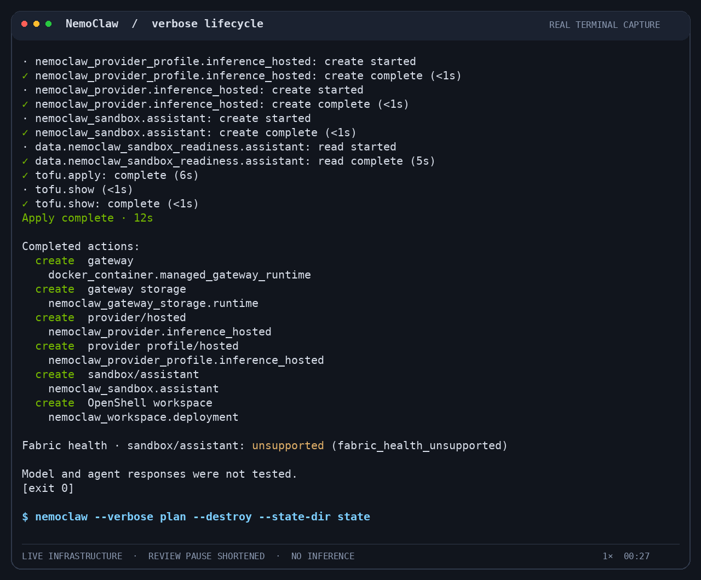

<!-- SPDX-FileCopyrightText: Copyright (c) 2026 NVIDIA CORPORATION & AFFILIATES. All rights reserved. -->
<!-- SPDX-License-Identifier: Apache-2.0 -->

# NemoClaw

NemoClaw deploys agents in OpenShell sandboxes from desired-state YAML.
Use the CLI or Rust SDK to plan, apply, export, and destroy deployments.

This branch documents v1 development using source-built bundles.
See [tested configurations and limits](docs/validation/README.md) before choosing a deployment.

[Watch the 43-second demo](docs/assets/terminal-lifecycle-verbose.mp4): a real OpenShell gateway and OpenClaw sandbox lifecycle with `--verbose`.
Images are cached; no inference requests are sent, and only the plan-review pause is shortened.

## Start Here

- [Understand NemoClaw](docs/overview.md).
- [Get started with v1](docs/get-started.md).
- [Build a native bundle](docs/build.md).
- [Configure and operate a deployment](docs/usage.md).
- [Move from an earlier version](docs/migration.md).
- [Use the SDK](docs/sdk.md).
- [Browse all documentation](docs/README.md).

## Contribute

Read the [accepted scope](docs/design/scope.md) and follow [AGENTS.md](AGENTS.md) for repository workflow and required checks.
Follow [WRITING.md](WRITING.md) for explanatory text and the [documentation contributor guide](docs/CONTRIBUTING.md) for documentation changes.
Report potential vulnerabilities through the private channels in [SECURITY.md](SECURITY.md).

## Licenses

Original NemoClaw code uses [Apache-2.0](LICENSE).
The Qwen3.8 artifact includes AGPL-3.0-or-later recipe code and adaptations.
See [component attribution and license notices](runtimes/qwen38/NOTICE.md) for their scope and retained sources.
