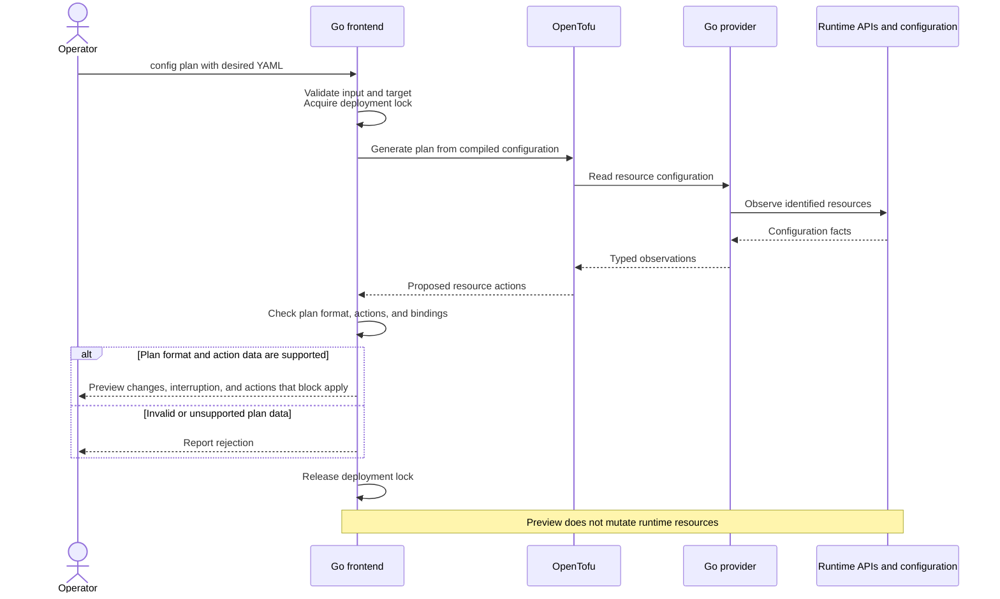
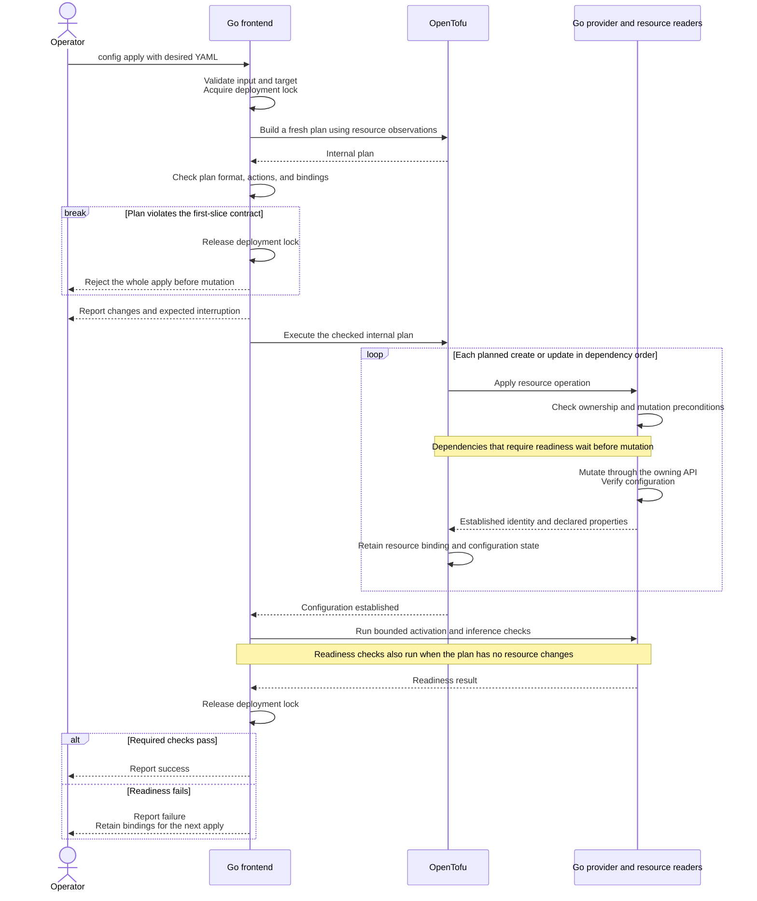
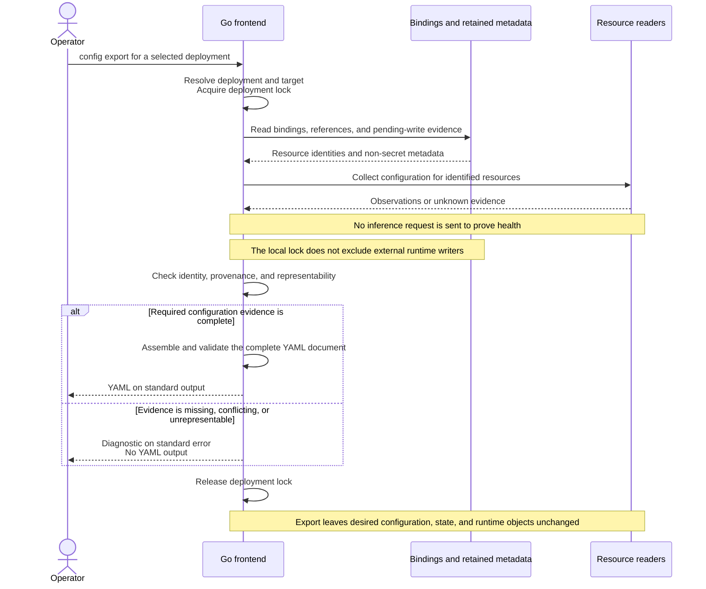

<!--
  SPDX-FileCopyrightText: Copyright (c) 2026 NVIDIA CORPORATION & AFFILIATES. All rights reserved.
  SPDX-License-Identifier: Apache-2.0
-->

# RFC: NemoClaw as a declarative deployment system

| Field | Value |
|---|---|
| Document | `draft-nemoclaw-desired-state-04` |
| Status | Draft for project discussion |
| Intended scope | NemoClaw architecture and product contract |
| Date | 2026-09-11 |
| Related issue | [NVIDIA/NemoClaw#10904](https://github.com/NVIDIA/NemoClaw/issues/10904) |
| Accountable maintainer | To be assigned in the project decision |
| Decision | Pending |

## Abstract

NemoClaw should become a declarative deployment system with one YAML contract and
one plan/apply engine. A Go frontend would translate configuration into OpenTofu
resources. A Go provider would manage those resources through OpenShell and
backend APIs. Shared resource readers would supply observations, with osquery
included where its queries reduce maintained code.

The proposed result is one workflow for creation, configuration changes, drift
repair, and recovery. Export captures the current configuration of managed
resources. Adoption depends on a working capability slice, qualified Windows,
macOS, and Linux arrangements, and a measured reduction in maintained complexity.

## Status of This Memo

This project RFC proposes an architecture and its acceptance requirements.
Appendix B records completed research tests and qualification status.

This RFC extends #10904 beyond onboarding to the core CLI and execution
architecture. Project adoption requires an `Accept` decision, placement,
accountable owner, and validation plan under the
[product scope gate](AGENTS.md#product-scope-gate).

## 1. Recommendation and Rationale

Adopt one desired-state contract and evaluate OpenTofu as its execution engine
through the capability slice in this RFC. Expand that implementation only after
the adoption gates in Section 9 pass.

Three arguments support this recommendation:

1. **One configuration path reduces product complexity.** Creation, intentional
   changes, and drift repair use the same document and resource operations.
2. **An existing engine reduces orchestration work.** OpenTofu supplies dependency
   execution and state machinery; NemoClaw supplies resource-specific behavior.
3. **Explicit authorities reduce reconstruction work.** YAML states intent,
   runtime APIs report observations, and state binds logical resources to objects.

The design succeeds only if these boundaries reduce total maintenance. Provider
code, SQL, packaging, recovery, tests, and compatibility work count toward the
result. A smaller command surface alone is insufficient.

### 1.1. Problem

Issue #10904 identifies overlapping menus, flags, environment variables, and
serving profiles as sources of precedence rules and duplicated validation.
This RFC extends its declarative onboarding approach to subsequent changes:

```text
Describe the deployment → inspect changes → apply → export
```

The compatibility assessment covers existing user outcomes and failure behavior.
Section 8 defines the requirements for migrating or retiring supported capabilities.

### 1.2. First Capability Slice

The first slice attaches to an existing OpenShell gateway and an available
inference service. It manages one deployment workspace, inference registration
and routing, and an OpenClaw sandbox with agent configuration. Gateway provisioning
and inference-server installation are prerequisites.

Success means creating a working agent, repeating apply without resource changes,
changing its inference model, recovering an interrupted operation, and exporting
configuration that can recreate equivalent managed behavior.

The next local experiment manages one Ollama container, its named model volume,
and a selected CPU model on an existing Linux Docker engine and network. It keeps
the gateway external. Its purpose is to test the resource boundary and recovery
rules before expanding the proposal. Section 5.3 records a failed repair case;
this experiment does not establish a supported managed-inference product.

Later slices can cover gateway provisioning, other inference backends, additional
agents, and other accepted configuration capabilities. Each needs a resource
contract and qualification evidence before inclusion.

The Spark experiment now tests gateway provisioning and a pinned inference recipe.
It adds a managed `service` alternative to a provider's external `endpoint` and
keeps provider references and routes unchanged. The service names a qualified
backend, immutable image and model, bounded serving settings, and memory policy.
The schema version resolves stable agent-image, Docker-runtime, and isolated-policy
defaults. It exposes no generic commands, shell hooks, or extra arguments.

Automatic adoption, pruning, arbitrary scripts, user-defined OpenTofu modules,
and a permanent NemoClaw daemon are outside the first slice.

## 2. Conventions and Terminology

Uppercase **MUST**, **MUST NOT**, **SHOULD**, and **MAY** use the BCP 14 meanings
in [RFC 2119] and [RFC 8174]. They mark observable compatibility and safety
requirements. Architectural methods described in ordinary prose are the proposed
implementation, subject to qualification.

| Term | Meaning |
|---|---|
| Deployment | Resources governed by a stable deployment UID and target binding |
| Desired configuration | Versioned, non-secret YAML describing requested behavior |
| Observation | A fact read from an identified resource or execution environment |
| Resource binding | A logical address associated with a physical resource identity |
| Managed resource | An object with established deployment ownership and mutation authority |
| Attached resource | A dependency used by the deployment but owned elsewhere |
| Unknown | A fact that could not be established; distinct from confirmed absence |
| Configured | The resource's declared properties have been established |
| Ready | Required activation and inference checks have passed |
| Converged | Managed resources are configured and the deployment is ready |

## 3. Public Contract

The proposed command surface is:

```sh
nemoclaw config plan < deployment.yaml
nemoclaw config apply < deployment.yaml
nemoclaw config export > deployment.yaml
```

`plan` previews changes. A later `apply` creates a fresh internal plan and executes
that checked plan. The first slice does not expose saved plans as a public artifact.
Execution options select a deployment or target; they do not override desired fields.
Ambiguous selection fails before mutation.

The schema defines supported fields, versioned defaults, and omission behavior.
Inputs MUST reject unknown fields, duplicate keys, unsupported versions,
unresolved references, and unsupported combinations before deployment mutation.
Reordering a collection does not change resource identity.

A configurator can generate YAML through the same schema. Logs, interactive agent
access, and diagnosis need documented homes before existing commands retire.

For valid input and successful observations, plan preview follows this sequence.



### 3.1. Apply and Removal

Apply reports the resource changes and expected interruption before execution.
It returns success only after configuration and readiness checks pass. An unchanged
plan still receives readiness checks; zero resource changes do not establish health.

Ordinary apply in the first slice MUST reject deletion, replacement, forgetting,
and unrequested import before resource mutation. Omitting a managed resource
rejects the whole apply; it does not delete the object or release its binding.
Section 4.2 defines the engine checks that enforce this behavior.

Later removal or replacement needs explicit intent, retention rules, and recovery
behavior. The first slice cannot repair a lost persistent resource by silently
creating an empty replacement.

The Spark extension permits one narrower replacement: an explicit change to the
inference service specification can replace its container after the independent
model volume's ownership and durable binding are confirmed. It retains that volume,
the gateway, and OpenShell identities. A tainted container under unchanged intent
does not authorize replacement. Removal, storage replacement, and gateway
replacement remain forbidden.

Apply builds its own plan under the deployment lock.
The sequence below shows successful resource operations; Section 5.4 defines recovery from operation failures.



### 3.2. Export

Export produces the current, representable configuration of one managed deployment.
Observable fields come from runtime APIs or configuration readers. Non-observable
fields, such as the source of a credential, come from retained references tied
to the same resource identity.

A difference from previously applied YAML does not prevent export. If an operator
changes the model on a managed route, export records the observed model. Export
itself does not change desired configuration, resource state, or runtime objects.
Applying the exported document is the explicit step that accepts it as intent.

Export holds the deployment lock while collecting bindings, retained references,
and configuration evidence. If a pending write leaves installed credential
provenance or another required configuration field uncertain, export fails without
YAML output. This lock does not prevent writes by external runtime clients.

Export MUST fail without YAML output when required configuration evidence is
missing, identities conflict, or runtime settings cannot be represented faithfully.
Export is limited to resources with established deployment bindings.

Readiness and configuration evidence are separate. A failed health probe alone
does not prevent export when the configuration can be established independently.
Export does not send an inference request to prove health. A field whose effective
value requires activation evidence remains unknown when that evidence is unavailable.

These distinctions do not require a second persistent lifecycle state machine.
The prototype records completed writes before probing readiness, then uses
established bindings and fresh configuration observations to authorize export.
An unavailable model-inventory API still prevents exporting managed Ollama:
knowing the container exists does not establish which model is installed.

The complete document is validated before output. YAML goes to standard output;
diagnostics go to standard error. Shell redirection can truncate the destination
before export starts, so this interface does not promise atomic file replacement.

With stable observations and unchanged secret references, applying exported YAML
to the original target plans no resource mutations. Accepting updated intent can
still update local metadata. Recreating on a fresh target requires explicit target
selection and separate state. If the gateway changes, the operator also changes
`spec.gateway.endpoint` and its authentication references in the document;
execution options do not override them. Export preserves logical identity and references,
not physical object IDs, conversations, caches, or application-data backups.

Export combines observed configuration with retained references before emitting a complete document.



### 3.3. Worked Example

This example illustrates the proposed schema for an OpenClaw deployment.
Section 6 defines credential references and installation versions.
The domains, model names, and image digest are placeholders for qualified artifacts.

```yaml
apiVersion: nemoclaw.nvidia.com/v1alpha1
kind: NemoClawConfig
metadata:
  name: assistant
  uid: 31bc9d7a-d174-4718-a3fd-57beec04a916
spec:
  gateway:
    management: external
    endpoint: https://gateway.example.net:8080
    credential:
      env: OPENSHELL_TOKEN
  inferenceProviders:
    - name: primary
      provider: openai
      endpoint: https://inference.example.net/v1
      credential:
        env: INFERENCE_API_KEY
        version: 1
  sandboxes:
    - name: assistant
      image:
        ref: registry.example.net/openclaw@sha256:aaaaaaaaaaaaaaaaaaaaaaaaaaaaaaaaaaaaaaaaaaaaaaaaaaaaaaaaaaaaaaaa
      runtime:
        provider: docker
      network:
        tier: isolated
      agents:
        - name: primary
          type: openclaw
          inference:
            routes:
              - name: primary
                providerRef: primary
                overrides:
                  model: model-a
```

The gateway authentication reference is for the client connection. The versioned
inference credential is installed into the managed provider registration. The
inference endpoint is reachable from the gateway's execution environment.

| Input or event | Planned changes | Result after apply |
|---|---|---|
| First apply of the document | Create workspace, provider registration, route, sandbox, and agent configuration | Agent completes the required inference check |
| Apply the same document again | No resource mutations | Readiness is checked again |
| Change `model-a` to `model-b` | Update the route, assuming both models satisfy the same agent contract | Sandbox identity and data remain unchanged |
| Change the key value and increase `credential.version` to `2` | Update credential registration | New credential is installed and inference checked |
| Operator changes the route to `model-c`, then exports | No mutation during export | YAML contains `model-c`; applying it accepts that intent |

Resource granularity follows independently committed operations. Agent
configuration belongs in a separate resource when its failure needs independent
recovery.

## 4. Architecture and Engine Contract

```text
Desired YAML
    |
    v
Go frontend: validate, resolve, compile, inspect plan
    |
    v
OpenTofu: refresh, plan, apply, resource state
    |
    v
Go provider: resource operations and typed readers
    +-- OpenShell API for OpenShell-owned resources
    +-- backend APIs for other managed resources
    +-- osquery where collection or queries reduce owned code
```

The frontend generates OpenTofu JSON configuration [TOFU-JSON]. Each independently
managed resource has a stable address, allowing OpenTofu to order its operations.

The Spark implementation uses two explicit graphs under one deployment lock:
runtime infrastructure, then OpenShell resources. The runtime graph owns the
gateway, retained model volume, and replaceable inference container. The second
graph owns the workspace, registration, route, and sandbox. Each graph gets its
own checked saved plan and state checkpoint. This is ordered convergence, with
partial completion retained across graphs; it is not a transaction.

On a first plan, an absent gateway makes the OpenShell graph explicitly deferred.
No backend is created to discover that graph. With established children and an
unavailable gateway, plan fails because their observations are unknown. Apply can
reconcile the runtime graph, wait for readiness, and then plan the OpenShell graph
from current observations. This fixed two-stage boundary adds orchestration, but
avoids a generic scheduler, targeted apply, or fabricated child observations.

For a sandbox managed by OpenShell, NemoClaw uses OpenShell's lifecycle API.
It does not also manage that sandbox's Docker or Podman container directly.
Direct backend handlers apply to separately owned resources, such as a
managed inference service.

### 4.1. Authority and State

| Information | Authority |
|---|---|
| Requested settings and defaults | Validated desired document |
| Observed configuration and lifecycle | Owning runtime API or qualified reader |
| Logical-to-physical bindings | OpenTofu state |
| Credential source and requested installation version | Desired document and retained non-secret metadata |
| Ambiguous operation identity and recovery evidence | Bounded operation record |

State is bound to the deployment UID and authenticated target identity, independently
of the YAML path. Endpoint text alone does not prove target identity. Missing state
MUST NOT authorize adoption. An operation record retains the operation ID, resource
address, intended change, and last confirmed outcome. Resource recovery handlers
use this record to reconcile interrupted mutations.

The first slice uses local state and one managing client per deployment. A local
lock covers preparation, planning, apply, export, and recovery metadata. Lock failure
stops mutation. OpenTofu backend locking protects state access, not arbitrary
writes by other runtime clients [TOFU-LOCK]. Shared state is later work.

### 4.2. OpenTofu Integration

The research baseline is OpenTofu 1.12.6. Releases pin and qualify an engine/provider
combination rather than assuming compatibility with all later releases.
The adapter uses documented `tofu show -json` output for plans and state inspection;
it does not parse or edit private state-file structure [TOFU-PLAN-JSON].

The initial adapter supports JSON format major version 1. It tolerates additive
minor-version fields but rejects unsupported major versions and missing required
action data. Engine actions are handled explicitly:

| Plan content | First-slice behavior |
|---|---|
| `no-op`, `create`, `update` | Permitted for declared managed resources, subject to resource checks |
| `read` | Permitted for declared data sources without resource mutation |
| `delete`, either replacement order, `forget` | Reject the whole ordinary apply |
| Import metadata or resource-address moves | Reject ordinary apply; only a qualified recovery or migration procedure can use them |
| Unknown action or incomplete required plan data | Reject the plan |

Checking for `delete` alone is insufficient. OpenTofu can forget a resource while
leaving the object alive, and `prevent_destroy` does not protect a resource block
removed from configuration. `destroy = false` also permits forgetting, so it does
not satisfy our binding-retention contract [TOFU-LIFECYCLE].

The checked saved plan is bound to the deployment, generated configuration, engine
bundle, and local state. Apply executes that artifact under the deployment lock.
Changed inputs or stale state require a new plan. Provider writes still need the
backend-specific checks in Section 5; a saved plan does not freeze runtime objects.

### 4.3. Distribution

The proposed bundle contains the Go CLI, OpenTofu, and one provider package for the
required resource types. When selected, osquery and its Go extension are private
helpers. Only the CLI needs a public PATH entry.

A private filesystem mirror, explicit CLI configuration, pinned selections, and
package checksums control provider installation [TOFU-INSTALL]. Helpers run by
absolute path. Unexpected providers or fallback downloads are rejected.
Immutable release files have a separate lifetime from writable deployment state.
The bundle manifest records versions, artifact identities, platforms, and notices.

## 5. Resources, Observations, and Recovery

Each resource contract specifies identity, managed fields, ownership, mutation
preconditions, readiness, retention, and recovery. The initial capability inventory
below identifies work to qualify, not guarantees supplied by every SDK method.

### 5.1. Resource Capabilities and Concurrency

The inspected OpenShell Go SDK revision was `d1155aa70042`.
Its route read returns a version; its route-write configuration exposes no expected
version. A separate read followed by a write therefore cannot establish an atomic
conditional update. The pinned provider-update path carries a resource version,
but server-side conflict behavior still needs a qualification test.

| Resource | Identity and proposed recovery basis | Conditional mutation | Readiness evidence |
|---|---|---|---|
| Workspace | Backend ID, deployment ownership, recorded create operation | Create-name conflict and recovery semantics need tests | Active workspace |
| Provider registration | Backend ID, ownership, operation record, acknowledged credential version | Qualify resource-version rejection and credential-update behavior | Required registration fields and credential slots exist |
| Inference route | Workspace identity, route name, observed version | Inspected SDK has no expected-version input; one writer required | Intended provider/model route established |
| Sandbox | Backend ID, ownership, operation record | Qualify create recovery; replacement is outside this slice | OpenShell lifecycle and required agent activation |
| Agent configuration, when separately managed | Sandbox ID and configuration revision | Qualify atomic file/API updates and activation | Effective settings loaded by the intended process |

Mutations MUST enforce established ownership and the preconditions that the
backend can support. A conditional-write conflict stops that operation and requires
replanning. Observed revisions are included in diagnostics where available.

For an API without conditional writes, the proposed first-slice constraint is
exclusive management of that deployment's fields during apply. The provider reads
before writing and verifies afterward, but those checks cannot exclude every race.
An observed conflict stops apply; this RFC makes no stronger concurrency guarantee.
If exclusive management is unacceptable for a resource, conditional-write support
becomes a prerequisite for including it.

### 5.2. Observation and the osquery Decision

Readers return typed configuration facts with target identity and bounded calls.
Unknown observations MUST remain distinct from confirmed absence. Failed access,
timeouts, parse errors, or unavailable tables cannot authorize mutation.
Activation checks establish that the intended process loaded the requested configuration.

The proposed osquery extension exposes resource concepts, such as sandboxes,
policies, and routes. Resource readers parse configuration files directly where needed.
The extension mechanism supports additional tables [OSQUERY-EXT].

An isolated osquery 5.23.1 test distinguished a table error from confirmed absence
(Appendix B). Consumers discard output on a failed invocation; valid JSON alone
does not prove observation success. Joins across live tables are not atomic snapshots.

Built-in tables need their own failure qualification. With osquery 5.23.1,
`docker_containers` returned an empty array and exit code 0 for an unavailable
Docker socket, just as it did for a successful query matching no containers.
It therefore cannot supply confirmed absence for reconciliation by itself.
The Ollama experiment shares direct typed Docker and model-API readers between
refresh and export. Existing OpenShell observations retain their custom tables
with explicit `present`, `absent`, and `failed` results. A future Docker table
would need to preserve the direct reader's failure and identity semantics.

The Spark resources reuse this direct Docker boundary for container, bridge,
volume, and offline artifact inspection. Capacity checks use local filesystem
capacity, `/proc/meminfo`, and bounded NVIDIA GPU inventory calls. The resident
watchdog reads host memory every second; starting an osquery process for each
sample would add latency and another failure boundary without removing a collector.
An added table remains an option for independent inventory consumers, rather
than a prerequisite for these safety checks. Mutations and active probes stay direct.

Before bundling osquery, compare the same readers consumed directly and through
custom tables. Measure collection code removed, useful joins, startup latency,
memory, binary size, tests, and release maintenance. Retain osquery where that
comparison shows a benefit. Provider operations and osquery tables share each
resource's collector.

### 5.3. Creation, Configuration, and Readiness

OpenTofu can mark a resource tainted when provider creation returns an error after
returning state. The next plan can require replacement [PROVIDER-CREATE]. Appendix B
records this result with OpenTofu 1.12.6. Blanket replacement rejection then blocks
a naive retry, even if the object exists.

The proposed resource boundary separates durable configuration from transient
readiness. A provider completes `Create` once identity and all properties declared
by that resource are established. It does not report creation success while those
properties are incomplete. Independently fallible configuration uses a separate
resource when necessary; OpenTofu retains the dependency graph.

A readiness timeout after configuration is recorded produces a failed deployment
result while preserving the resource binding. Reapplying re-observes configuration
and repeats bounded readiness checks. It does not force a replacement to rerun a
probe. Dependencies that require readiness wait before their own mutation.

Resource separation also needs a repair test. In the Ollama experiment, a service
resource owns the container and volume, and a model resource queries its HTTP API.
The model's implicit dependency orders initial creation correctly. When the service
is stopped, however, model refresh fails before OpenTofu can plan the service's
restart. Ordinary plan and apply stop with a diagnostic and retain bindings.
The live test requires an explicit runtime restart to continue, after which apply
is a no-op. Dependency ordering alone does not solve this failure.

Before accepting this resource split, test a boundary that can repair the parent
without inventing child observations. Candidates include one service/model resource
with qualified in-place reconciliation, or an engine with explicit deferred
observations. Any extra staging must justify its orchestration cost. Hidden writes
during refresh, stale inventory reported as current, and unreviewed targeted apply
are not acceptable substitutes.

The Spark experiment chooses the fixed staging described in Section 4. Container
configuration and named storage are separate resources; download, preparation,
and inference loading run inside the pinned service artifact. Their progress does
not depend on an HTTP inventory endpoint that disappears when inference stops.
The container's running flag is computed and becomes unknown in a restart plan.
An immediate process exit can therefore record the configured container's identity
without contradicting a promised `running = true` value and tainting the resource.
Deployment readiness still fails until loading and an actual agent reply succeed.

Snapshot files have pinned sizes and hashes, resumable range downloads, and atomic
completion receipts. Packed PLE preparation uses a staging directory, verifies
every row against the pinned model, and publishes an atomic completion record.
Its key includes the model manifest, recipe, preparation tool, and verifier source
revisions. Reapply checks verified receipts and file identity without downloading
or preparing again. Established conflicting files are retained for inspection.
The artifact includes the recipe patches, original and patched source notices,
preparation tools, and supervisor source; mutable tags do not select its contents.

Memory protection belongs to the runtime artifact's supervisor, which remains
active after the CLI exits. It checks available host memory independently of
readiness polling and terminates the inference process group after consecutive
low-memory samples or failed observation. Docker has automatic restart disabled.
Explicit apply restarts the same stopped container after capacity checks; it does
not create a restart loop. Startup capacity uses reclaimable available memory,
since downloading weights can fill page cache while leaving ample safe headroom.
This experiment makes no host kernel, driver, or memory-tuning changes.

The earlier Ollama experiment treats downloaded models as reproducible cache contents: changing
the selected tag pulls the new model and retains previous weights. It records the
observed digest but does not pin model contents in desired YAML. The named volume
is retained; loss of a bound container or volume stops ordinary apply. Docker's
engine ID, container ID, volume creation timestamp, and retained operation labels
provide the current checks. The timestamp is not a native volume UUID, and this
does not qualify general persistent application-data recovery.

### 5.4. Recovery Cases

| Failure boundary | Recovery behavior |
|---|---|
| Create request outcome unknown, no binding recorded | Reconcile the recorded operation against the owning API before any repeated create |
| Object exists and matches the interrupted operation | Recover its binding through a qualified engine operation, then inspect configuration |
| Configuration incomplete | Retain identity and evidence; resume only supported in-place steps |
| Configuration established, readiness failed | Keep the binding; rerun readiness checks without replacement |
| Provider error left a tainted binding | Inspect live configuration and taint cause before changing engine metadata |
| Multiple matches, foreign identity, or inaccessible backend | Stop with unresolved evidence; do not guess or repeat creation |

Ambiguous creates require backend idempotency or a verifiable binding between the
recorded operation and the object. A name or label alone does not authorize adoption.
Retries require a narrow transient condition, an attempt bound, and evidence that
repeating the operation is safe. Partial completion is reported without promising
transactional rollback across backends.

For a tainted binding, the proposed recovery procedure clears taint only after
proving ownership, physical identity, and completion of the retained planned
properties. If those properties remain incomplete, the resource needs a qualified
in-place recovery path or stops for inspection. The system MUST NOT blindly untaint,
import, discard state, or replace objects to make a retry proceed.

Recovery metadata changes use supported engine interfaces under the deployment
lock. They are limited to recorded interrupted operations. Missing-state adoption
and user-requested imports remain outside ordinary apply. Qualification must cover
both lost responses and provider errors; neither is established by the other.

## 6. Credentials and Security Considerations

Credentials remain references in YAML. Values MUST NOT appear in generated resource
configuration, SQL results, plans, state, operation records, arguments, logs, or
export.

### 6.1. Proposed Credential Transport

For the first slice, resolve environment-variable references inside the provider.
Pass only reference names and non-secret installation versions as resource fields.

The caller, CLI, OpenTofu child, and provider form the trusted process path through
which allowlisted credential variables can pass. Child environments include only
required values and execution settings. Observation helpers receive only the
authentication needed for their target, never unrelated inference credentials.
The original environment remains owned by the caller; child copies last for the
operation. No credential file is generated by this resolver.

### 6.2. Installation and Rotation

A credential installed into a managed runtime carries `credential.env` and a
positive `credential.version`. Newly authored configuration starts at version `1`.
A fresh target accepts any positive version preserved by export. Rotation on an
existing target increases its acknowledged version and resolves the value again.
A reference-name change also requires a version increase. Connection-only credentials,
such as gateway login, are resolved for each invocation and do not need an installation version.

The provider records an acknowledged installation version only after confirming
the credential write. An ambiguous write remains pending; the next apply reconciles
it before advancing the version. Where the backend cannot report the installed
version, the resource contract needs a safe retry basis or stops for inspection.
A subsequent readiness failure does not erase an acknowledged installation.

Changing the value behind the same reference without changing its version does
not trigger rotation. Credential metadata retains only the source reference,
installation version, and evidence needed to reconcile a pending write.
Export preserves the acknowledged reference and version; it does not prove that
the caller's present value equals the installed key.

The destination is the runtime's authenticated credential API. The runtime retains
the value for the registration's lifetime, restricted to its intended principal.
Rotation replaces the registration's value; source-key revocation remains the
operator's responsibility. Failed apply reports retained registrations without
values. Explicit retirement removes the registration under the later removal
contract; ordinary apply does not delete it implicitly.

### 6.3. Remaining Security Boundaries

Each mutating connection authenticates its target and checks ownership. The design
preserves URL and SSRF controls, image identity, network policy, and filesystem
restrictions. YAML values are escaped when compiled into OpenTofu expressions;
the schema cannot introduce provisioners or executable modules.

State directories and extension sockets or named pipes restrict access to the
operating user. Container-socket access is privileged and belongs in the qualified
trust boundary. Redacted diagnostics preserve useful failure classification without
credential contents. Appendix A includes credential and artifact checks.

## 7. Platform Targets

The matrix below records upstream documentation checked on **2026-09-11** and the
proposed qualification targets. No row is a claim that the new NemoClaw implementation
has passed qualification. OpenShell lists Linux amd64/arm64 and macOS Apple silicon
with Docker Desktop as supported, and Windows through WSL2 with Docker Desktop as
experimental [OPENSHELL-PLATFORMS].

| Native client target | Gateway location | Container runtime and workload boundary | Initial inference location | Qualification status |
|---|---|---|---|---|
| Linux amd64/arm64 | Same Linux host | Docker Engine | Remote service reachable from gateway | Required target; pending |
| Linux amd64/arm64 | Same Linux host | Rootless Podman 5.x | Remote service reachable from gateway | Required Podman target; pending |
| macOS arm64 | Mac host | Docker Desktop Linux guest | Remote service reachable from gateway | Required target; pending |
| macOS arm64 | Mac host | Podman machine Linux guest | Remote service reachable from gateway | Documented driver path; separate qualification pending |
| Windows amd64 | WSL2 Linux environment | Docker Desktop integration | Remote service reachable from gateway | Required Windows target; upstream experimental, qualification pending |
| Windows amd64 | WSL2/Linux VM | Podman in the Linux environment | Remote service reachable from gateway | Candidate only; topology and qualification unresolved |
| Linux, macOS, Windows clients above | Separate qualified Linux host | Docker or Podman on gateway host | Remote service reachable from gateway | API-client portability target; pending |

OpenShell's Podman driver documents Podman 5.x, cgroups v2, rootless networking,
and a responsive API socket. macOS Podman-machine networking has specific host
address and callback requirements [OPENSHELL-DRIVERS]. Docker qualification does
not establish Podman qualification.

The first slice attaches to inference. Native host inference, such as Ollama on
Windows with a sandbox in WSL2, adds a separate reachability and authentication
dimension. It is later qualification work. Windows arm64 and Intel macOS also
need explicit helper-artifact and runtime decisions before inclusion.

A host osquery process observes that host, not automatically its Linux guest.
Cross-boundary collection uses the owning API or a collector in the relevant
environment. Qualification MUST execute the complete workflow in every claimed
arrangement; cross-compilation alone is insufficient. If a required platform
cannot pass, maintainers must explicitly change the adoption scope.

## 8. Compatibility and Transition

The first implementation covers the capability slice in Section 1.2.
Before adoption, it uses a separate installation and deployment state.
Migration of existing deployments requires the capability assessment below.

Before adoption, maintainers classify supported capabilities as preserved,
migrated, or explicitly retired. Each retirement names a replacement or accepted
removal and a release boundary. A temporary legacy-input translator produces the
same desired document, uses the same engine, and has a removal target.

Schema versions, provider-state versions, and backend API capabilities evolve
separately. Unsupported upgrades MUST stop before mutation. State backup and
restoration are tested before introducing migrations. Existing objects are not
imported based on names, and old binaries cannot interpret newer state by guessing.

## 9. Adoption Gates

The decision has three gates:

1. **Behavior:** The full capability slice and failure scenarios in Appendix A pass.
2. **Compatibility:** Required platform arrangements, security boundaries, and
   migration or retirement decisions are complete.
3. **Maintenance:** An equivalent-capability comparison shows fewer independently
   maintained workflows and a net reduction in owned production logic.

The comparison includes YAML resolution, provider code, SQL, recovery, packaging,
and tests. Dependency code is excluded from owned-code counts, but dependency
release and security maintenance costs are reported. The osquery comparison is
part of this assessment, not an assumed benefit.

Appendix B records the engine and collector behavior tested so far.
The deployment, platform, and maintenance gates remain open until their evidence
is complete. If a gate fails, revise or decline the proposal before expanding it.

## 10. Alternatives Considered

| Alternative | Benefit | Tradeoff |
|---|---|---|
| Add YAML input to the existing onboarding and lifecycle commands | Incremental delivery and established compatibility | Separate command workflows still need maintenance unless their execution paths are consolidated |
| Build a Go planner | Full control over semantics | NemoClaw owns graph execution and state mechanics |
| Represent a deployment as one OpenTofu resource | Small initial provider schema | The provider must order and recover its internal operations because OpenTofu sees only the deployment as a whole |
| Use direct readers throughout | Fewer bundled helpers | Preferred wherever osquery adds no measured collection or query benefit |

## 11. Open Project Decisions

Project acceptance requires these decisions:

- An accountable maintainer for schema, provider, dependencies, and qualification.
- Accepted placement and the lifecycle of the experimental implementation.
- The final schema subset, target identity, and deployment-selection rules.
- Confirmation of required platform rows and treatment of APIs without conditional writes.
- Named compatibility releases and a measured baseline for the maintenance gate.

## 12. IANA Considerations

This proposal requests no IANA allocations or registry changes.

## 13. References

### 13.1. Normative References

- **RFC 2119:** [Key words for use in RFCs to Indicate Requirement Levels](https://www.rfc-editor.org/info/rfc2119/).
- **RFC 8174:** [Ambiguity of Uppercase vs Lowercase in RFC 2119 Key Words](https://www.rfc-editor.org/info/rfc8174/).
- [NemoClaw product scope gate](AGENTS.md#product-scope-gate).

### 13.2. Informative References

- [RFC 7322: RFC Style Guide](https://www.rfc-editor.org/info/rfc7322/).
- [Issue #10904: Replace onboarding inputs with one declarative configuration](https://github.com/NVIDIA/NemoClaw/issues/10904).
- **TOFU-JSON:** [OpenTofu JSON Configuration Syntax](https://opentofu.org/docs/language/syntax/json/).
- **TOFU-PLAN-JSON:** [OpenTofu JSON Output Format](https://opentofu.org/docs/internals/json-format/).
- **TOFU-LIFECYCLE:** [OpenTofu 1.12 Resource Behavior](https://opentofu.org/docs/v1.12/language/resources/behavior/).
- **TOFU-LOCK:** [OpenTofu State Locking](https://opentofu.org/docs/language/state/locking/).
- **TOFU-INSTALL:** [OpenTofu CLI Configuration File](https://opentofu.org/docs/cli/config/config-file/).
- **PROVIDER-CREATE:** [Provider Framework: Create Resources](https://developer.hashicorp.com/terraform/plugin/framework/resources/create).
- **OSQUERY-EXT:** [Using osquery Extensions](https://osquery.readthedocs.io/en/stable/deployment/extensions/).
- **OPENSHELL-PLATFORMS:** [OpenShell Support Matrix](https://docs.nvidia.com/openshell/latest/reference/support-matrix).
- **OPENSHELL-DRIVERS:** [OpenShell Sandbox Compute Drivers](https://docs.nvidia.com/openshell/latest/reference/sandbox-compute-drivers).

## Appendix A. Qualification Plan

Each result identifies the commit, dependency bundle, execution arrangement,
scenario, and retained redacted evidence. Use deterministic tests for schema,
planning, comparison, and failure classification. Exercise real executables for
process contracts and real runtimes for isolation, activation, and inference.

| Scenario | Required evidence |
|---|---|
| Create from YAML | Working OpenClaw agent using the selected inference path |
| Apply unchanged YAML | No resource mutations; identities and persistent data retained; readiness checked |
| Change inference | Requested model usable without sandbox replacement |
| Lose the create response before state persistence | One owned object recovered through recorded operation identity |
| Fail configuration after allocation | Identity retained; qualified in-place recovery or explicit unresolved result |
| Fail readiness after configuration | Failed deployment result; subsequent apply checks readiness without replacement |
| Return a provider error with resource state | Taint identified; no blind replacement or metadata reset |
| Fail observation or return an empty result | Error distinguished from confirmed absence; no unsafe mutation |
| Omit a managed resource or plan `forget` | Entire ordinary apply rejected; binding retained |
| Unsupported plan format, action, import, or move | Rejected before mutation |
| Change runtime model, then export and apply | Observed model exported; no resource mutations when accepting it as intent |
| Export with missing configuration evidence | Failure without YAML output |
| Export during local apply or with an unresolved credential write | Lock excludes concurrent apply; uncertain provenance produces no YAML |
| Export while unhealthy but configuration is known | Configuration exported without claiming readiness |
| Export after credential rotation and recreate on a fresh target | Exported version greater than 1 accepted; equivalent managed behavior with separate physical bindings |
| Rotate a credential with a version increase | New installation acknowledged; no secret values persisted |
| Change a secret without increasing its version | No implicit rotation; explicit version rule documented |
| Lose a credential-write response | Pending outcome reconciled or stopped; no unsupported retry |
| Compete for local state or change a conditional-write revision | Second writer or stale mutation rejected |
| Modify through an API without conditional writes | Read/write race limits recorded; no atomicity claim |
| Change ownership or physical identity | Mutation denied with a bounded diagnostic |
| Inspect arguments, output, state, plans, and recovery artifacts | Credential values absent |
| Compare direct readers and osquery | Equivalent facts/errors with measured code, latency, memory, and packaging costs |
| Execute every claimed platform row | Complete workflow tested in the stated client/gateway/runtime arrangement |

Before product adoption, record the before/after inventory of public inputs,
execution paths, configuration representations, production logic, SQL, packaging,
and tests. Name remaining resource-capability gaps rather than inferring them
from a passing test on another resource or platform.

## Appendix B. Research Evidence

The following experiments ran on 2026-09-11. Fixture and live runtime results are
identified separately. Full deployment and platform qualification remain pending.

| Experiment | Setup | Observed result | Limit |
|---|---|---|---|
| Creation error and taint | OpenTofu 1.12.6; Provider Framework 1.19.0; Linux arm64; fixture returns a known ID and error | Apply exited 1; subsequent plan requested `delete, create` with `replace_because_tainted`; adding `prevent_destroy` blocked planning | Establishes engine behavior, not a production recovery implementation |
| Failed and absent observations | osquery 5.23.1; osquery-go revision `eb39ad3443df`; Linux arm64; custom table fixtures | Table error exited 1 with diagnostic; absence exited 0 and `count(*)` returned 0 | Establishes these query paths, not all extensions, joins, or operating systems |
| Built-in Docker observation failure | osquery 5.23.1; Linux arm64; live Docker socket versus nonexistent socket | Valid socket returned a running container; nonexistent socket returned `[]` with exit 0 | Built-in empty output cannot prove absence; full collector cost comparison remains open |
| Managed inference lifecycle | Linux arm64; Docker 29.2.1; OpenShell 0.0.116; pinned Ollama 0.34.0 and OpenClaw 2026.9.4 images | Six resources created; repeat apply had no changes; model switch retained the sandbox and previous model; export recreated a second deployment with working inference | One native Docker topology, CPU models, and fresh volumes; no Podman/macOS/Windows runtime qualification |
| Stopped inference parent | Same live deployment; stop the owned Ollama container before planning | Model inventory failed, blocking the restart plan; state stayed unchanged; explicit runtime start restored a no-op apply | Current service/model split fails automatic repair; no product restart workaround added |
| Interrupted model installation | HTTP fixture; partial pull stream and cancellation during streaming | Failed operation did not report a model or retry the mutation; explicit reapply resumed and subsequent ensure had no effects | Reader boundary only; engine-level interruption during a real download still needs qualification |
| Export after failed inference | Real OpenTofu/provider/osquery processes; OpenShell gRPC fixture | Failed probe retained four configured bindings; export succeeded; reapply created no duplicate resources | Existing sandbox Create still performs readiness checks; provider-error taint recovery remains open |

Reproduce the first experiment with a provider whose `Create` records a local
fixture object, returns its known identity in state, and adds an error diagnostic.
Plan again, then repeat planning with deletion protection. Reproduce the second
with one table returning an error and another returning an empty successful result;
query each with `count(*)` and inspect both exit status and output.

The managed-inference harness and setup are in [LOCAL_TEST.md](LOCAL_TEST.md).
Current checks and redacted live artifact references are in
[VALIDATION.md](VALIDATION.md). This remains a prototype: documented state
inspection, the complete plan-action allowlist, credential installation versions,
and qualified taint recovery in this RFC are still implementation gaps.

SDK observations in Section 5 apply to Go SDK revision `d1155aa70042`.
Platform observations in Section 7 refer to the linked upstream documentation
as checked on the stated date.

## Appendix C. Project Decision Record

| Field | Decision record |
|---|---|
| Outcome | Pending: Accept / Request changes / Defer / Decline |
| Reason | Pending |
| Placement | Proposed: experimental implementation, then core after adoption gates |
| Accountable maintainer | Pending |
| Accepted capability boundary | Pending |
| Validation plan | Section 9 and Appendix A, with named platforms and evidence links |
| Compatibility and removal boundary | Pending |
| Decision date and discussion link | Pending |

[RFC 2119]: https://www.rfc-editor.org/info/rfc2119/
[RFC 8174]: https://www.rfc-editor.org/info/rfc8174/
[TOFU-JSON]: https://opentofu.org/docs/language/syntax/json/
[TOFU-PLAN-JSON]: https://opentofu.org/docs/internals/json-format/
[TOFU-LIFECYCLE]: https://opentofu.org/docs/v1.12/language/resources/behavior/
[TOFU-LOCK]: https://opentofu.org/docs/language/state/locking/
[TOFU-INSTALL]: https://opentofu.org/docs/cli/config/config-file/
[PROVIDER-CREATE]: https://developer.hashicorp.com/terraform/plugin/framework/resources/create
[OSQUERY-EXT]: https://osquery.readthedocs.io/en/stable/deployment/extensions/
[OPENSHELL-PLATFORMS]: https://docs.nvidia.com/openshell/latest/reference/support-matrix
[OPENSHELL-DRIVERS]: https://docs.nvidia.com/openshell/latest/reference/sandbox-compute-drivers
