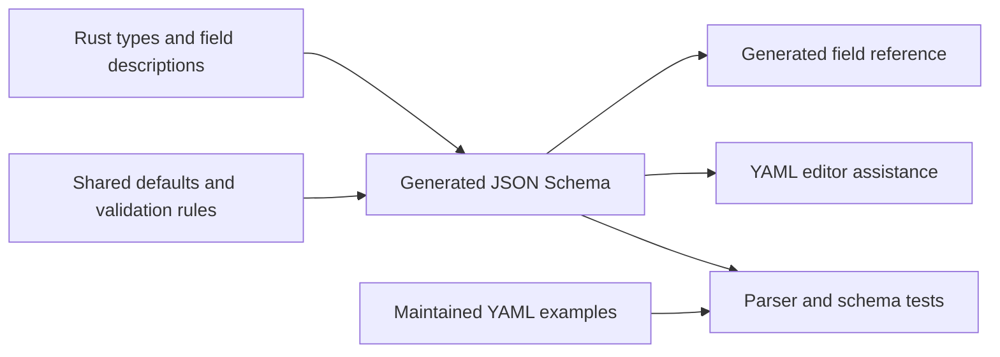

<!-- SPDX-FileCopyrightText: Copyright (c) 2026 NVIDIA CORPORATION & AFFILIATES. All rights reserved. -->
<!-- SPDX-License-Identifier: Apache-2.0 -->

# Maintain the Configuration Schema

The [YAML field reference](reference/configuration.md) and [JSON Schema](../schemas/nemoclaw-v1alpha1.schema.json) come from the SDK's configuration types and validation constraints.
Edit their Rust sources, then regenerate both artifacts.
CI rejects stale output.



## Change a Field or Rule

Complete the [build prerequisites](build.md).
From the repository root:

1. Add a parser/schema test for the accepted or rejected input in [config_schema.rs](../crates/nemoclaw-sdk/tests/config_schema.rs).
2. Change the [configuration types](../crates/nemoclaw-sdk/src/config/types.rs), [inline recipe types](../crates/nemoclaw-sdk/src/recipes/inline.rs), or their shared constraints.
3. Describe the field beside its Rust declaration, including units and conditional behavior.
4. If needed, update the [conditional schema rules](../crates/nemoclaw-sdk/src/config/schema/validation.rs).
5. Regenerate the artifacts:

```sh
cargo run --locked -p nemoclaw-build -- schema
```

The command replaces `schemas/nemoclaw-v1alpha1.schema.json` and `docs/reference/configuration.md` from the compiled SDK.
It contacts no deployment services and creates no runtime resources.
Review both generated diffs with the source change.
Generation fails when a public field or object has no description.

Run the focused tests and freshness check:

```sh
cargo test --locked -p nemoclaw-sdk --test config_input --test config_schema
cargo test --locked -p nemoclaw-build --test schema --lib
cargo run --locked -p nemoclaw-build -- schema --check
```

The freshness check exits nonzero if an artifact is missing or differs from the generated bytes.
It does not rewrite files.
Regenerate after correcting the source, then rerun the check and the [repository checks](testing.md).

Keep schema changes, descriptions, examples, tests, and regenerated files in the same commit.

## Preserve the Input Contract

Schemars derives names, types, and unknown-field rejection from Serde declarations.
Schema annotations restore required fields that the parser validates after deserialization.
They also distinguish an omitted option from an explicit null value.
The Pi metadata object is the one location that accepts nested nulls.

Defaults come from SDK normalization, which can replace an omitted value, empty string, or zero where documented.
A JSON Schema `default` is an annotation; validation does not insert it.
See [JSON Schema annotations](https://json-schema.org/understanding-json-schema/reference/annotations).

Use shared constants when the same choice, bound, or default appears in runtime and schema validation.
Keep conditional schema rules beside their tests.
For a rule that the schema cannot express, document the parser check in the generated reference and test that distinction.

`Document::parse` remains authoritative for YAML syntax, cross-field comparisons, and transport policy.
Schema validation does not establish image availability, host capacity, credential access, ownership, or inference readiness.
The [reference's validation limits](reference/configuration.md#validation-beyond-the-schema) list those boundaries.

## Keep Generation Reproducible

The generator selects JSON Schema Draft 2020-12 explicitly, sorts object keys, and writes LF-terminated files.
Schemars and the test validator have fixed versions in [Cargo.toml](../Cargo.toml), with resolved dependencies in [Cargo.lock](../Cargo.lock).
Review generated changes when updating those dependencies.

The schema's API version identifies the document format; experimental revisions can change its accepted fields without changing that version.
Use a schema from the same source revision as the SDK or CLI you run.
