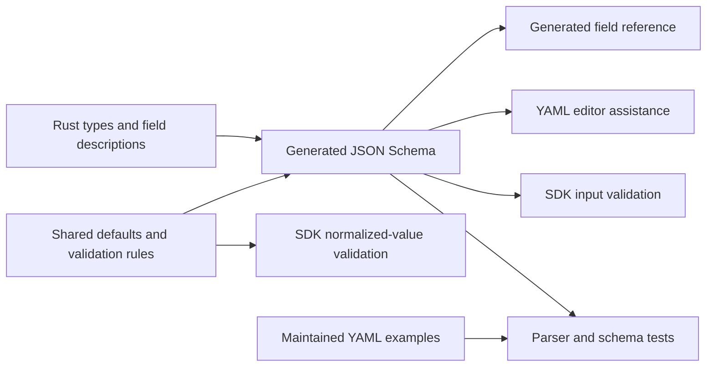

<!-- SPDX-FileCopyrightText: Copyright (c) 2026 NVIDIA CORPORATION & AFFILIATES. All rights reserved. -->
<!-- SPDX-License-Identifier: Apache-2.0 -->

# Maintain the Configuration Schema

The [YAML field reference](reference/configuration.md) and [JSON Schema](../schemas/nemoclaw-v1alpha1.schema.json) come from the SDK's configuration types and validation constraints.
Edit their Rust sources, then regenerate both artifacts.
CI rejects stale output.

For editing a deployment, use [editor schema assistance](usage.md#editor-schema-assistance).



## Change a Field or Rule

Complete the [build prerequisites](build.md).
From the repository root:

1. Add a parser/schema test for the accepted or rejected input in [config_schema.rs](../crates/nemoclaw-sdk/tests/config_schema.rs).
2. Change the [configuration types](../crates/nemoclaw-sdk/src/config/types.rs), [service configuration types](../crates/nemoclaw-sdk/src/services/installers/vllm/config.rs), [inline recipe types](../crates/nemoclaw-sdk/src/services/installers/vllm/recipes/inline.rs), or their shared constraints.
3. Describe the field beside its Rust declaration, including units and conditional behavior.
4. If needed, update the [conditional schema rules](../crates/nemoclaw-sdk/src/config/schema/validation.rs).
5. Regenerate the artifacts:

```sh
cargo run --locked -p nemoclaw-build -- schema
```

The command replaces `schemas/nemoclaw-v1alpha1.schema.json` and `docs/reference/configuration.md` from the compiled SDK.
It contacts no deployment services and creates no runtime resources.
Review both generated diffs with the source change.
Generation fails when a public field or object has no description.

Run the focused tests and freshness check:

```sh
cargo test --locked -p nemoclaw-sdk --test config_input --test config_schema --test config_validation
cargo test --locked -p nemoclaw-build --test schema --lib
cargo run --locked -p nemoclaw-build -- schema --check
```

The freshness check exits nonzero if an artifact is missing or differs from the generated bytes.
It does not rewrite files.
Regenerate after correcting the source, then rerun the check and the [repository checks](testing.md).

Keep schema changes, descriptions, examples, tests, and regenerated files in the same commit.

## Preserve the Input Contract

Reusable application objects follow the [definitions and references contract](configuration-references.md).
Keep its coverage table accurate when adding a family or changing supported scopes.

Schemars derives names, types, and unknown-field rejection from Serde declarations.
Schema annotations restore required fields that Serde otherwise defaults during deserialization.
They also distinguish an omitted option from an explicit null value.
Pi metadata and the opaque `harness.settings` object accept nested nulls.
Fabric owns validation of adapter-specific settings against its selected descriptor; the SDK validates the enclosing configuration object.

Defaults come from SDK normalization, which can replace an omitted value, empty string, or zero where documented.
A JSON Schema `default` is an annotation; validation does not insert it.
See [JSON Schema annotations](https://json-schema.org/understanding-json-schema/reference/annotations).

The SDK validates authored input against the compiled schema before deserialization and defaulting.
`Document::validate` checks directly constructed Rust documents against a normalized form of the same contract before checking semantics.
The normalized form rejects unresolved empty-string and zero defaults, including fields that serialization would otherwise omit.
Zero remains valid where it represents an effective value, such as KV-cache allocation with GPU utilization.
Standalone service, harness-option, and policy validators use the same schema definitions.
Validators are cached in memory and use the compiled SDK contract; deployment validation does not read the checked-in schema or fetch remote schemas.

Put field shapes, scalar bounds, allowed values, and local conditional requirements in schema annotations or constraints.
Share constants with normalization when a bound or default is also needed there.
Keep reference resolution, uniqueness by name, compatibility of resolved selections, comparisons between values, UTF-8 byte limits, and transport policy in Rust.
Do not approximate reference resolution with schema conditions for selected declaration layouts.
The pinned OpenShell validator continues to own its policy semantics.
For a semantic check outside the schema, document the distinction in the generated reference and test both acceptance boundaries.

`Document::parse` owns YAML syntax restrictions and invokes both validation stages.
Schema diagnostics identify trusted contract paths and constraints without echoing input values, unknown properties, or user-supplied map keys.
Schema validation does not establish image availability, host capacity, credential access, ownership, or inference readiness.
The [reference's validation limits](reference/configuration.md#validation-beyond-the-schema) list those boundaries.

## Add a Reusable Configuration Family

Follow the [definitions and references contract](configuration-references.md).
Specify the definition collection, consumer, cardinality, visible scopes, and runtime identity before adding fields.
Use the same typed definition and resolved behavior for inline and reference forms.
Test missing and conflicting selections, scope collisions, unused definitions, and export/reapply.
Add the family to the authoring guide's coverage table only when its runtime behavior is implemented.

## Keep Generation Reproducible

The generator selects JSON Schema Draft 2020-12 explicitly, sorts object keys, and writes LF-terminated files.
Schemars and the runtime validator have fixed versions in [Cargo.toml](../Cargo.toml), with resolved dependencies in [Cargo.lock](../Cargo.lock).
Review generated changes when updating those dependencies.

The schema's API version identifies the document format; accepted fields can change between source revisions without changing that version.
Use a schema from the same source revision as the SDK or CLI you run.
Native bundles carry their matching schema at `schemas/nemoclaw-v1alpha1.schema.json`, covered by the bundle manifest's hash.
The builder generates it from the compiled SDK and checks its source fingerprint before assembling CLI and provider binaries.
See [bundle construction](build.md#build-a-native-bundle) for rebuild and verification behavior.
