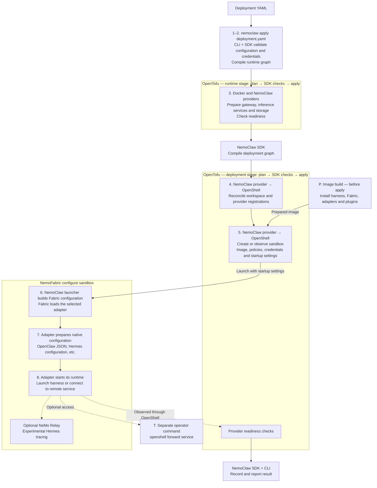

<!-- SPDX-FileCopyrightText: Copyright (c) 2026 NVIDIA CORPORATION & AFFILIATES. All rights reserved. -->
<!-- SPDX-License-Identifier: Apache-2.0 -->

# Apply Flow

`nemoclaw apply deployment.yaml` validates desired state, reconciles infrastructure through OpenTofu, and checks the resulting deployment.
The diagram shows the main managed-deployment path and the configuration handoff to the agent harness.
Use the [architecture guide](architecture.md) for ownership, resource lifetimes, and recovery rules.

## Plan and Apply

Each OpenTofu stage follows **plan → SDK checks → apply**.
OpenTofu compares the configuration with observed resources, the SDK checks the proposed actions, and providers execute the accepted plan.
Independent resources can reconcile concurrently; the numbered stages summarize dependencies rather than individual callbacks.

Running `nemoclaw plan deployment.yaml` first is optional.
That command previews changes without changing runtime resources, although it can write local intent and plan files.
On a fresh managed deployment, planning OpenShell resources can be deferred until the gateway exists.
`nemoclaw apply` generates and checks fresh plans itself.
See the [CLI reference](../reference/cli.md) for command options.

## Component Flow

The “NemoFabric configure sandbox” group runs inside the OpenShell sandbox.
NemoClaw prepares Fabric's input, and Fabric delegates harness setup to the selected adapter.
OpenShell owns sandbox creation and policy enforcement.

## Stages

| Stage | What happens |
|---|---|
| **P. Image preparation** | The image build installs the harness, Fabric, adapters, and packaged native plugins, including OpenClaw Brave and Tavily. Apply uses the prepared image's immutable digest. |
| **1–2. Validate and compile** | The CLI acquires required credential values. The SDK validates configuration, locks deployment state, checks identity and recovery constraints, and compiles the runtime graph when required. |
| **3. Runtime prerequisites** | Providers reconcile the declared gateway, inference services, storage, and networks. Provider data sources check gateway compatibility and service readiness before the SDK proceeds. |
| **Deployment compilation** | After the runtime stage completes, the SDK compiles the OpenShell resource dependencies, sandbox policy, and startup settings into the deployment graph. |
| **4. OpenShell registrations** | The NemoClaw provider reconciles the workspace, provider profiles, and credential-bearing provider registrations. Gateway version and compute-driver checks gate deployment mutations. |
| **5. Sandbox reconciliation** | The NemoClaw provider sends OpenShell the image, network and filesystem policy, provider attachments, launch command, and environment. Existing bindings are observed; ordinary apply protects sandboxes against replacement or recreation of a missing bound sandbox. |
| **6. Fabric configuration** | OpenShell starts NemoClaw's `fabric.py` launcher. It reads serialized `SandboxRuntimeSettings` from `NEMOCLAW_INFERENCE_CONFIG` and builds Fabric configuration for models, tools, and supported harness settings. |
| **7. Native configuration** | The local OpenClaw and Hermes adapters initialize native configuration when absent, or validate deployment-owned settings when it exists. Conflicting settings are rejected; other adapters use their own configuration contracts. |
| **8. Harness runtime** | The adapter starts its runtime and launches the harness or connects to an independently deployed remote service. The harness uses its installed components and configured settings. |
| **Optional Relay** | Explicitly enabled Hermes Relay tracing runs in process and writes artifacts inside the sandbox. It is an experimental integration. |
| **Readiness and result** | Provider data sources observe sandbox configuration, startup, and supported health within the deployment graph. The SDK reads those observations, retains operation state, and the CLI reports the outcome. |
| **T. Port forwarding** | An operator runs `openshell forward service` using a separately configured OpenShell CLI connection. Forwarding to an enabled listener lasts while that foreground command runs. |

The Docker provider owns disposable Docker compute, images, model-cache volumes, and service networks.
The NemoClaw provider owns OpenShell operations, Podman gateway processes, gateway initialization and retained bridges, and application-specific persistence.
The selected engine, any SSH execution setup, and the harness image are [operator prerequisites](../prerequisites.md).

## Conditions Summarized by the Diagram

- The runtime stage is skipped when neither a managed gateway nor runtime-stage inference services are declared.
  An external gateway must already be reachable for deployment planning.
- The deployment graph can also contain an [Ollama proxy](../inference.md#use-external-ollama-through-a-managed-proxy), its credential storage, model observation, and readiness dependencies.
- Pi requires `nemoclaw_pi_configuration` after sandbox creation.
  Its host waits for explicit configuration before starting Fabric, including after a process restart.
- The pinned Fabric lacks `runtime.check_health()`.
  Apply reports that capability as unsupported while retaining its configuration and startup checks.
  Success does not establish fresh Fabric health or working inference; see [Fabric health during apply](../usage.md#fabric-health-during-apply).

For native configuration and optional tracing, see [agent runtimes](../agents.md).
For listener setup and forwarding, see [agent interfaces](../interfaces.md).
For partial failure and retry rules, see [deployment recovery](../usage.md#recover-an-interrupted-operation).

## Implementation

- [SDK operation orchestration](../../crates/nemoclaw-sdk/src/deployment/mod.rs) and [runtime stage](../../crates/nemoclaw-sdk/src/deployment/runtime.rs).
- [Runtime graph compiler](../../crates/nemoclaw-sdk/src/compile_runtime.rs) and [deployment graph compiler](../../crates/nemoclaw-sdk/src/compile.rs).
- [Harness image build](../../image/fabric/Dockerfile) and [NemoClaw Fabric launcher](../../image/fabric/fabric.py).
- [Local OpenClaw adapter](../../image/fabric/openclaw_adapter.py), [local Hermes adapter](../../image/fabric/hermes_adapter.py), and [Pi host](../../image/fabric/pi_host.py).
