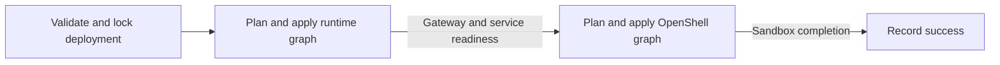

<!-- SPDX-FileCopyrightText: Copyright (c) 2026 NVIDIA CORPORATION & AFFILIATES. All rights reserved. -->
<!-- SPDX-License-Identifier: Apache-2.0 -->

# SDK and OpenTofu Architecture

NemoClaw compiles desired-state YAML into OpenTofu graphs and retains enough state to recover interrupted operations.
The [accepted scope](scope.md) defines the invariants; this page explains the responsibility boundaries and their reasons.

## Responsibilities

| Component | Responsibility |
|---|---|
| CLI | Arguments, prompts, credential acquisition, and output |
| Authoring library | Guided presets, validated draft edits, and review data |
| SDK | Configuration validation, graph compilation, deployment locking, plan policy, and recovery across stages |
| OpenTofu | Dependency ordering, concurrent resource reconciliation, and resource state |
| Docker provider | Docker containers, images, model-cache volumes, and service networks |
| NemoClaw provider | OpenShell operations, Podman gateway processes, durable storage contracts, and readiness observations |
| Hosted runtime | Model preparation, startup, application health, and protective shutdown |

Operation coordination belongs in the SDK so applications and the CLI share the same recovery behavior.
The SDK checks deployment scope and recovery constraints; providers decide resource transitions and verify remote identity before mutation.
For reconstructible OpenShell resources and non-retained disposable Docker resources, apply and teardown report OpenTofu's actions without reconstructing absence or replacement cleanup from plan history.
Durable identity, retained storage, and undeclared-resource checks remain deployment constraints.
OpenTofu executes the graph with its default parallelism.
The SDK and NemoClaw provider share backend library code.

The [provider reference](../provider.md) owns resource-specific contracts and protocol details.
Implementation starts at [Deployment](../../crates/nemoclaw-sdk/src/deployment/mod.rs), [graph compilation](../../crates/nemoclaw-sdk/src/compile.rs), and [backend contracts](../../crates/nemoclaw-sdk/src/backend.rs).

## OpenShell SDK Boundary

NemoClaw's [OpenShell adapter](../../crates/nemoclaw-sdk/src/openshell/mod.rs) reconciles deployment ownership and desired state against the gateway.
NemoClaw uses the SDK's public operations directly where they cover the deployment contract.
Sandbox teardown uses workspace-scoped `get_sandbox`, `delete_sandbox`, and `wait_deleted`; it checks ownership before deletion and requires confirmed absence afterward.
Teardown does not require the sandbox's old image, command, or policy to remain intact.
The reconciliation code retains the SDK's raw API only for operations or fields missing from the high-level interface, without a separate raw-client wrapper.
The Rust SDK uses gRPC; adopting it does not remove the gateway RPC boundary.
NemoClaw supplies the channel to preserve mutual TLS, lazy connection, and timeout settings that the pinned SDK configuration cannot express.

At the pinned OpenShell revision `1fe79f53991debf32776853a60f0cbd4e127dcfb`, the SDK has these integration limits:

| Requirement | SDK limit | Consequence |
|---|---|---|
| Telemetry disabled at build time | Its manifest enables `openshell-core` default features, including telemetry | Use a [vendored manifest patch](../../crates/vendor/openshell-sdk/NOTICE.md) with unchanged Rust source to disable core default features |
| Mutual TLS and bounded lazy connections | `ClientConfig` lacks client certificate/key fields, lazy connection configuration, and request timeouts | Retain custom channel construction through `OpenShellClient::from_parts` |
| Complete workspace identity | `WorkspaceRef` omits the physical ID, resource version, and deletion timestamp | Use the SDK's supported `raw_grpc()` escape hatch for workspace observations and creation readback |
| Sandbox creation with explicit policy | `SandboxSpec` has no policy field; the policy-bearing template API requires a separate workload template | Retain raw creation so the declared policy applies in the initial request |
| Sandbox drift and startup checks | `SandboxRef` omits the specification, deletion timestamp, and startup conditions | Keep full protobuf observations through the raw SDK client |
| Conditional provider updates | The curated client has no provider update method | Preserve raw requests carrying the verified physical ID and resource version |
| Providers, provider profiles, policy status, and gateway capabilities | The curated client has no equivalent methods for these operations | Use the raw SDK client; provider readiness helpers do not replace provider/profile reconciliation |
| Bounded exec against a verified identity | High-level exec resolves the sandbox by name again, buffers output without a size cap, and does not reject every malformed event sequence | Retain ID-bound streaming, the local deadline, output limits, and event validation |
| Secret-safe diagnostics | SDK bearer construction does not mark metadata sensitive; SDK errors can retain upstream diagnostic text | Preserve sensitive metadata and NemoClaw's redacted error mapping |

These limits are verified against the pinned [SDK manifest](https://github.com/NVIDIA/OpenShell/blob/1fe79f53991debf32776853a60f0cbd4e127dcfb/crates/openshell-sdk/Cargo.toml), [configuration](https://github.com/NVIDIA/OpenShell/blob/1fe79f53991debf32776853a60f0cbd4e127dcfb/crates/openshell-sdk/src/config.rs), [client](https://github.com/NVIDIA/OpenShell/blob/1fe79f53991debf32776853a60f0cbd4e127dcfb/crates/openshell-sdk/src/client.rs), [types](https://github.com/NVIDIA/OpenShell/blob/1fe79f53991debf32776853a60f0cbd4e127dcfb/crates/openshell-sdk/src/types.rs), and [authentication interceptor](https://github.com/NVIDIA/OpenShell/blob/1fe79f53991debf32776853a60f0cbd4e127dcfb/crates/openshell-sdk/src/auth.rs).
The supported raw escape hatch provides an SDK integration point but still exposes protobuf compatibility risk.
NemoClaw constructs the client without a token refresher; neither the selected high-level operations nor raw calls automatically retry mutations.
An [artifact test](../../crates/nemoclaw-sdk/tests/artifact_pins.rs) checks revision alignment and proves telemetry remains disabled even when the process environment requests it.
Deletion remains name-addressed in the pinned protocol; neither client offers an atomic ID/version precondition, so NemoClaw verifies identity immediately before deletion and never retries an ambiguous mutation automatically.
Ownership checks, retained bindings, and desired-state comparison remain NemoClaw responsibilities even when the SDK gains broader coverage.

## Terminal Presentation

The CLI renders SDK progress through an inline Ratatui display or plain lines for redirected output.
Both consume the same typed observations; neither queries resources or interprets runtime logs.
OpenTofu supplies resource operations and identities, while readiness and health remain with their existing owners.
The renderer tracks active work and elapsed time without treating animation as evidence of progress.
It finishes before the CLI writes the final text or JSON result.
Unsupported health, incomplete plans, and unconfirmed state after failure remain explicit in both formats.
See [CLI output](../reference/cli.md#output-and-failure) for the user contract.

## Configuration

Desired-state YAML passes through the SDK's [configuration validation](../configuration-schema.md).
Configuration retains credential references, not values.

The [authoring library](../../crates/nemoclaw-authoring/src/lib.rs) owns an SDK `Document` while a frontend edits or reviews it.
It has no terminal or deployment operations.
Its guided API derives current values and compatible choices from a curated scenario table.
It refuses a guided edit when the document has V1 configuration that the guided flow cannot show, which prevents data loss.
The [example onboarding TUI](../../examples/onboarding-tui/README.md) renders these fields and sends typed changes back to the library.
It is a separate generation-only binary, not a prescribed onboarding flow or a lifecycle CLI command.

The native [bundle](../build.md#build-a-native-bundle) ships the matching CLI, schema, OpenTofu, and providers; source-derived provider versions prevent stale installations from being reused.

## Why Managed Apply Has Two Stages

OpenShell needs a reachable gateway to refresh resources and plan changes.
A managed deployment therefore establishes its runtime infrastructure before planning OpenShell resources.
Deferred provider configuration supports fresh bootstrap, but an unavailable gateway still blocks refresh of existing OpenShell bindings before a combined graph can restore it.
The runtime stage preserves that recovery path.
The SDK coordinates two graphs:

Each stage produces a saved plan that the SDK checks before applying.
The runtime graph manages the gateway and inference services; the OpenShell graph manages registrations, sandboxes, and their configuration, including supporting proxies.
Dependencies place required readiness observations after creation and before dependent work.

Public plan observes resources without mutating them and can defer the OpenShell stage until the managed gateway is established.
It can write local intent and plan files.
Apply obtains and checks new plans; a previous preview is not an approval artifact.

Destroy reverses the stage order so workloads are removed while their gateway is still available.
The SDK checks both teardown plans before deleting anything and records completed stages so an interrupted destroy can resume.
The compiler builds teardown configuration from retained intent and the established resource inventory, keeping storage and workspace declarations while removing workload and readiness declarations.
It returns the retained addresses with that graph; plan validation and destroy reporting use the same result.
Storage that was never established is omitted, so partial teardown does not finish creating it.
For commands and deletion effects, see [deployment lifecycle](../usage.md).

## State and Recovery

Desired configuration describes what should exist; a binding identifies the object already established.
The SDK retains deployment ownership, configuration, pending creation targets, and operation progress alongside OpenTofu's resource state.
Matching a name alone cannot authorize adoption.
See [deployment state](../state.md) for the retained files.

Providers distinguish three observation outcomes:

| Observation | Consequence |
|---|---|
| Present with verified identity | Plan permitted configuration changes |
| Confirmed absent | Recreate only if the resource's lifecycle permits it |
| Failed or incomplete | Stop and preserve the prior binding |

Ownership checks run during observation and again before mutation because an object can change after planning.
A mutation can return an established binding together with an error; the caller must preserve both.
Automatic rollback could destroy useful data or repeat an operation whose response was lost.

Before an OpenShell apply, the SDK records targets that may be created or replaced.
A lost creation response can leave an object outside OpenTofu state, so retries must retain those targets' original configuration until reconciliation succeeds.
Unrelated settings can change, and retries preserve earlier pending targets.
Older pending records without per-target evidence require the entire original configuration.

Failures involving only observations, established updates or deletions, or disposable compute permit revised intent or teardown using recorded bindings.
They cannot clear earlier unresolved OpenShell creations; those must be reconciled before teardown.
An OpenShell-stage apply without non-disposable resource creations does not start a pending-creation guard; export can verify its established bindings through OpenTofu even after that apply fails.
Managed-runtime failures retain their separate stage recovery evidence.
Teardown recovery validates current bindings and fresh plans; the failed apply's saved plan file and hash do not authorize the next operation.
The [recovery guide](../usage.md#recover-an-interrupted-operation) describes the caller's next steps.

## Storage and Resource Lifetimes

Processes and their data have different lifetimes.
Separate storage bindings let compute change while gateway signing keys, credentials, and model files survive.
OpenTofu selects Podman gateway replacement through the provider contract, without an SDK whitelist inferred from specification changes.
The SDK requires the gateway's independent storage binding, the compiler orders the dependency and protects retained storage, and the provider rechecks identity before replacing the process.
Missing or substituted bound credentials and gateway storage stop planning; reproducible model caches can be rebuilt.

The shared [OpenShell lifecycle contract](../../crates/nemoclaw-sdk/src/backend.rs) distinguishes retained workspace identity, stateful sandboxes, and reconstructible registrations and configuration.
Sandbox files and conversation history have no separately retained storage, so ordinary apply refuses sandbox deletion or replacement.
It also refuses to recreate a missing sandbox binding.
Explicit destroy deletes those files even though the OpenShell workspace remains.
The [retention reference](../state.md#deletion-and-retention) lists what survives.

## Readiness and Export

Required service and sandbox readiness runs through provider data sources in the graph, including on unchanged applies.
Sandbox completion checks configuration, startup, and Fabric health without invoking an agent or requesting model responses.
The SDK reports the fresh OpenTofu observations; it does not repeat those probes.
Only failures proven to be exclusively completion observations can clear the pending-mutation guard.
Readiness failure retains resource state and persistent data.

The hosted runtime owns model preparation and health semantics, including protection that remains active after the CLI exits.
Explicit inference probes are separate SDK operations.
See [runtime design](runtime.md) for process supervision, [execution targets](execution-targets.md) for placement, and [recipe design](recipes.md) for model-specific preparation.

Export uses a refresh-only OpenTofu plan against a temporary state copy and provider configuration without resource or data-source declarations.
It checks observed identity and configuration against retained intent before producing YAML.
It neither applies the plan nor changes the deployment's state and graph, and apply-only readiness checks do not run.
Export preserves desired settings and credential references, not agent files, histories, or model weights.

## Validation

[Integration fixtures](../testing/fixtures.md) exercise the production provider and SDK through the pinned OpenTofu binary, including interrupted operations and failed observations.
[Recorded results](../validation/README.md) identify tested revisions, platforms, and remaining limits.
Successful resource creation or readiness does not establish working inference; that requires a separate model or agent response test.
