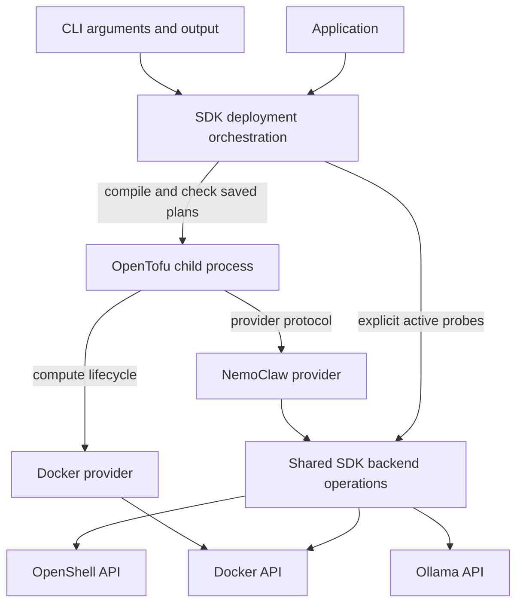
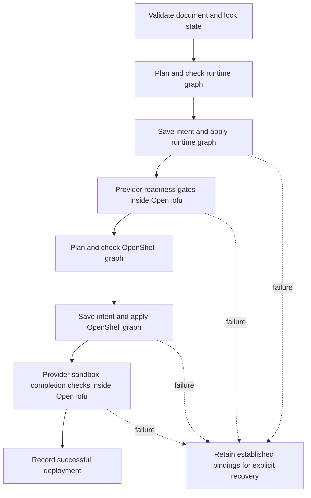

<!-- SPDX-FileCopyrightText: Copyright (c) 2026 NVIDIA CORPORATION & AFFILIATES. All rights reserved. -->
<!-- SPDX-License-Identifier: Apache-2.0 -->

# SDK and OpenTofu Architecture

The SDK turns a deployment document into checked OpenTofu operations and preserves enough state to recover after failure.
The [accepted scope](scope.md) governs implementation changes.
The explanations below describe the current boundaries; the later findings retain intermediate results and their limits.

## Configuration Authoring

The CLI uses [nemoclaw-authoring](../../crates/nemoclaw-authoring/src/lib.rs) to turn onboarding answers into desired-state YAML.
This unpublished library owns authoring presets, draft edits, stable draft identity, structured reviews, and field diagnostics.
The CLI is its current consumer; the crate boundary keeps terminal and argument-handling dependencies out of the authoring model so other frontends can use it.
Both prompted answers and command-line overrides use the same projection and SDK parser.
The SDK remains the authority for configuration validity and deployment behavior.

The authoring library exposes its supported combinations but does not discover runtime capabilities or claim to cover every SDK configuration.
Draft edits currently change deployment, sandbox, agent, and provider names, the model, and the credential environment-variable name.
The current edit methods cannot change harness, runtime, inference type, or API choices.
Rejected edits leave the previous answers intact.
Reopening YAML requires the authoring model to reproduce the parsed document; it rejects unsupported customizations and does not preserve comments or formatting.
The [public API tests](../../crates/nemoclaw-authoring/tests/public_api.rs) check these boundaries and compare default YAML against the pre-extraction output with a fixed UID.

The CLI owns prompts, review rendering, file I/O, credential acquisition, and apply confirmation.
Authoring retains credential environment-variable names, not credential values, and never calls deployment operations.
Planning, apply, ownership checks, and recovery remain in the SDK.
The library still depends on the SDK; this separation does not remove the SDK's build dependencies.

## Why the SDK Owns the Operation

An application and a CLI user need the same answer to an interrupted apply: which resources exist, who owns them, and what can resume?
Putting locking or recovery in the CLI would leave programmatic callers to implement those rules again.
The SDK therefore owns the complete deployment operation, while OpenTofu owns dependency ordering and resource state.
Within each graph, OpenTofu uses its default parallelism to reconcile independent resources concurrently.
Explicit dependencies order gateway checks, selected provider registrations, sandbox creation, and configuration.

The diagram shows logical responsibilities across the SDK and its child processes:

The shared backend code is compiled into its callers; it is not another server.
The provider translates the OpenTofu protocol into those operations.
The SDK also checks proposed changes against its deployment contract before asking OpenTofu to execute a saved plan.
For example, an unbound undeclared resource or changed durable storage binding stops apply even if OpenTofu can express that change.
The SDK accepts provider-planned deletion of reconstructible bindings subject to the graph's protected-resource constraints.
The Docker provider may recreate Docker gateway, inference, and proxy containers and service-owned networks; their physical identities are not recovery invariants.

The shared [OpenShell lifecycle contract](../../crates/nemoclaw-sdk/src/backend.rs) classifies retained workspace identity, stateful sandboxes, and reconstructible registrations and configuration.
The provider declares field mutability, reports confirmed absence, and verifies ownership through the shared backend before mutation.
OpenTofu orders those actions and records their results; the SDK checks deployment scope and unresolved-operation constraints.
Repeated ownership checks at observation and mutation protect different moments in time and remain necessary.
The [provider reference](../provider.md#openshell-resource-lifecycles) describes the resource-specific behavior and upstream deletion constraints.

The [public SDK lifecycle commit](https://github.com/NVIDIA/NemoClaw/commit/bd45fa3297) tested SDK apply followed by CLI export and destroy.
That mixed-client test established that recovery belongs below the CLI boundary.
The current implementation is in [Deployment](../../crates/nemoclaw-sdk/src/deployment/mod.rs) and [saved-plan checks](../../crates/nemoclaw-sdk/src/deployment/plan.rs).

## Intent, Identity, and Observation

Desired configuration answers “what should exist?”
A durable binding answers “which existing resource did this deployment establish?”
Keeping both matters when a process replacement is requested but the old process still exists.
Durable resources retain their verified bindings.
Disposable compute uses the Docker provider's state and reconciliation instead of a second composite identity.

The local state directory retains these records:

| Record | Meaning | Why recovery needs it |
|---|---|---|
| Deployment UID and generation tokens | Deployment ownership and creation identity | Matching a resource name alone cannot authorize adoption. |
| Intent document, digest, and pending creation targets | Configuration selected for an operation | A possibly completed creation retains its original resource configuration; unrelated intent can change without losing recovery evidence. |
| OpenTofu state and saved resource specifications | Established physical IDs and configurations | A failed readiness check retains state; explicit recovery may replace disposable compute. |
| Operation flags | Apply or destroy progress | Recovery can verify intent and resume the remaining resource operations. |

An observation has three outcomes, with different consequences:

| Observation | Meaning | Consequence |
|---|---|---|
| Present and verified | The owning API returned a complete result with matching identity | Compare configuration and plan permitted changes. |
| Confirmed absent | The owning API established that the resource is missing | The provider can report absence; deployment rules still forbid automatic recreation of bound credentials and gateway storage; model caches may be reconstructed. |
| Failed or incomplete | The resource may exist, but the client cannot verify it | Stop and preserve the prior binding. |

For example, an authentication error from Docker cannot mean that a model volume disappeared.
Likewise, a container that exits immediately can have a valid ID while failing readiness.
The [first observation contract](https://github.com/NVIDIA/NemoClaw/commit/93c146f285) and [immediate-exit correction](https://github.com/NVIDIA/NemoClaw/commit/238d0ef294) established these distinctions.
The current [backend result types](../../crates/nemoclaw-sdk/src/backend.rs) allow a mutation to return established state together with an error.

## Why Managed Apply Has Stages

OpenShell registrations require a reachable gateway.
For a fresh managed deployment, the SDK must establish runtime infrastructure before it can obtain a complete OpenShell plan.
This is a dependency between two checked graphs, not one atomic transaction.

The successful managed apply path is:

A public plan performs observations and can report a deferred OpenShell graph; it does not execute either apply stage.
Planning can write local intent and plan files, so “read-only” refers to runtime resources.
Apply obtains and checks its own plans rather than consuming a previous public preview as approval.

Suppose gateway creation succeeds but inference startup fails.
The gateway and model-storage bindings remain recorded, and a later explicit apply can reconcile them.
Automatic rollback could delete useful data or repeat an operation whose response was lost.

Before an OpenShell apply, the SDK records the compiled targets for planned creations and replacements.
A lost creation response can leave an object outside OpenTofu state, so revised intent must preserve those pending targets until reconciliation succeeds.
Unrelated target configuration can change; later failures merge new pending targets without discarding earlier evidence.
Older unfinished records without target-level evidence retain their full original-intent guard.
Runtime failures retain an unfinished-operation marker for export, but allow revised intent or teardown using OpenTofu's recorded bindings and the existing durable-storage checks.
An OpenShell-graph apply that only observes resources, updates or deletes established bindings, or changes disposable compute uses the same recovery rule.
Those operations do not create an untracked identity; provider refresh and mutation checks verify the existing bindings on retry.
Runtime reconciliation cannot clear earlier pending OpenShell creations, and teardown requires resolving those creations first.
Gateway and managed vLLM/Ollama readiness run inside the runtime graph; a failed read retains compute and storage state without rolling them back.

Destroy reverses the dependency direction: remove OpenShell workloads before stopping the gateway that owns them.
It checks both saved plans before deletion and records when the OpenShell stage finishes.
That saved progress lets an interrupted destroy continue even after the gateway becomes unavailable.
The [managed orchestration commit](https://github.com/NVIDIA/NemoClaw/commit/b18e282837) records the failure cases behind this order.

The installer contract declares install and removal plans.
Managed vLLM/Ollama and proxy readiness use an independent provider data source ordered after the container and deferred until every apply.
Proxy consumers depend on this observation; unrelated provider registrations remain independent.
Sandbox configuration, startup readiness, and Fabric health run in a separate provider data source after sandbox creation and any model configuration.
Its postcondition rejects incomplete readiness; OpenTofu retains the observation and resource bindings.
An apply-only read token ensures unchanged applies check again and lets the SDK reject stale health results when reporting a failure.
The SDK reads these results through public OpenTofu JSON rather than contacting the sandbox again.
Only exclusively observed completion failures can clear the unfinished-mutation guard; partial mutations remain guarded.
This moves observation scheduling into the graph; the broader [Fabric management contract](fabric-management.md#result-and-adoption-gates) remains separate work.
A stopped service remains bound, and an explicit apply can reconcile it without a package-specific recovery operation or an automatic restart loop.

## Why Storage Has Its Own Binding

A runtime process and its data have different lifetimes.
Updating an image can require a new container while model files, prepared artifacts, or gateway signing keys must remain intact.
Separate credential bindings let the provider reject lost durable storage during planning before process replacement.
Reproducible model caches use Docker volume resources, without a second SDK physical-identity check.

This distinction also changed Ollama teardown.
The [storage separation commit](https://github.com/NVIDIA/NemoClaw/commit/8040b1ef99) made it possible to remove the verified service container while retaining model bytes.
For gateways, an [independent storage binding](https://github.com/NVIDIA/NemoClaw/commit/8eb8a72852) prevents an interrupted initializer from regenerating established credentials.

Storage retention does not cover every file in a deployment.
Destroy deletes sandbox files and conversation history; [the lifecycle guide](../usage.md#destroy) owns the complete retention and recovery procedure.

## Public Contract

For operational commands and deletion effects, use [the lifecycle guide](../usage.md).

Unknown fields, inline credentials, conflicting provider forms, mutable artifact pins, and unsupported combinations fail validation before runtime mutation.
Agent image, runtime and isolation defaults belong to the schema version.
A managed inference service declares a qualified backend, pinned image and model, bounded serving settings, and memory policy.

There are no shell hooks or arbitrary argument fields.

## What the Implementation Has Confirmed

The CLI bundle contains the CLI, OpenTofu, and the NemoClaw and Docker provider executables in a verified filesystem mirror.
Source-derived provider versions prevent stale installations from being reused after a build.

The public SDK does not embed OpenTofu or expose its raw graph as a user configuration mechanism.

Refresh and export use the owning providers' readers.
Export runs an OpenTofu refresh-only plan against a temporary copy of state with provider configuration and no resource or data-source declarations.
It does not apply that plan or change the deployment's state and graph.
The SDK projects refreshed values from the plan's public JSON into YAML and checks their identity and configuration against retained intent.
Apply-only readiness data sources do not run during export.
Observations use the owning OpenShell, Docker, and model APIs.
The relevant orchestration observations are provider resource identities, configuration, policy, and application status.
Model inventories and preparation verification belong to the hosted runtime.

A host inventory collector would not replace the owning APIs for these checks.
Capacity uses observations from the selected execution host; credential references, intent, and OpenTofu state remain client-side.
Explicit inference probes remain direct SDK operations.

Export writes YAML only after all required observations succeed.

The managed graph separates gateway storage, gateway process, model storage, and inference process.
The Docker gateway storage binding covers its database volume, bridge, initializer, signing identity, and persisted encryption key.
Its process uses a native Docker-provider ID and the verified storage mountpoint.
Podman retains its existing composite process identity and storage binding.

A bound initializer cannot generate credentials again.
Inference storage retains both the exact model snapshot and prepared data.

Configuration and readiness are separate.
A process can exit immediately after start while retaining valid identity and storage.
The Docker provider creates service containers; a separate NemoClaw data source consumes application readiness through the recorded container ID.
An application readiness failure does not roll back persistent data.

The [runtime lifecycle](runtime.md#why-the-watchdog-lives-with-inference) explains loading deadlines and protective shutdown.
Destroy cannot infer ownership from missing local state or delete a whole workspace with an unverified cascading operation.

## Costs and Hypotheses Still to Test

The pinned high-level OpenShell Rust client omits mTLS, so the SDK uses its generated tonic clients with explicit certificate and bearer references.
The real OpenTofu test exposed a Rustls backend-selection panic after HTTP dependencies were added.

Selecting the plugin transport's crypto backend explicitly fixed that failure.
Protocol tests run against the complete production binary.
Authenticated wire tests now cover valid mTLS/bearer references and reject incorrect server trust, client trust, bearer values, and missing key files without mutation or disclosure.

A stalled exec stream demonstrated that a gRPC deadline alone was insufficient; the SDK now bounds the complete call and retains uncertainty about invocation effects.

Native builds need a C toolchain and Protocol Buffers compiler.
Native bundles and protocol/lifecycle fixtures pass on Linux ARM64/x64, macOS ARM64/Intel, and Windows x64.
Managed gateway and GPU execution are qualified on Linux ARM64.

Native CLI availability does not establish container or GPU backend support on every platform.
[Managed Podman test results](../validation/rust-managed-podman-linux-arm64.md) qualify the local rootless Linux ARM64 gateway and sandbox topology; inference remains independently hosted.

The model runtime retains the recipe archive, original and patched sources, preparation tools, licenses, supervisor source and vendored dependency licenses.
The builder normalizes timestamps and rejects changing source inputs during a build.
An independent offline rebuild from another extraction directory produced an identical supervisor binary hash.

The archive must include OpenShell protobuf inputs omitted by Cargo vendoring, and the build must use that exact vendor layout to avoid dependency-path differences.
Source packaging and dependency maintenance count toward the architecture's cost.

Managed Ollama uses the same service-installer boundary and retained-storage model as managed vLLM.
Package-specific model download and runtime arguments stay in the Ollama implementation; its status reader serves the shared provider readiness contract.
Deployment orchestration consumes only the installer plan and the resolved provider connection.

Destroy retains the volume resource and its data, then removes the provider-managed container and service-owned network after dependent OpenShell resources.
The Ollama installer declares a native Docker cache volume and retains it during teardown.
Credential and gateway storage verify durable identity independently of disposable container state; model caches use native provider reconciliation.

A lost deletion response leaves state for explicit reconciliation.
The fixture checks credential-volume replacement and engine failures before compute changes, cache reconstruction, and retained teardown.
This is deterministic Docker/HTTP/OpenShell fixture qualification with the real provider and OpenTofu; it does not establish a new live Ollama hardware qualification.

Managed apply also exposed an async allocation cost that the release CLI hid: composing several debug-build SDK calls overflowed a normal executor thread stack.
Public plan/apply now heap-allocate their orchestration future, with a tested per-operation stack-size budget.
SDK qualification must exercise its public API directly as well as its CLI consumer.

## Recorded Test Results

[Validation records](../validation/) distinguish deterministic failure tests, protocol qualification, native runtime execution, and remaining platform limits.
Gateway lifecycle validation passed initial create, no-op, retained-storage destroy, and explicit recovery.
The [Spark run](../validation/rust-spark-linux-arm64.json) passed a fresh model download, verified PLE preparation, actual OpenClaw reply, unchanged apply without download or preparation, export/reapply, safe capacity rejection, and watchdog shutdown followed by explicit recovery.

Image replacement changed only the inference process identity.
Initial loading took 670 seconds, confirming the need for a multi-minute loading budget with headroom.
Deterministic fixtures cover interrupted preparation, failed startup, and failed observations; live interrupted downloads resumed without losing their storage or binding.

The [validation matrix](../validation/README.md) covers the supported Fabric and native agent interfaces, real Ollama reconciliation, five native bundle targets, and their documented limitations.
No reduction in maintained code or overall maintenance cost has been measured.

Live qualification also found a compatibility boundary absent from YAML shape: Hermes rejects the DGX Spark service's 32K context at startup because it requires at least 64K.
Its Ollama/Qwen3 path passed a short native response; that does not establish long-context capability.
Do not falsify model metadata or widen isolation policy to make readiness pass.

Backend/agent compatibility requires successful inference tests in addition to provider registration.
