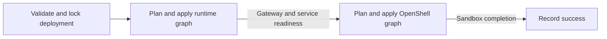

<!-- SPDX-FileCopyrightText: Copyright (c) 2026 NVIDIA CORPORATION & AFFILIATES. All rights reserved. -->
<!-- SPDX-License-Identifier: Apache-2.0 -->

# SDK and OpenTofu Architecture

NemoClaw compiles desired-state YAML into OpenTofu graphs and retains enough state to recover interrupted operations.
The [accepted scope](scope.md) defines the invariants; this page explains the responsibility boundaries and their reasons.

## Responsibilities

| Component | Responsibility |
|---|---|
| CLI | Arguments, prompts, credential acquisition, and output |
| Authoring library | Presets, draft edits, and review data |
| SDK | Configuration validation, graph compilation, deployment locking, plan policy, and recovery across stages |
| OpenTofu | Dependency ordering, concurrent resource reconciliation, and resource state |
| Docker provider | Docker containers, images, model-cache volumes, and service networks |
| NemoClaw provider | OpenShell operations, Podman gateway processes, durable storage contracts, and readiness observations |
| Hosted runtime | Model preparation, startup, application health, and protective shutdown |

Operation coordination belongs in the SDK so applications and the CLI share the same recovery behavior.
The SDK checks deployment scope and recovery constraints; providers decide resource transitions and verify remote identity before mutation.
OpenTofu executes the graph with its default parallelism.
The SDK and NemoClaw provider share backend library code.

The [provider reference](../provider.md) owns resource-specific contracts and protocol details.
Implementation starts at [Deployment](../../crates/nemoclaw-sdk/src/deployment/mod.rs), [graph compilation](../../crates/nemoclaw-sdk/src/compile.rs), and [backend contracts](../../crates/nemoclaw-sdk/src/backend.rs).

## Configuration

The [authoring library](../../crates/nemoclaw-authoring/src/lib.rs) owns an SDK `Document` while a frontend edits or reviews it, without terminal dependencies or deployment operations.
It can open any valid V1 document without reducing it to onboarding fields.
Its guided API derives current values and compatible choices from the document and a curated preset table; a document with additional V1 configuration remains available for review but does not permit a lossy guided edit.
Preset projection constructs SDK configuration types and then passes the result through the same [configuration validation](../configuration-schema.md) as directly supplied YAML.
The library retains credential references, not values.
The [example onboarding TUI](../../examples/onboarding-tui/README.md) renders the guided field query and sends typed field changes back to the library, so compatibility rules do not live in the terminal frontend.
It is a separate generation-only binary and does not define a prescribed onboarding flow or extend the lifecycle CLI.
The native [bundle](../build.md#build-a-native-bundle) ships the matching CLI, schema, OpenTofu, and providers; source-derived provider versions prevent stale installations from being reused.

## Why Managed Apply Has Two Stages

OpenShell needs a reachable gateway to refresh resources and plan changes.
A managed deployment therefore establishes its runtime infrastructure before planning OpenShell resources.
The SDK coordinates two graphs:

Each stage produces a saved plan that the SDK checks before applying.
The runtime graph manages the gateway and inference services; the OpenShell graph manages registrations, sandboxes, and their configuration, including supporting proxies.
Dependencies place required readiness observations after creation and before dependent work.

Public plan observes resources without mutating them and can defer the OpenShell stage until the managed gateway is established.
It can write local intent and plan files.
Apply obtains and checks new plans; a previous preview is not an approval artifact.

Destroy reverses the stage order so workloads are removed while their gateway is still available.
The SDK checks both teardown plans before deleting anything and records completed stages so an interrupted destroy can resume.
For commands and deletion effects, see [deployment lifecycle](../usage.md).

## State and Recovery

Desired configuration describes what should exist; a binding identifies the object already established.
The SDK retains deployment ownership, configuration, pending creation targets, and operation progress alongside OpenTofu's resource state.
Matching a name alone cannot authorize adoption.
See [deployment state](../state.md) for the retained files.

Providers distinguish three observation outcomes:

| Observation | Consequence |
|---|---|
| Present with verified identity | Plan permitted configuration changes |
| Confirmed absent | Recreate only if the resource's lifecycle permits it |
| Failed or incomplete | Stop and preserve the prior binding |

Ownership checks run during observation and again before mutation because an object can change after planning.
A mutation can return an established binding together with an error; the caller must preserve both.
Automatic rollback could destroy useful data or repeat an operation whose response was lost.

Before an OpenShell apply, the SDK records targets that may be created or replaced.
A lost creation response can leave an object outside OpenTofu state, so retries must retain those targets' original configuration until reconciliation succeeds.
Unrelated settings can change, and retries preserve earlier pending targets.
Older pending records without per-target evidence require the entire original configuration.

Failures involving only observations, established updates or deletions, or disposable compute permit revised intent or teardown using recorded bindings.
They cannot clear earlier unresolved OpenShell creations; those must be reconciled before teardown.
The [recovery guide](../usage.md#recover-an-interrupted-operation) describes the caller's next steps.

## Storage and Resource Lifetimes

Processes and their data have different lifetimes.
Separate storage bindings let compute change while gateway signing keys, credentials, and model files survive.
Missing or substituted bound credentials and gateway storage stop planning; reproducible model caches can be rebuilt.

The shared [OpenShell lifecycle contract](../../crates/nemoclaw-sdk/src/backend.rs) distinguishes retained workspace identity, stateful sandboxes, and reconstructible registrations and configuration.
Sandbox files and conversation history have no separately retained storage, so ordinary apply refuses sandbox deletion or replacement.
It also refuses to recreate a missing sandbox binding.
Explicit destroy deletes those files even though the OpenShell workspace remains.
The [retention reference](../state.md#deletion-and-retention) lists what survives.

## Readiness and Export

Required service and sandbox readiness runs through provider data sources in the graph, including on unchanged applies.
Sandbox completion checks configuration, startup, and Fabric health without invoking an agent or requesting model responses.
The SDK reports the fresh OpenTofu observations; it does not repeat those probes.
Only failures proven to be exclusively completion observations can clear the pending-mutation guard.
Readiness failure retains resource state and persistent data.

The hosted runtime owns model preparation and health semantics, including protection that remains active after the CLI exits.
Explicit inference probes are separate SDK operations.
See [runtime design](runtime.md) for process supervision, [execution targets](execution-targets.md) for placement, and [recipe design](recipes.md) for model-specific preparation.

Export uses a refresh-only OpenTofu plan against a temporary state copy and provider configuration without resource or data-source declarations.
It checks observed identity and configuration against retained intent before producing YAML.
It neither applies the plan nor changes the deployment's state and graph, and apply-only readiness checks do not run.
Export preserves desired settings and credential references, not agent files, histories, or model weights.

## Validation

[Integration fixtures](../testing/fixtures.md) exercise the production provider and SDK through the pinned OpenTofu binary, including interrupted operations and failed observations.
[Recorded results](../validation/README.md) identify tested revisions, platforms, and remaining limits.
Successful resource creation or readiness does not establish working inference; that requires a separate model or agent response test.
