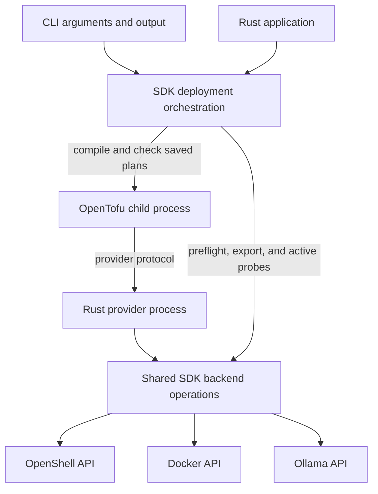
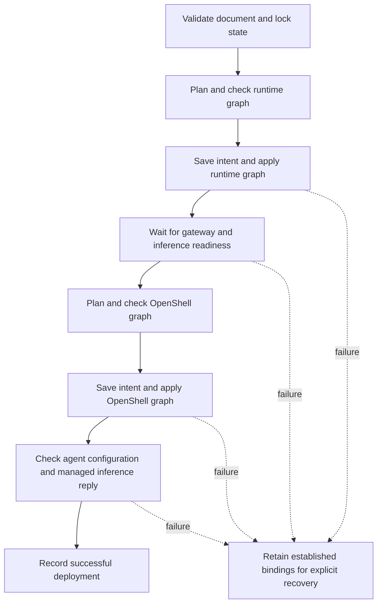

<!-- SPDX-FileCopyrightText: Copyright (c) 2026 NVIDIA CORPORATION & AFFILIATES. All rights reserved. -->
<!-- SPDX-License-Identifier: Apache-2.0 -->

# SDK and OpenTofu Architecture

The SDK turns a deployment document into checked OpenTofu operations and preserves enough state to recover after failure.
The [accepted scope](../../DESIGN.md) governs implementation changes.
The explanations below describe the current boundaries; the later findings retain intermediate results and their limits.

## Why the SDK Owns the Operation

A Rust application and a CLI user need the same answer to an interrupted apply: which resources exist, who owns them, and what can resume?
Putting locking or recovery in the CLI would leave programmatic callers to implement those rules again.
The SDK therefore owns the complete deployment operation, while OpenTofu owns dependency ordering and resource state.

The diagram shows logical responsibilities across the SDK and its child processes:

The shared backend code is compiled into its callers; it is not another server.
The provider translates the OpenTofu protocol into those operations.
The SDK also checks proposed changes against its deployment contract before asking OpenTofu to execute a saved plan.
For example, an undeclared resource or an unverified replacement stops apply even if OpenTofu can express that change.

The [public SDK lifecycle commit](https://github.com/NVIDIA/NemoClaw/commit/bd45fa3297) tested SDK apply followed by CLI export and destroy.
That mixed-client test established that recovery belongs below the CLI boundary.
The current implementation is in [Deployment](../../crates/nemoclaw-sdk/src/deployment/mod.rs) and [saved-plan checks](../../crates/nemoclaw-sdk/src/deployment/plan.rs).

## Intent, Identity, and Observation

Desired configuration answers “what should exist?”
A durable binding answers “which existing resource did this deployment establish?”
Keeping both matters when a process replacement is requested but the old process still exists.
Deletion must verify the old bound specification, even though the new YAML describes its replacement.

The local state directory retains distinct kinds of evidence:

| Record | Meaning | Why recovery needs it |
|---|---|---|
| Deployment UID and generation tokens | Deployment ownership and creation identity | Matching a resource name alone cannot authorize adoption. |
| Intent document and digest | Configuration selected for an operation | An interrupted graph mutation rejects different intent until reconciled. |
| OpenTofu state and saved resource specifications | Established physical IDs and configurations | A failed readiness check must not erase a created container. |
| Operation flags and saved-plan digest | Apply or destroy progress | Recovery can verify intent and resume the remaining graph boundary. |

An observation has three outcomes, with different consequences:

| Observation | Meaning | Consequence |
|---|---|---|
| Present and verified | The owning API returned a complete result with matching identity | Compare configuration and plan permitted changes. |
| Confirmed absent | The owning API established that the resource is missing | The provider can report absence; deployment rules still forbid automatic recreation of bound storage. |
| Failed or incomplete | The resource may exist, but the client cannot verify it | Stop and preserve the prior binding. |

For example, an authentication error from Docker cannot mean that a model volume disappeared.
Likewise, a container that exits immediately can have a valid ID while failing readiness.
The [first observation contract](https://github.com/NVIDIA/NemoClaw/commit/93c146f285) and [immediate-exit correction](https://github.com/NVIDIA/NemoClaw/commit/238d0ef294) established these distinctions.
The current [backend result types](../../crates/nemoclaw-sdk/src/backend.rs) allow a mutation to return established state together with an error.

## Why Managed Apply Has Stages

OpenShell registrations require a reachable gateway.
For a fresh managed deployment, the SDK must establish runtime infrastructure before it can obtain a complete OpenShell plan.
This is a dependency between two checked graphs, not one atomic transaction.

The successful managed apply path is:

A public plan performs observations and can report a deferred OpenShell graph; it does not execute either apply stage.
Planning can write local intent and plan files, so “read-only” refers to runtime resources.
Apply obtains and checks its own plans rather than consuming a previous public preview as approval.

Suppose gateway creation succeeds but inference startup fails.
The gateway and model-storage bindings remain recorded, and a later explicit apply can reconcile them.
Automatic rollback could delete useful data or repeat an operation whose response was lost.

The pending-intent guard applies while a graph mutation is unfinished.
After OpenTofu apply completes, the SDK clears that guard before readiness checks.
A later readiness failure still retains bindings, but revised intent can proceed if it satisfies validation and ownership checks.

Destroy reverses the dependency direction: remove OpenShell workloads before stopping the gateway that owns them.
It checks both saved plans before deletion and records when the OpenShell stage finishes.
That checkpoint lets an interrupted destroy continue even after the gateway becomes unavailable.
The [managed orchestration commit](https://github.com/NVIDIA/NemoClaw/commit/b18e282837) records the failure cases behind this order.

Ollama has a related dependency: a stopped service cannot return authoritative model inventory.
Its [recovery stage](https://github.com/NVIDIA/NemoClaw/commit/ca2ece58e8) repairs the verified service, waits for the API, and then requests a complete plan.
It does not treat unavailable inventory as an empty model list.

## Why Storage Has Its Own Binding

A runtime process and its data have different lifetimes.
Updating an image can require a new container while model files, prepared artifacts, or gateway signing keys must remain intact.
Separate storage bindings let the SDK verify those dependencies before authorizing process replacement.

This distinction also changed Ollama teardown.
The [storage separation commit](https://github.com/NVIDIA/NemoClaw/commit/8040b1ef99) made it possible to remove the verified service container while retaining model bytes.
For gateways, an [independent storage binding](https://github.com/NVIDIA/NemoClaw/commit/8eb8a72852) prevents an interrupted initializer from regenerating established credentials.

Storage retention does not cover every file in a deployment.
Destroy deletes sandbox files and conversation history; [the lifecycle guide](../usage.md#destroy) owns the complete retention and recovery procedure.

## Public Contract

For operational commands and deletion effects, use [the lifecycle guide](../usage.md).

Unknown fields, inline credentials, conflicting provider forms, mutable artifact pins, and unsupported combinations fail validation before runtime mutation.
Agent image, runtime and isolation defaults belong to the schema version.
A managed inference service declares a qualified backend, pinned image and model, bounded serving settings, and memory policy.

There are no shell hooks or arbitrary argument fields.

## What the Implementation Has Confirmed

The CLI bundle contains the CLI, OpenTofu, and one provider executable in a known mirror path.
Source-derived provider versions prevent stale installations from being reused after a build.

The public SDK does not embed OpenTofu or expose its raw graph as a user configuration mechanism.

Refresh and export share typed readers.
The pinned Go reference retired osquery in favor of the owning OpenShell, Docker, and model APIs; the Rust port follows that boundary.
The relevant observations are resource identities, configuration, policy, and complete model inventories.

A host inventory collector would not replace the owning APIs for these checks.
Capacity uses observations from the selected execution host; credential references, intent, and OpenTofu state remain client-side.
Mutations and active readiness or inference probes remain direct.

Export writes YAML only after all required observations succeed.

The managed graph separates gateway storage, gateway process, model storage, and inference process.
The gateway storage binding covers its database volume, bridge, initializer and signing identity.
The gateway process additionally binds the persisted encryption key.

A bound initializer cannot generate credentials again.
Inference storage retains both the exact model snapshot and prepared data.

Configuration and readiness are separate.
A process can exit immediately after start while retaining valid identity and storage.
Managed `running` is computed and becomes unknown during create or an explicit restart, so OpenTofu does not taint a valid resource merely because startup failed.

The [runtime lifecycle](runtime.md#why-the-watchdog-lives-with-inference) explains loading deadlines and protective shutdown.
Destroy cannot infer ownership from missing local state or delete a whole workspace with an unverified cascading operation.

## Costs and Hypotheses Still to Test

Rust does not remove protocol or packaging work.
The pinned high-level OpenShell Rust client omits mTLS, so the SDK uses its generated tonic clients with explicit certificate and bearer references.
The real OpenTofu test exposed a Rustls backend-selection panic after HTTP dependencies were added.

Selecting the plugin transport's crypto backend explicitly fixed that failure.
Protocol tests run against the complete production binary.
Authenticated wire tests now cover valid mTLS/bearer references and reject incorrect server trust, client trust, bearer values, and missing key files without mutation or disclosure.

A stalled exec stream demonstrated that a gRPC deadline alone was insufficient; the SDK now bounds the complete call and retains uncertainty about invocation effects.

Native builds need a C toolchain and Protocol Buffers compiler.
Native bundles and protocol/lifecycle fixtures pass on Linux ARM64/x64, macOS ARM64/Intel, and Windows x64.
Managed gateway and GPU execution are qualified on Linux ARM64.

Native CLI availability does not establish container or GPU backend support on every platform.
Podman topology still requires its own evidence.

The model runtime retains the recipe archive, original and patched sources, preparation tools, licenses, Rust source and vendored dependency licenses.
The builder normalizes timestamps and rejects changing source inputs during a build.
An independent offline rebuild from another extraction directory produced an identical supervisor binary hash.

The archive must include OpenShell protobuf inputs omitted by Cargo vendoring, and the build must use that exact vendor layout to avoid dependency-path differences.
Source packaging and dependency maintenance count toward the architecture's cost.

The Ollama recovery experiment changed the inherited Go resource boundary.
`nemoclaw_ollama_storage.models` now tracks persistent storage independently; the existing service and model addresses remain unchanged.
Existing deployments must apply once to establish the independently verified storage binding before destroy.
Storage still uses the original labels and configuration digest, so this change does not establish image or network migration semantics.

Only startup connection refusal is polled, within the existing 30-second budget; authentication, transport and partial-inventory failures stop the operation.
No refresh is disabled and no stale inventory is substituted.
The ordinary provider refresh and export remain strict when the service is stopped.

Destroy retains the volume resource and its data, releases the model installation binding, and removes the verified container after dependent OpenShell resources.
Its model-binding check verifies the parent and storage rather than asserting current model inventory: no model bytes are deleted.
A missing container is confirmed only after checking the bound engine and retained storage identity.

A lost deletion response leaves state for explicit reconciliation.
The fixture also checks volume replacement and engine failure before any deletion, and reapply after destroy keeps model data without another pull.
This is deterministic Docker/HTTP/OpenShell fixture qualification with the real provider and OpenTofu; it does not establish a new live Ollama hardware qualification.

Managed apply also exposed a Rust async allocation cost that the release CLI hid: composing several debug-build SDK calls overflowed a normal executor thread stack.
Public plan/apply now heap-allocate their orchestration future, with a tested per-operation stack-size budget.
SDK qualification must exercise its public API directly as well as its CLI consumer.

## Acceptance Evidence

[Validation records](../validation/) distinguish deterministic failure tests, protocol qualification, native runtime execution, and remaining platform limits.
The Rust gateway experiment passed initial create, no-op, retained-storage destroy, and explicit recovery.
The [Spark run](../validation/rust-spark-linux-arm64.json) passed a fresh model download, verified PLE preparation, actual OpenClaw reply, unchanged apply without download or preparation, export/reapply, safe capacity rejection, and watchdog shutdown followed by explicit recovery.

Image replacement changed only the inference process identity.
Initial loading took 670 seconds, confirming the need for a multi-minute loading budget with headroom.
Deterministic fixtures cover interrupted preparation, failed startup, and failed observations; live interrupted downloads resumed without losing their storage or binding.

The [parity matrix](../validation/README.md) covers the supported Fabric and native agent interfaces, real Ollama reconciliation, five native bundle targets, and their documented limitations.
The Rust implementation now meets that pinned experimental scope.
No reduction in maintained code or overall maintenance cost has been measured.

Live qualification also found a compatibility boundary absent from YAML shape: Hermes rejects the DGX Spark service's 32K context at startup because it requires at least 64K.
Its retained Go-compatible Ollama/Qwen3 path passed a short native response; that does not establish long-context capability.
Do not falsify model metadata or widen isolation policy to make readiness pass.

Backend/agent compatibility needs evidence beyond successful provider registration.
