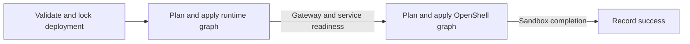

<!-- SPDX-FileCopyrightText: Copyright (c) 2026 NVIDIA CORPORATION & AFFILIATES. All rights reserved. -->
<!-- SPDX-License-Identifier: Apache-2.0 -->

# SDK and OpenTofu Architecture

NemoClaw compiles desired-state YAML into OpenTofu graphs and retains enough state to recover interrupted operations.
The [accepted scope](scope.md) defines the invariants; this page explains the responsibility boundaries and their reasons.

## Responsibilities

| Component | Responsibility |
|---|---|
| CLI | Arguments, prompts, credential acquisition, and output |
| Authoring library | Sparse desired-state values, question guidance, answer resolution, and validation results |
| SDK | Configuration validation, graph compilation, deployment locking, plan policy, and recovery across stages |
| OpenTofu | Dependency ordering, concurrent resource reconciliation, and resource state |
| Docker provider | Docker containers, images, model-cache volumes, and service networks |
| Helm provider | The pinned OpenShell chart release on the authored Kubernetes cluster |
| OpenShell provider | OpenShell workspaces, provider registrations and profiles, sandboxes, and gateway capability reads |
| Fabric provider | Fabric runtime configuration and readiness in agent sandboxes |
| NemoClaw provider | Podman gateway processes, durable storage contracts, and readiness observations |
| Hosted runtime | Model preparation, startup, application health, and protective shutdown |
| Fabric | Adapter and target discovery, native schemas, native configuration validation and mapping, and agent execution |

Operation coordination belongs in the SDK so applications and the CLI share the same recovery behavior.
The SDK checks deployment scope and recovery constraints; providers decide resource transitions and verify remote identity before mutation.
For reconstructible OpenShell resources and non-retained disposable Docker resources, apply and teardown report OpenTofu's actions without reconstructing absence or replacement cleanup from plan history.
Durable identity, retained storage, and undeclared-resource checks remain deployment constraints.
OpenTofu executes the graph with its default parallelism.
The provider implements resource operations against SDK desired-state and observation contracts.
Pure policy compilation stays in SDK configuration; OpenShell transport and mutation code belong to the provider.

The [provider reference](../provider.md) owns resource-specific contracts and protocol details.
Implementation starts at [Deployment](../../crates/nemoclaw-sdk/src/deployment/mod.rs), [graph compilation](../../crates/nemoclaw-sdk/src/compile.rs), and [backend contracts](../../crates/nemoclaw-backend/src/contract.rs).

## Managed Kubernetes Ownership

For a managed Kubernetes gateway, the runtime graph orders retained storage, development authentication, `helm_release.gateway`, and gateway readiness.
The native bundle includes the pinned Helm provider; no Helm CLI is required.

| Owner | Managed Kubernetes responsibility |
|---|---|
| SDK | Compile the graph, validate saved plans against deployment intent and retained bindings, and coordinate runtime and OpenShell stages |
| OpenTofu | Execute dependencies and retain each provider's resource state |
| NemoClaw provider | Create and retain the namespace and encryption key; prepare and remove the development issuer; verify object identities and gateway readiness |
| Helm provider | Install, upgrade, and remove the pinned OpenShell chart release, using the prepared namespace and credentials |
| Platform operator | Install and maintain Agent Sandbox, the default StorageClass, and OpenShift security prerequisites |

The NemoClaw provider does not install or remove the chart, and the Helm release cannot create or adopt the namespace or take ownership of existing resources.
Before Helm can change the release, NemoClaw verifies retained Kubernetes identities; after installation, it records the StatefulSet identity and observes readiness.
For OpenShift, authentication preparation reads the owned namespace's UID and group ranges and supplies non-secret chart overrides through a computed resource output.
Helm waits for that output, and subsequent refresh rejects a changed namespace identity.
Teardown reverses that order, removes the release before the issuer, and retains the namespace, encryption key, and persistent volumes.
Before teardown accepts a missing release, the authentication resource must independently confirm that its Helm release records are absent.
The SDK also checkpoints an established release binding before removal because the pinned Helm provider can forget it after a failed lookup.
Recovery validates the original bundle, intent, generations, state lineage and serial, and resource identities, then uses OpenTofu's state operations to restore only a missing Helm binding.
It preserves the latest state of other resources; a fresh checked plan must authorize subsequent deletion.
Confirmed authentication cleanup prevents restoration after successful release removal.
The [Helm removal recovery procedure](../usage.md#recover-an-interrupted-helm-removal) describes the required retained evidence and retry command.
Issuer private material stays outside Helm values and OpenTofu state.
The provider receives the explicit kubeconfig and context; ambient Helm and Kubernetes provider settings are excluded.
OpenTofu and its providers inherit only platform variables, so a kubeconfig exec plugin gets the caller variables listed in `gateway.kubernetes.environment` and nothing else.
The [migration policy](../migration.md#move-from-the-combined-kubernetes-gateway-resource) keeps deployments using the earlier combined gateway resource with their original bundle and state; the new graph starts a separate deployment.

## OpenShell SDK Boundary

NemoClaw's [OpenShell adapter](../../crates/openshell-provider/src/lib.rs) reconciles deployment ownership and desired state against the gateway.
Reconciliation calls a private, domain-shaped gateway boundary for observations, mutations, sandbox state, and exec.
The connected implementation owns the pinned `OpenShellClient`, protobuf conversion, transport errors, and the choice between a high-level SDK operation and its supported raw client.
The boundary does not mirror gRPC methods or create a second public client API.
NemoClaw uses the SDK's public operations directly where they cover the deployment contract.
Sandbox teardown uses workspace-scoped `get_sandbox`, `delete_sandbox`, and `wait_deleted`; it checks ownership before deletion and requires confirmed absence afterward.
Teardown does not require the sandbox's old image, command, or policy to remain intact.
The connected implementation retains the SDK's raw API only for operations or fields missing from the high-level interface.
The Rust SDK uses gRPC; adopting it does not remove the gateway RPC boundary.
NemoClaw supplies the channel to preserve mutual TLS, lazy connection, and timeout settings that the pinned SDK configuration cannot express.

At the pinned OpenShell revision `e1f3c82caa3ed3b65de22889ae7ef32a774878ef`, the SDK has these integration limits:

| Requirement | SDK limit | Consequence |
|---|---|---|
| Telemetry disabled at build time | Its manifest enables `openshell-core` default features, including telemetry | Use a [vendored manifest patch](../../crates/vendor/openshell-sdk/NOTICE.md) with unchanged Rust source to disable core default features |
| Mutual TLS and bounded lazy connections | `ClientConfig` lacks client certificate/key fields, lazy connection configuration, and request timeouts | Retain custom channel construction through `OpenShellClient::from_parts` |
| Complete workspace identity | `WorkspaceRef` omits the physical ID, resource version, and deletion timestamp | Use the SDK's supported `raw_grpc()` escape hatch for workspace observations and creation readback |
| Sandbox creation with explicit policy | `SandboxSpec` has no policy field; the policy-bearing template API requires a separate workload template | Retain raw creation so the declared policy applies in the initial request |
| Sandbox drift and startup checks | `SandboxRef` omits the specification, deletion timestamp, and startup conditions | Keep full protobuf observations through the raw SDK client |
| Conditional provider updates | The curated client has no provider update method | Preserve raw requests carrying the verified physical ID and resource version |
| Providers, provider profiles, policy status, and gateway capabilities | The curated client has no equivalent methods for these operations | Use the raw SDK client; provider readiness helpers do not replace provider/profile reconciliation |
| Bounded exec against a verified identity | High-level exec addresses the sandbox by name, buffers output without a size cap, and does not reject every malformed event sequence | Verify identity before workspace-scoped exec; retain the local deadline, output limits, and event validation |
| Secret-safe diagnostics | SDK bearer construction does not mark metadata sensitive; SDK errors can retain upstream diagnostic text | Preserve sensitive metadata and NemoClaw's redacted error mapping |

These limits are verified against the pinned [SDK manifest](https://github.com/NVIDIA/OpenShell/blob/e1f3c82caa3ed3b65de22889ae7ef32a774878ef/crates/openshell-sdk/Cargo.toml), [configuration](https://github.com/NVIDIA/OpenShell/blob/e1f3c82caa3ed3b65de22889ae7ef32a774878ef/crates/openshell-sdk/src/config.rs), [client](https://github.com/NVIDIA/OpenShell/blob/e1f3c82caa3ed3b65de22889ae7ef32a774878ef/crates/openshell-sdk/src/client.rs), [types](https://github.com/NVIDIA/OpenShell/blob/e1f3c82caa3ed3b65de22889ae7ef32a774878ef/crates/openshell-sdk/src/types.rs), and [authentication interceptor](https://github.com/NVIDIA/OpenShell/blob/e1f3c82caa3ed3b65de22889ae7ef32a774878ef/crates/openshell-sdk/src/auth.rs).
The supported raw escape hatch provides an SDK integration point but still exposes protobuf compatibility risk.
NemoClaw constructs the client without a token refresher; neither the selected high-level operations nor raw calls automatically retry mutations.
A [telemetry test](../../crates/nemoclaw-sdk/tests/telemetry.rs) proves telemetry remains disabled even when the process environment requests it.
Deletion and exec are name-addressed in the pinned protocol without an atomic ID/version precondition.
NemoClaw verifies identity immediately before either call and never retries an ambiguous mutation automatically; this cannot prevent replacement between verification and the call.
Ownership checks, retained bindings, and desired-state comparison remain NemoClaw responsibilities even when the SDK gains broader coverage.

## Terminal Presentation

The CLI renders SDK progress through an inline Ratatui display or plain lines for redirected output.
Both consume the same typed observations; neither queries resources or interprets runtime logs.
OpenTofu supplies resource operations and identities, while readiness and health remain with their existing owners.
The renderer tracks active work and elapsed time without treating animation as evidence of progress.
It finishes before the CLI writes the final text or JSON result.
Unsupported health, incomplete plans, and unconfirmed state after failure remain explicit in both formats.
See [CLI output](../reference/cli.md#output-and-failure) for the user contract.

## Configuration

Desired-state YAML passes through the SDK's [configuration validation](../contributing/configuration-schema.md).
Configuration retains credential references, not values.

The [authoring library](../../crates/nemoclaw-authoring/src/lib.rs) retains sparse authored values while a frontend answers questions.
It materializes an SDK `Document` only after the current question and validation gates pass.
It has no terminal or deployment operations.
Its journey resolver consumes Fabric descriptor schemas and preserves explicit choices independently of target availability.
Provider presets supply presentation defaults; they do not form a compatibility matrix.
The SDK owns deployment references, credentials, security grants, and resource lifecycle.
Fabric owns adapter identity, native capability claims, accepted settings, configuration validation, and native mapping.
Image builds call Fabric discovery in the installed environment and attach canonical records to the image.
The bundled snapshot is provisional offline metadata.
Harness identifiers are opaque strings.
Authoring derives questions, choices, defaults, and conditional requirements from the selected settings schema.
The SDK projects deployment references into one public Fabric configuration; both planning and execution consume that configuration.
The selected-image descriptor snapshot is validated by Fabric's planner, without starting adapters or reading their native code.
An unavailable or incompatible metadata version leaves native validation unknown.
Generic field validation helps the interview; Fabric's planner owns validation of the complete native configuration.

The Fabric revision remains pinned until the [descriptor catalog change](https://github.com/NVIDIA/NeMo-Fabric/pull/318) and its adapter follow-ups are available together.
That change removes `config.schema` without a replacement; NemoClaw must stop using it to infer required workflows when adopting that revision.
Settings, model, and target schemas remain owner contracts.
A pin update must preserve the currently qualified native configuration, model roles, web integrations, and retained adapter state before regenerating discovery metadata.

The [authoring domain model](authoring-domain.md) defines the journey's configuration, run state, question resolution, and validation gates.
It separates authored intent from decision status, interview position, and target observations.
The [onboarding prototype](onboarding-journeys.md) records supported question coverage, inspection scenarios, and open design questions.

Onboarding reads the target directly through the [`nemoclaw-discovery`](../../crates/nemoclaw-discovery/src/lib.rs) crate, whose read functions the provider's data sources also call during a plan.
It needs no bundle and creates no deployment state.
Discovery observations are keyed by the query that produced them: an engine and compute driver, a hardware engine, an image with its sandbox's Fabric requirements and platform engine, an inference endpoint request, a gateway, or a credential reference.
Onboarding looks up the current document's queries, so an observation made for a different engine, compute driver, image, requirement, or inference endpoint request is never found.
A read that could not be made is an unknown observation with its reason, never absence, so it is not asked again until the caller refreshes it.
Changing the harness or a route changes the image read's requirements, so the image is unobserved until it is read again.
Independent reads run concurrently.

A read whose inputs need no deployment resource is a `DiscoveryObservation`, which onboarding's `observe` and a plan's data sources both produce from the same `DiscoveryQuery` and the same read function.
An image read for a managed gateway takes its platform from the engine read, and `judge_image` computes its compatibility verdict for plan and onboarding alike.
A read that references a resource in the same plan, or whose result a resource consumes, is a `PlanObservation` and appears only in a plan's report: runtime-image acquisition, service readiness after install, and values OpenTofu cannot compute until apply.
Known engine incompatibility or conflicting image/adapter requirements block review and saving.
Engine or image uncertainty remains explicit and permits offline authoring; the bundled catalog supplies harness choices whether or not target inspection is available, and target inspection only assesses compatibility.
Onboarding and planning read engine, hardware-advertisement, image, adapter, and model-catalog observations through the same functions.
Onboarding does not use hardware advertisements yet.
Gateway checks and existing-resource refresh retain their existing owners and failure rules.
Credential availability and explicit host collectors remain direct operations; neither introduces a second provider-state owner.
Observed model identifiers supplement suggestions without replacing accepted intent or proving inference behavior.
See [provider discovery](../provider.md#engine-and-fabric-discovery) for observation status and planning policy.

Native interface, tool-disclosure, and reasoning settings are authored through Fabric's configuration and adapter settings.
Managed search credentials, endpoint protocols, and network grants remain SDK deployment behavior.
The reconstructible `agent_configuration` resource applies canonical Fabric configuration after provider routes are established.
It restarts the Fabric runtime inside its retained sandbox when configuration changes; it does not replace the sandbox.
A restarted host waits for explicit apply before starting a runtime, because persisted intent does not prove that current gateway routes match.
The host calls Fabric's public plan/start/invoke/stop APIs.
The bridge reports health as unsupported for the pinned Fabric revision.
Native model or agent probes with no Fabric contract remain unavailable.

Authoring question resolution and the OpenTofu execution graph have different jobs.
The former chooses questions and reopens dependent answers; the latter schedules provider reads and resource operations for concrete desired state.

The native [bundle](../build.md#build-a-native-bundle) ships the matching CLI, schema, OpenTofu, and providers; source-derived provider versions prevent stale installations from being reused.

## Why Managed Apply Has Two Stages

OpenShell needs a reachable gateway to refresh resources and plan changes.
A managed deployment therefore establishes its runtime infrastructure before planning OpenShell resources.
Deferred provider configuration supports fresh bootstrap, but an unavailable gateway still blocks refresh of existing OpenShell bindings before a combined graph can restore it.
The runtime stage preserves that recovery path.
The SDK coordinates two graphs:

```mermaid
flowchart LR
    Validate[Validate and lock deployment] --> Runtime[Plan and apply runtime graph]
    Runtime -->|Gateway and service readiness| Shell[Plan and apply OpenShell graph]
    Shell -->|Sandbox completion| Done[Record success]
```

Each stage produces a saved plan that the SDK checks before applying.
The runtime graph manages the gateway and inference services; the OpenShell graph manages registrations, sandboxes, and their configuration, including supporting proxies.
Dependencies place required readiness observations after creation and before dependent work.

Public plan observes resources without mutating them and can defer the OpenShell stage until the managed gateway is established.
It can write local intent and plan files.
Apply obtains and checks new plans; a previous preview is not an approval artifact.

Destroy reverses the stage order so workloads are removed while their gateway is still available.
The SDK checks both teardown plans before deleting anything and records completed stages so an interrupted destroy can resume.
The compiler builds teardown configuration from retained intent and the established resource inventory, keeping storage and workspace declarations while removing workload and readiness declarations.
It returns the retained addresses with that graph; plan validation and destroy reporting use the same result.
Storage that was never established is omitted, so partial teardown does not finish creating it.
For commands and deletion effects, see [deployment lifecycle](../usage.md).

## State and Recovery

Desired configuration describes what should exist; a binding identifies the object already established.
The SDK retains deployment ownership, configuration, pending creation targets, and operation progress alongside OpenTofu's resource state.
Matching a name alone cannot authorize adoption.
See [deployment state](../state.md) for the retained files.

Providers distinguish three observation outcomes:

| Observation | Consequence |
|---|---|
| Present with verified identity | Plan permitted configuration changes |
| Confirmed absent | Recreate only if the resource's lifecycle permits it |
| Failed or incomplete | Stop and preserve the prior binding |

Ownership checks run during observation and again before mutation because an object can change after planning.
A mutation can return an established binding together with an error; the caller must preserve both.
Automatic rollback could destroy useful data or repeat an operation whose response was lost.

Before an OpenShell apply, the SDK records targets that may be created or replaced.
A lost creation response can leave an object outside OpenTofu state, so retries must retain those targets' original configuration until reconciliation succeeds.
Unrelated settings can change, and retries preserve earlier pending targets.
Older pending records without per-target evidence require the entire original configuration.

Failures involving only observations, established updates or deletions, or disposable compute permit revised intent or teardown using recorded bindings.
They cannot clear earlier unresolved OpenShell creations; those must be reconciled before teardown.
An OpenShell-stage apply without non-disposable resource creations does not start a pending-creation guard; export can verify its established bindings through OpenTofu even after that apply fails.
Managed-runtime failures retain their separate stage recovery evidence.
Teardown recovery validates current bindings and fresh plans; the failed apply's saved plan file and hash do not authorize the next operation.
The [recovery guide](../usage.md#recover-an-interrupted-operation) describes the caller's next steps.

## Storage and Resource Lifetimes

Processes and their data have different lifetimes.
Separate storage bindings let compute change while gateway signing keys, credentials, and model files survive.
OpenTofu selects Podman gateway replacement through the provider contract, without an SDK whitelist inferred from specification changes.
The SDK requires the gateway's independent storage binding, the compiler orders the dependency and protects retained storage, and the provider rechecks identity before replacing the process.
Missing or substituted bound credentials and gateway storage stop planning; reproducible model caches can be rebuilt.

The shared [OpenShell lifecycle contract](../../crates/nemoclaw-openshell/src/lifecycle.rs) distinguishes retained workspace identity, stateful sandboxes, and reconstructible registrations and configuration.
Sandbox files and conversation history have no separately retained storage, so apply refuses sandbox deletion or replacement.
It also refuses to recreate a missing sandbox binding.
Explicit destroy deletes those files even though the OpenShell workspace remains.
The [retention reference](../state.md#deletion-and-retention) lists what survives.

## Readiness and Export

Required service and sandbox readiness runs through provider data sources in the graph, including on unchanged applies.
Sandbox completion checks deployment configuration and runtime startup, then requests the packaged bridge's health response without invoking an agent or model.
The pinned bridge reports health as unsupported; unrecognized responses fail completion.
A remembered active handle does not establish fresh native health or native file validation; see [observation limits](fabric-management.md#observation-limits).
The SDK reports the fresh OpenTofu observations; it does not repeat those probes.
Only failures proven to be exclusively completion observations can clear the pending-mutation guard.
Readiness failure retains resource state and persistent data.

The hosted runtime owns model preparation and health semantics, including protection that remains active after the CLI exits.
Explicit inference probes are separate SDK operations.
See [runtime design](runtime.md) for process supervision, [execution targets](execution-targets.md) for placement, and [recipe design](recipes.md) for model-specific preparation.

Export uses a refresh-only OpenTofu plan against a temporary state copy and provider configuration without resource or data-source declarations.
It checks observed identity and configuration against retained intent before producing YAML.
It neither applies the plan nor changes the deployment's state and graph, and apply-only readiness checks do not run.
Export preserves desired settings and credential references, not agent files, histories, or model weights.

## Validation

[Integration fixtures](../contributing/integration-tests.md) exercise the production provider and SDK through the pinned OpenTofu binary, including interrupted operations and failed observations.
Successful resource creation or readiness does not establish working inference; that requires a separate model or agent response test.
