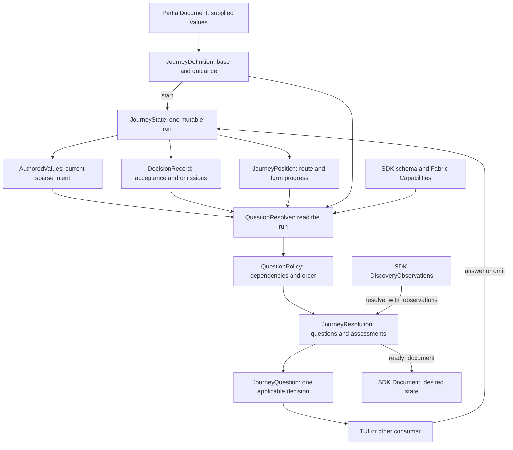

<!-- SPDX-FileCopyrightText: Copyright (c) 2026 NVIDIA CORPORATION & AFFILIATES. All rights reserved. -->
<!-- SPDX-License-Identifier: Apache-2.0 -->

# Authoring Domain Model

Use this model to understand the concepts in `nemoclaw-authoring` and where to change their behavior.
A journey combines sparse desired state with guidance about decisions to review with a person.
One run resolves that combination into questions, applies answers, and produces a document when its configured authoring gates pass.
The [onboarding design](onboarding-journeys.md) owns prototype coverage, inspection scenarios, and open design questions.
The [architecture](architecture.md#configuration) places authoring within the SDK and Fabric boundaries.

## Definition, Run, and Result

`JourneyDefinition`, `JourneyState`, `JourneyQuestion`, and `JourneyResolution` are public concepts.
`AuthoredValues`, `DecisionRecord`, `JourneyPosition`, `QuestionResolver`, `QuestionPolicy`, and `QuestionTarget` are private implementation types with distinct responsibilities.
Consumers use the state API; they do not coordinate these private objects themselves.

| Concept | Represents and owns | Lifetime |
| --- | --- | --- |
| [PartialDocument](../../crates/nemoclaw-authoring/src/partial_document.rs) | Supplied sparse YAML/JSON values; absence remains distinguishable from explicit `null`. Assesses those values against SDK constraints. | Input template or assessment input |
| [JourneyDefinition](../../crates/nemoclaw-authoring/src/journey_definition.rs) | Base partial document, exact `ask` selectors, question scopes, exact and scope `omit` selectors, authored question order, and target prerequisites. | Reusable journey configuration |
| [JourneyState](../../crates/nemoclaw-authoring/src/journey_state.rs) | Coordinates one run and applies validated answer transitions across its value, decision, and position owners. | Mutable run |
| [AuthoredValues](../../crates/nemoclaw-authoring/src/journey_state/authored_values.rs) | Current sparse desired state, cached inactive adapter settings, and whether a gateway engine value was generated. | Run state |
| [DecisionRecord](../../crates/nemoclaw-authoring/src/journey_state/decision_record.rs) | Accepted and omitted answers, reopening causes, preset selections, and route-specific native model decisions. | Run state |
| [JourneyPosition](../../crates/nemoclaw-authoring/src/journey_state/journey_position.rs) | Selected structural forms, current inference route, and visited route completion markers. | Run progress |
| [QuestionResolver](../../crates/nemoclaw-authoring/src/journey_state/resolver/mod.rs) | Read-only interpretation of the run, guidance, and schemas; assembles questions and assessments. | Rebuilt for each resolution |
| [QuestionPolicy](../../crates/nemoclaw-authoring/src/journey_state/resolver/policy.rs) | Prompt dependencies, omissions, preset API restrictions, and presentation order applied to candidate questions. | One resolution pass |
| JourneyQuestion | ID, typed answer target, reason, requiredness, schema, choices, suggestion, reopening cause, and optional title and description for an applicable decision. | Resolution snapshot |
| JourneyResolution | Current questions, omissions, warnings, unverified constraints, partial assessment, and target assessment. | Resolution snapshot |

The decision record is current decision status, rather than an event log or undo history.
The TUI owns its history of state snapshots for Back.
Journey position is authoring progress; selecting a route chooses which existing route to interview without creating deployment state.

## Configuration and Rules

The definition controls deliberate review: ask for a deployment name even if the template supplies one, review a schema-discovered family, or leave an absent optional value omitted.
`JourneySelector::Field` identifies an exact question; `JourneySelector::Scope` selects a supported family through `JourneyScope`.
A scope discovers its applicable fields from the current document and schemas.
The SDK and Fabric determine applicability, valid values, and requiredness.
Guidance can retain a selector for another reachable branch; the resolver warns while it is inactive.
A required or supplied value cannot be omitted through definition guidance.
An optional supplied value can be removed through an interactive omit answer.

[Capabilities](../../crates/nemoclaw-authoring/src/capabilities.rs) represents a Fabric descriptor catalog: advertised harnesses, settings and model schemas, and workflow targets.
It is a rules snapshot, rather than evidence that a target machine can run the deployment.
Bundled catalog metadata permits offline authoring with explicit verification limits.
The SDK input schema describes deployment structure; SDK semantic validation checks complete documents and references.
Fabric owns its complete native configuration validation and mapping.

Schema collectors discover candidate SDK, adapter, workflow, model, and deployment questions.
Question policy decides which candidates can currently appear together and their order.
For example, an open inference preset suppresses its provider fields and current model; a custom endpoint precedes the model; an open API precedes its model in presentation order.
These relationships are built into authoring today, while independent exact-field order comes from the definition.
The definition does not yet describe arbitrary dependencies or conditional prompt programs.

## Values and Decisions Are Separate

A supplied value answers “what is currently proposed?”
Decision status answers “how has this run handled its review?”
A schema-valid supplied value can remain unreviewed and become a suggestion when `ask` requests confirmation.
A valid supplied value outside deliberate review can satisfy the journey without an acceptance record.

| Situation | Value | Decision or question |
| --- | --- | --- |
| Template supplies a name and asks for it | Name retained | Unreviewed; explicit-ask question offers it as a suggestion |
| Person accepts that suggestion | Same name | Accepted |
| Person omits an optional question | Field absent | Omitted |
| Provider endpoint changes after model acceptance | Previous model retained | Model decision reopens with the endpoint as its cause |
| Supplied value violates a known field constraint | Invalid value retained until repaired | Invalid-supplied question where the supported resolver can expose it |

Missing and invalid values are assessment results, not additional `DecisionStatus` variants.
`DecisionStatus` reports unreviewed, accepted, omitted, or reopened for the current run and route.

## A Question Can Represent an Operation

The public question ID connects guidance, presentation, and submitted answers.
An SDK JSON pointer often identifies a field, but several questions represent broader operations.
The private `QuestionTarget` carries that operation and its owner when the question is constructed.
`JourneyQuestionKind` is a public presentation hint for ordinary fields, model input, and structural forms; it does not describe every answer operation.

| Answer target | Effect |
| --- | --- |
| SDK field | Write or remove a field under the active SDK schema; apply dependency behavior for API, endpoint, runtime, or gateway roles. |
| Harness | Select an adapter and preserve inactive adapter settings for a later switch back. |
| Adapter, workflow, or model setting | Edit the active native owner using its Fabric field schema. Model settings belong to the selected route. |
| Structural form | Choose an exclusive representation, such as inline harness or `harnessRef`, before its required fields can be filled. |
| Route selection | Move the interview to an existing route. |
| Inference preset | Apply a curated provider profile and model suggestion through a compound transition. |

`inference:preset` is authoring guidance, rather than a YAML field.
Changing a preset preserves the shared provider name, updates its connection fields and the selected route's model suggestion, and reopens model decisions on every route referencing that provider.
A matching preset preserves supplied connection and model customizations.
Managed-service routes retain their service connection and do not offer external provider presets.
Preset and native model question IDs can be reused across routes; their decisions and typed targets carry route context.
Those IDs alone are insufficient to identify a decision across an entire run.

`JourneyState::answer` resolves an active or revisitable question, validates the answer, and applies it to a candidate copy.
It commits the candidate only after the transition succeeds, so invalid answers leave the run unchanged.
Answer transitions own changes and reopening; resolution reads the resulting state.
The next resolution can also expose a previously accepted value that became invalid under a changed catalog.

## Resolution and Validation Gates

There are several results because supplied-value validity, completed review, and observed compatibility answer different questions.
They are returned through one journey resolution.

| Gate | Meaning |
| --- | --- |
| `PartialAssessment` issues | SDK constraints classify missing, invalid, or deferred values. Partial assessment is conservative and bounded. |
| `assessment().document()` | SDK parsing, semantic validation, and normalization succeeded. Deliberate questions or Fabric constraints may still remain. |
| `materialized_document()` | An SDK document exists, no current questions remain, and the resolver has no unverified Fabric/schema constraints. |
| `ready_document()` | Materialization passed, no observed target conflict exists, and configured target prerequisites have compatible evidence. |

`PartialDocument` uses the SDK-generated schema and safe YAML parser; it does not define a separate partial deployment schema.
Full-schema error classification cannot prove every incomplete conditional instance valid so far.
Unsupported structure remains a deferred or unresolved frontier.
Native model questions currently need the SDK's complete Fabric projection, so they can appear after the SDK document becomes valid.
Successful materialization covers the resolver's supported surface; Fabric's planner retains ownership of complete native compatibility.
Without a configured target prerequisite, unknown target compatibility permits authoring; an observed conflict blocks `ready_document()`.
An SDK document or a ready authoring result does not establish successful deployment or working inference.

## Observations and Consumer Responsibilities

An SDK `DiscoveryQuery` names a read of the target by everything that determines its answer, and [`DiscoveryObservations`](../../crates/nemoclaw-sdk/src/discovery.rs) holds what each query returned: engine, hardware, image, inference endpoint, gateway, and credential-availability observations.
Each observation is keyed by its query, so an observation about one engine, image, or endpoint is never read as one about another, and a lookup by a query of one kind returns that kind's observation type.
A read that could not be made is recorded as an unknown observation with its reason, so it stays distinct from a query never asked and is not repeated on every pass.
`nemoclaw_discovery::observe` reads the real target; tests build or deserialize recorded observations, so decisions can be tested for any hardware without owning it.
`discovery_queries` returns the queries a journey asks for an SDK-valid document.
They are the SDK's `plan_queries`, the list a plan compiles into its discovery data sources, so onboarding and planning cannot ask different questions, plus the credential checks.
Three exclusions are deliberate and tested: only the selected route's inference catalog is read, onboarding reads no hardware for a managed service's engine, and it makes no image read for an external gateway without an engine.
`JourneyState::use_local_engines` keeps the candidate engines this machine has that answered; the caller supplies the candidates, so authoring holds no socket paths.
A runtime they offer becomes the suggestion when it is the only one, and choosing a runtime targets the managed gateway at the engine that answered for it.
A runtime no engine answered for gets no engine, and the target assessment's first reason says so unless an engine is authored.
Hosts are built from the engines they named and what each answered, and one recorded host in `tests/fixtures/observations` pins the replay format.
Hardware and gateway observations do not affect questions or readiness yet.
`resolve_with_observations` supplements current model suggestions with the matching inference observation and assesses target compatibility with `assess_target`.
An empty `DiscoveryObservations` leaves compatibility unverified; referenced credentials appear in informational guidance.
Observations do not silently replace authored values.
`delegate_remaining` is an explicit bulk answer transition gated by an accepted harness, compatible current target observations, and an advertised model. Missing or unverified local credential references appear in `JourneyResolution::information()` and do not block delegation. A reachable catalog that requires an absent key supplies an informational note, clears model suggestions, and defers the catalog gate under the `inference:catalog:credential` diagnostic field. The TUI renders that note separately from errors and leaves individual model entry available; it does not bypass the bulk model check. Denied authentication, missing observations, and other catalog failures remain blocking.

The [TUI](../../examples/onboarding-tui/README.md) owns keys, rendering, state snapshots for Back, discovery calls, cancellation, and saving the returned document.
Authoring owns question resolution and answer transitions; the SDK owns discovery operations and subsequent plan/apply behavior.
The [tree printer](../../crates/nemoclaw-authoring/examples/print_journey_tree.rs) explores the same resolver and answer API with finite choices, optional omissions, and bounded symbolic free input.
It prints a preview with explicit frontiers and limits, rather than storing a separate executable question tree.

## Current Boundaries to Keep Visible

- The journey supports one sandbox and known structural forms; it cannot automatically interview every arbitrary incomplete SDK document.
- String selectors remain the public guidance language even though resolved answer operations are typed internally.
- Question dependencies are code policy; there is no general declarative dependency graph.
- Native model questions depend on complete SDK projection, and target prerequisites currently cover engine and image compatibility.
- Target observations never change questions; they only assess compatibility, and they need an SDK-valid document.
- Journey state is an in-memory run; the public API has no persisted session or decision history format.

The [prototype design](onboarding-journeys.md#prototype-decisions-and-limits) owns these limits, their inspection criteria, and its open design questions.
