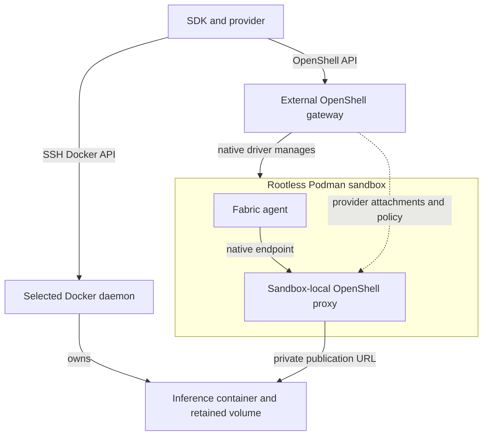

<!-- SPDX-FileCopyrightText: Copyright (c) 2026 NVIDIA CORPORATION & AFFILIATES. All rights reserved. -->
<!-- SPDX-License-Identifier: Apache-2.0 -->

# Execution Target Design

Execution placement determines where resources live; a connection determines how the client reaches them.
The [accepted scope](scope.md) governs implementation changes.
The opening explanation describes the current boundaries, followed by the validation results that established them.

## Connection, Identity, and Publication

An SSH alias can keep the same name while its destination changes.
An engine can also become temporarily inaccessible without losing any resources.
Neither the alias nor a failed connection tells the SDK which daemon owns an existing model volume.

The design separates three values:

| Value | Question it answers | Example |
|---|---|---|
| Connection endpoint | How does the client contact the engine? | An SSH URL resolved through OpenSSH configuration. |
| Durable target identity | Is this the daemon and resource namespace recorded in state? | A verified Docker daemon ID combined with bound resource identities. |
| Inference publication | How does the sandbox's OpenShell proxy reach the model API? | A private host address and declared `/v1` URL. |

This separation permits an external OpenShell gateway to own Podman sandboxes while a selected Docker daemon owns inference.
The Docker daemon running inference does not need to run the OpenShell gateway or its sandboxes.

The diagram distinguishes management traffic from an agent's inference request:

The SSH connection carries engine operations; it does not tunnel inference traffic.
The sandbox-local OpenShell proxy must reach the publication URL.
The gateway supplies provider attachments and policy; inference requests do not pass through the gateway API server.
A successful model request from the CLI host cannot establish that reachability.
The [connection-resolution change](https://github.com/NVIDIA/NemoClaw/commit/80deefbd97) and [independent placement change](https://github.com/NVIDIA/NemoClaw/commit/8bdf4960c0) established these separate paths.

The pinned OpenShell implementation uses [provider-backed native inference](https://github.com/NVIDIA/OpenShell/blob/1fe79f53991debf32776853a60f0cbd4e127dcfb/docs/sandboxes/inference-routing.mdx).

For example, suppose the alias used by an established deployment is redirected to a second daemon containing identically named containers.
The observed daemon identity no longer matches the binding, so planning stops before mutation.
Restoring access to the original daemon preserves the binding; matching names on the second daemon do not authorize adoption.
The [alias-retarget tests](https://github.com/NVIDIA/NemoClaw/commit/5c8936f115) exercise this distinction.

## Why Capacity Must Follow the Engine

The client may run on a laptop while the selected engine runs beside a GPU.
Reading the laptop's `/proc` files would produce valid measurements for the wrong machine.
The SDK needs both measurements and evidence that they belong to the execution target being checked.

The [SSH host collector](https://github.com/NVIDIA/NemoClaw/commit/853a729490) verifies that its remote Docker context is local and associates measurements with the daemon ID.
Missing or mismatched observations stop the capacity check; the SDK never substitutes client-host memory or disk measurements.
The resident supervisor separately checks its own execution host during startup and serving.
Refer to [host observation boundaries](../engine-assumptions.md#host-observations-and-supervision) for the implementation owners.

Two daemons can still share one physical GPU and memory pool.
The [two-daemon validation](https://github.com/NVIDIA/NemoClaw/commit/d3f45ce1a6) tested daemon isolation and routing on one DGX Spark.
Its result does not establish independent physical capacity or separate-host qualification.

## Execution-target Preparation

Decision: Accept for execution-target preparation requested by cvillela.
Keep the existing YAML, resource addresses and binding encodings during connection selection work.
cvillela owns acceptance; two-engine fixtures and a separately recorded live OpenShell/Podman proof are the validation gates.
This does not qualify Podman or remote deployment merely because a Docker-compatible client connects.

A connection alias selects transport details.
A durable execution target identifies the daemon and its storage/account namespace.
A hostname, socket pathname or alias is not sufficient identity.

Rootless and rootful engines on one host are different targets.
Changing connection details may preserve a target only after observing and matching its identity; changing target requires explicit migration, never adoption or cleanup by resource name.
Credential rotation does not migrate a resource.

Missing or failed identity observations stop operations.
This preparation keeps the existing stricter endpoint-change behavior until migration is implemented.

One gateway owns one sandbox execution target.
Inference may be elsewhere, reached through an explicitly resolved inference connection.
No per-sandbox engine placement is promised.

Validate OpenShell's configured Docker-compatible socket before adding engine selection to YAML.
Do not introduce a generic provider framework or remote observation agent in this preparation.

### Host Observation Boundary

Capacity observations belong to an execution host, while `/proc` and `nvidia-smi` belong to the process that reads them.
A remote daemon's architecture does not prove that local memory, GPU or disk observations belong to it.
Missing remote capacity must fail, never fall back to local measurements.

The resident supervisor remains responsible for its own execution host's immediate checks and memory protection.

The first extraction introduces an explicit host-observation boundary.
Capacity rules consume measurements tagged with the selected daemon identity; missing, incomplete, or mismatched observations fail.
The default collector is still the qualified local Linux collector.

An injected observer never falls back to it.
This establishes a test seam, not remote-host detection or a remote observation agent.
In-process SDK connection injection does not serialize transport clients or observers into OpenTofu subprocesses; those still use the explicit compiled endpoints.

Remote placement must address that boundary before it is exposed.

Inference connection resolution now returns the upstream URL and credential reference as one value, independently of sandbox engine selection.
The current managed local topology still publishes through its bridge; that remains a local publication rule, not a proposed cross-host address.
External inference keeps its explicit URL.

Plan performs no reachability probe.
The original implementation tested the route during apply.
Current apply stops at configuration and readiness; [explicit verification](../inference.md#verify-the-result) tests inference from the sandbox through OpenShell.

### Native Podman Validation

The earlier [external gateway proof](../validation/rust-podman-rootless-linux-arm64.json) used OpenShell `d1155aa70042d3e2ee49dbfa15346b108b7c1d92` and its native Podman driver.
It uses Podman image volumes, secrets and rootless networking rather than merely substituting a socket in the Docker driver.
Manual qualification must exercise that driver and record daemon identity behavior by rootless/rootful namespace.

That rootless Linux ARM64 proof exercised the native driver on Podman 4.9.3.
It accepts the client's v5.0.0 API requests and runs Fabric OpenClaw with inference on the existing Docker host.
Isolated egress returns a policy denial, while the OpenShell inference route returns an actual agent reply.

Unchanged apply and export/reapply preserve sandbox and hosted-runtime identities.

Two assumptions failed in this proof.
Podman's Docker-compatible `/info.ID` changes across requests to the same API service, so it cannot back our durable execution-target binding.
Podman resource support needs a separately qualified, persistent namespace identity; do not derive it from a socket, hostname or this compatibility field.

The fixture identity contract remains valid, but its Docker implementation is not a Podman implementation.

The native driver's 45-second graceful stop also exceeds the SDK's old 30-second RPC deadline.
Sandbox deletion now has a bounded 90-second budget; ordinary reads remain bounded at 30 seconds.
The failed first deletion retained state, and an explicit destroy reconciled confirmed absence.

No automatic mutation retry was added.
The live proof and a delayed-delete fixture protect the correction.

This result covers an external native OpenShell gateway and rootless Podman sandboxes on this Linux host.
That earlier result did not qualify managed Podman resources.
The [managed gateway contract](../usage.md#use-a-managed-podman-gateway) anchors identity in its retained owned network and signing keys.
[New managed Podman evidence](../validation/rust-managed-podman-linux-arm64.md) qualifies Deep Agents inference and the lifecycle on local rootless Podman 5.8.7 with OpenShell `1fe79f539`.
Managed Podman inference servers, rootful operation, remote placement, and other operating systems remain unqualified.
See the [Podman evidence](../validation/rust-podman-rootless-linux-arm64.json).

### SSH Transport Validation

The next transport slice accepts explicit `ssh://user@host:port` Docker endpoints in the SDK.
It uses OpenSSH and `docker system dial-stdio`, requires existing host trust, and does not retry mutations.
Remote capacity defaults to unavailable; selecting SSH never assigns the local host collector.

Real loopback SSH tests exercise daemon identity, absence, denied authentication/host trust and artifact upload/download.
They qualify the transport, not remote provisioning, network reachability between hosts, or remote GPU observation.
No engine-selection YAML or inference tunnel is introduced by this slice.

### Independent Inference Placement

The remote-model slice accepts independent service placement and publication.
Decision: Accept for independent inference placement requested by cvillela.
cvillela owns acceptance and the separate-host qualification gate.
A service's placement selects a Docker SSH connection and private container network.

Its publication selects the private host interface and URL that OpenShell can reach.
An external gateway may use the qualified native Podman driver.
There is no inference tunnel, generic provider framework, or per-sandbox engine selection in this change.

Implementation found that the remote model must not depend on a gateway container or gateway storage.
Its process depends only on its retained model storage, and it creates its own owned network.
Gateway connection changes do not alter the remote model specification.

Destroy checks the storage required by each process rather than assuming every process has gateway storage.
Explicit SSH placement and publication are optional, preserving existing local specs.

The SDK and provider subprocess reconstruct the same fixed, read-only SSH host collector.
It reads Linux memory, GPU and Docker-storage capacity on the selected execution host, associates measurements with the daemon ID, and rejects missing or mismatched observations.
It requires existing host trust, Python 3, Docker and NVIDIA tooling; it installs nothing and accepts no shell hooks.

Capacity validation and immediate startup checks remain direct.
Refresh and export retain the shared typed API observation path.
This bounded collector does not yet justify an installed remote observation agent.

Fixture qualification covers read-only plan, insufficient and missing capacity, failed startup with stable identity, explicit recovery, no-op, export/reapply, transport failure, daemon retarget rejection and destroy with retained data.
Real loopback SSH qualifies the collector against this DGX Spark's Docker daemon.
A separate-host GPU apply and an agent reply across that host boundary remain required before claiming live remote deployment qualification.

The example requires preloaded pinned runtime images and a private routable IPv4 interface; the current managed model hardware profile remains Linux ARM64 DGX Spark.

### Volume Observation Correction

Preparing a second Docker daemon exposed a storage observation assumption before live startup: volume verification hard-coded `/var/lib/docker`.
It now checks the selected daemon's reported `DockerRootDir` and rejects missing roots, traversal, and volume paths outside that root.
Ownership labels, generation, volume configuration and durable daemon/container identities remain required.

The remote lifecycle fixture uses a non-default root to exercise this through the CLI and provider; a fixture result does not qualify the two-daemon live setup.

### Two-Daemon Live Qualification

The two-daemon live validation now qualifies SSH-managed inference with an external native OpenShell gateway and rootless Podman sandbox on this DGX Spark.
The second Docker daemon had a separate containerd, data root, socket, daemon identity and network namespace.
OpenClaw answered FOUR through OpenShell using the pinned Qwen3-4B service.

Plan created no runtime resources; an oversized capacity request failed before allocation.

An interrupted download retained partial files and the established container.
Explicit apply completed the snapshot without replacing the container.
No-op and export/reapply preserved model-file timestamps and runtime bindings.

Transport failure and retargeting the same SSH alias to the original daemon stopped plan and preserved state bytes, despite identically named, owned fixtures on both engines.
Destroy touched only the selected engine and retained the model volume and completion receipt.

The resident supervisor also handled its explicit protection-trip signal after the CLI exited, stopped inference without an automatic restart, and recovered on explicit apply with the same container and model data.
Memory-threshold behavior remains covered by fixtures; the live test did not exhaust host memory.
At the recorded revision, managed applies performed the agent-reply probe even when resource plans were unchanged; current live tests invoke it separately.

The results confirm that connection selection, publication and durable daemon identity are separate concerns.
Both daemons share physical capacity: a distinct daemon ID does not imply another GPU or memory pool.
Network namespaces exercise routing isolation but do not qualify a separate physical host, WAN behavior, or another operating system.

The daemon fixture must retain cgroup mount visibility and use an isolated containerd; these are fixture requirements, not reasons to add another product execution framework.
