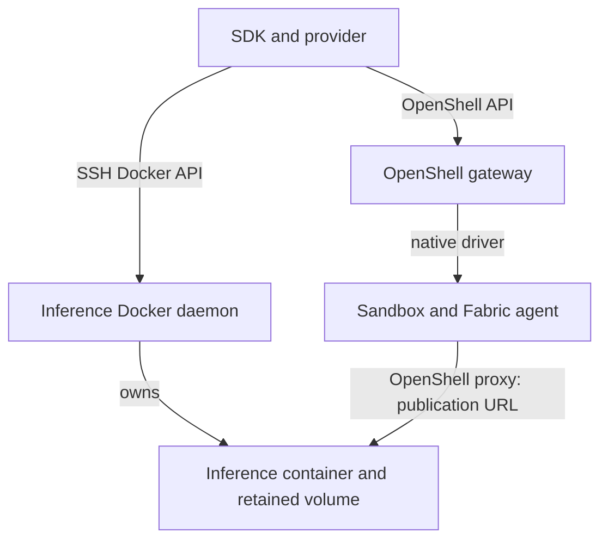

<!-- SPDX-FileCopyrightText: Copyright (c) 2026 NVIDIA CORPORATION & AFFILIATES. All rights reserved. -->
<!-- SPDX-License-Identifier: Apache-2.0 -->

# Execution Target Design

Placement determines where resources live; a connection determines how the client reaches them.
The [accepted scope](scope.md) defines the requirements, and [engine assumptions](../engine-assumptions.md) lists implementation constraints.

## Connection, Identity, and Publication

| Value | Purpose |
|---|---|
| Connection endpoint | Reach the engine, for example through an SSH URL |
| Durable target identity | Verify the daemon and resource namespace recorded in a durable binding |
| Inference publication | Give the sandbox's OpenShell proxy a reachable model API URL |

An SSH alias can be redirected, and a daemon can become inaccessible without losing resources.
Neither a connection name nor a failed connection establishes resource identity.
For bindings that require durable identity, missing or mismatched observations stop the operation; matching resource names cannot authorize adoption or cleanup.
Credential rotation does not migrate resources, and rootless and rootful engines are different targets.
Bound gateway and credential endpoint changes remain rejected; target migration is not implemented.
Disposable Docker compute and model caches follow their [provider reconciliation contracts](../provider.md).

One gateway selects one sandbox execution target.
Inference can run on an independent Docker daemon with its own model storage and network, without depending on gateway storage or a gateway container.
There is no per-sandbox engine selection.

SSH carries engine operations; the sandbox-local proxy sends inference traffic directly to the publication URL.
The gateway supplies policy and provider attachments, but inference requests do not pass through its API server.
A request from the CLI host cannot prove sandbox reachability.
Local bridge publication is not a general cross-host address; SSH services declare a private routable publication URL.
See [SSH service setup](../remote-service.md) and [explicit inference verification](../inference.md#verify-the-result).

## Why Capacity Must Follow the Engine

The default service graph relies on startup checks and resident memory protection inside the inference runtime.
Optional capacity observations must come from the selected engine's host and carry its daemon identity.
Reading the client laptop's memory can produce valid measurements for the wrong machine.
Missing, incomplete, or mismatched observations must fail; there is no fallback to client-host values.

The fixed SSH collector verifies that its remote Docker context is local and reads Linux memory, GPU, and Docker-storage capacity.
SDK and provider subprocesses reconstruct the same collector from explicit placement; in-process client or observer injection does not cross the subprocess boundary.
The collector requires existing host trust and tools, installs nothing, and accepts no shell hooks.
See [host observation boundaries](../engine-assumptions.md#host-observations-and-supervision) for prerequisites and implementation owners.

Capacity observations do not reserve resources, and distinct daemons can share a GPU and memory pool.
The runtime must therefore recheck its own host during startup and serving.

## Engine-Specific Identity

Docker-compatible transport alone cannot establish Podman lifecycle compatibility.
The native OpenShell Podman driver uses Podman image volumes, secrets, and rootless networking.
Podman 4.9.3's changing Docker-compatible `/info.ID` could not identify a durable target.
Managed Podman gateways instead bind their retained owned network and signing identity; this is not a general inference-engine identity.
See [engine identity constraints](../engine-assumptions.md#connections-and-identity).

OpenShell calls remain bounded without automatic mutation retries.
Sandbox deletion has a longer deadline than reads to allow the native driver's graceful stop; a lost response retains state for explicit reconciliation.

## Accepted Scope and Qualification

cvillela accepted execution-target preparation and independent inference placement, retaining ownership of their validation gates.
The preparation preserved existing YAML, resource addresses, and binding encodings; optional service placement and publication subsequently extended configuration.
These changes introduce neither a generic provider framework nor a remote observation agent.

[Transport tests](../validation/rust-ssh-linux-arm64.json) and [service fixtures](../validation/rust-remote-service-linux-arm64.json) cover SSH identity, observation failures, recovery, export, and retained teardown.
[Two-daemon live results](../validation/rust-dual-daemon-linux-arm64.json) cover routing and daemon isolation on one DGX Spark, not separate-host capacity, WAN behavior, or another operating system.
A separate-host GPU apply and agent response remain required before claiming that qualification.

[External Podman](../validation/rust-podman-rootless-linux-arm64.json) and [managed Podman](../validation/rust-managed-podman-linux-arm64.md) results identify the tested native-driver revisions and local rootless Linux ARM64 scope.
They do not qualify managed Podman inference, rootful operation, or remote Podman placement.
