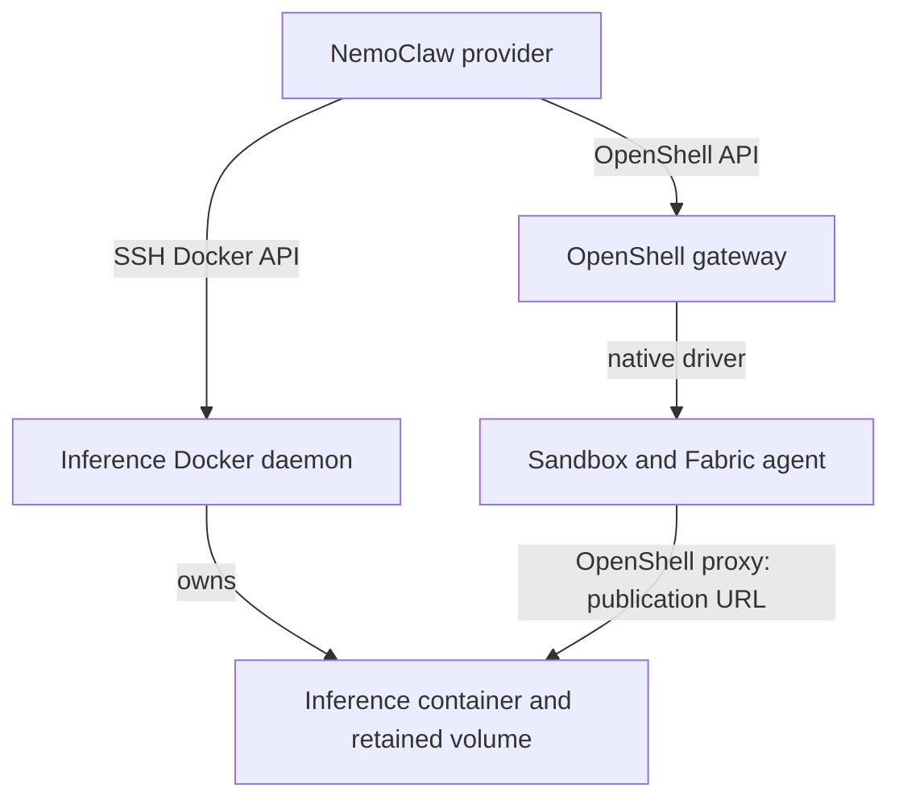
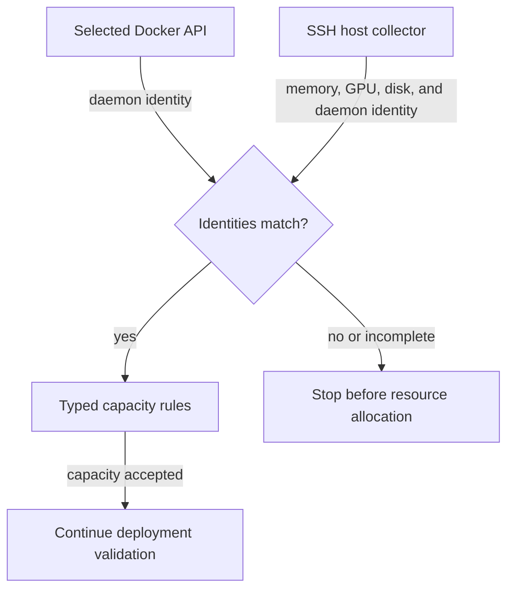

<!-- SPDX-FileCopyrightText: Copyright (c) 2026 NVIDIA CORPORATION & AFFILIATES. All rights reserved. -->
<!-- SPDX-License-Identifier: Apache-2.0 -->

# Execution Target Design

Placement determines where resources live; a connection determines how the client reaches them.
The [accepted scope](scope.md) defines the requirements; [implementation constraints](#implementation-constraints) map them to the code that enforces them.

## Connection, Identity, and Publication

| Value | Purpose |
|---|---|
| Connection endpoint | Reach the engine, for example through an SSH URL |
| Durable target identity | Verify the daemon and resource namespace recorded in a durable binding |
| Inference publication | Give the sandbox's OpenShell proxy a reachable model API URL |

An SSH alias can be redirected, and a daemon can become inaccessible without losing resources.
Neither a connection name nor a failed connection establishes resource identity.
For bindings that require durable identity, missing or mismatched observations stop the operation; matching resource names cannot authorize adoption or cleanup.
Credential rotation does not migrate resources, and rootless and rootful engines are different targets.
Bound gateway and credential endpoint changes remain rejected; target migration is not implemented.
Disposable Docker compute and model caches follow their [provider reconciliation contracts](../provider.md).

One gateway selects one sandbox execution target.
Inference can run on an independent Docker daemon with its own model storage and network, without depending on gateway storage or a gateway container.
There is no per-sandbox engine selection.

```mermaid
flowchart TD
    Client[NemoClaw provider] -->|SSH Docker API| Engine[Inference Docker daemon]
    Client -->|OpenShell API| Gateway[OpenShell gateway]
    Gateway -->|native driver| Sandbox[Sandbox and Fabric agent]
    Engine -->|owns| Model[Inference container and retained volume]
    Sandbox -->|OpenShell proxy: publication URL| Model
```

SSH carries engine operations; the sandbox-local proxy sends inference traffic directly to the publication URL.
The gateway supplies policy and provider attachments, but inference requests do not pass through its API server.
A request from the CLI host cannot prove sandbox reachability.
Local bridge publication is not a general cross-host address; SSH services declare a private routable publication URL.
See [SSH service setup](../remote-service.md) and [explicit inference verification](../inference.md#verify-the-result).

## Why Capacity Must Follow the Engine

The default service graph relies on startup checks and resident memory protection inside the inference runtime.
Optional capacity observations must come from the selected engine's host and carry its daemon identity.
Reading the client laptop's memory can produce valid measurements for the wrong machine.
Missing, incomplete, or mismatched observations must fail; there is no fallback to client-host values.

The fixed SSH collector verifies that its remote Docker context is local and reads Linux memory, GPU, and Docker-storage capacity.
The provider reconstructs the collector from explicit placement; in-process client or observer injection does not cross the subprocess boundary.
The collector requires existing host trust and tools, installs nothing, and accepts no shell hooks.
See [host observations and supervision](#host-observations-and-supervision) for prerequisites and implementation owners.

Capacity observations do not reserve resources, and distinct daemons can share a GPU and memory pool.
The runtime must therefore recheck its own host during startup and serving.

## Engine-Specific Identity

Docker-compatible transport alone cannot establish Podman lifecycle compatibility.
The native OpenShell Podman driver uses Podman image volumes, secrets, and rootless networking.
Podman 4.9.3's changing Docker-compatible `/info.ID` could not identify a durable target.
Managed Podman gateways instead bind their retained owned network and signing identity; this is not a general inference-engine identity.
See [connections and identity](#connections-and-identity).

OpenShell calls remain bounded without automatic mutation retries.
Sandbox deletion has a longer deadline than reads to allow the native driver's graceful stop; a lost response retains state for explicit reconciliation.

## Scope and Qualification

Execution targets add no generic provider framework and no remote observation agent.

The [SSH service fixtures](../contributing/integration-tests.md#ssh-service-fixtures) and [live SSH transport tests](../contributing/live-tests.md#ssh-engine-transport) cover SSH identity, observation failures, recovery, export, and retained teardown.
Separate-host capacity, WAN behavior, and other operating systems are untested; a separate-host GPU apply and agent response are tracked in [#12641](https://github.com/NVIDIA/NemoClaw/issues/12641).

Podman support is limited to local rootless Linux; managed Podman inference, rootful operation, and remote Podman placement are untested ([#12641](https://github.com/NVIDIA/NemoClaw/issues/12641)).

## Implementation Constraints

“Client host” means the host running the SDK, CLI, provider, or collector; “engine host” means the daemon’s execution and storage namespace.
A forwarded Unix socket does not establish that those hosts are the same, and a distinct daemon ID does not establish a distinct physical GPU or memory pool.
Paths labeled SDK are relative to `crates/nemoclaw-sdk/src`; provider and runtime paths are relative to their crate’s `src` directory.

### Connections and Identity

| Boundary and owner | Constraint |
|---|---|
| Provider `docker/mod.rs` and `docker/ssh.rs` | Explicit Unix sockets select local Docker or Podman API connections on Unix clients; SSH endpoints select Docker. HTTP/TLS engine URLs and environment-based discovery are unavailable. |
| Provider `docker/` and `managed/backend.rs` | Connection resolution must select the same endpoint for read, ensure, remove, validation, readiness, and export. |
| Provider `provider.rs`, `services/registry.rs`, and `services/installers/ollama/backend.rs` | Ollama’s engine connection is separate from its HTTP model API. Compilation and provider execution must select the same daemon. |
| SDK `config/` and `managed/spec.rs` | Managed gateways select one local Docker or Podman compute driver for every sandbox. Managed inference can declare independent SSH placement and publication. |
| Provider `managed/storage.rs`, `managed/gateway_storage.rs`, and `managed/observation.rs` | Durable storage bindings combine daemon identity, volume identity, ownership, and generation. Podman gateway bindings use the retained owned network UUID as their namespace anchor. Docker gateway, disposable service compute, and model-cache volumes use native Docker-provider IDs. Cache recovery does not require the original daemon ID or volume creation time. |
| Provider `openshell/transport.rs`; SDK `state/` and `bundle/` | Gateway credentials, deployment locks, state, and bundle subprocesses remain client-side. OpenShell RPC observes gateway-owned resources. |

Both Unix-socket and SSH engine transports require a Unix client.
Windows deployment planning is blocked by required image discovery, including with an external OpenShell gateway.
Unavailable or mismatched identity stops the operation.
Managed Podman gateway bindings combine the retained network UUID with container identity, volume creation time, and signing keys; they never derive identity from a socket path or hostname.

### Storage and Network Placement

| Boundary and owner | Constraint |
|---|---|
| SDK `managed/spec.rs` gateway launch | Host networking, socket binds, supervisor paths, signing files, and relay paths must exist in the gateway and sandbox daemon’s shared host namespace. Remote inference does not move this gateway topology. |
| SDK `managed/spec.rs`; provider `managed/mutation.rs` and `managed/observation.rs` | Bridge identity and published bind addresses belong to the engine host. A local bridge address is not a general cross-host inference address. |
| Provider `managed/gateway_storage.rs` and `managed/observation.rs` | Volume verification uses the selected daemon’s `DockerRootDir`, including non-default roots. It rejects paths outside that root and retains label, creation-time, network, and image checks. |
| Docker provider; NemoClaw provider `docker/mod.rs` | The provider acquires Docker gateway and service images on the selected daemon. Application-status and credential archive reads use that same daemon. Model downloads belong to the runtime. Failed reads are not absence. |
| SDK `config/` and `compile.rs`; provider `openshell/probes.rs` | Local managed inference uses bridge publication; SSH services declare a private publication URL. Explicit inference verification sends requests from the sandbox through OpenShell to the configured endpoint. |
| Build crate and `runtimes/` | Build-engine selection is separate from runtime placement. A locally loaded image must be transferred before another daemon can use it. |

Podman gateway observation checks the native effective and bounding capability sets before normalizing the compatibility API representation of `CapDrop=ALL`; missing or nonempty sets fail observation.
The gateway stores OpenShell’s extracted runtime binaries under its shared data volume, where both the gateway and Podman can read them.
The runtime retains model storage on destroy; do not inspect a remote daemon’s mountpoint as a client-host path.

### Host Observations and Supervision

An engine API result and a host measurement need a common identity before the provider can use them together.
The fixed SSH collector follows this path; local collection follows the same requirement:

```mermaid
flowchart TD
    API[Selected Docker API] -->|daemon identity| Match{Identities match?}
    SSH[SSH host collector] -->|memory, GPU, disk, and daemon identity| Match
    Match -->|yes| Rules[Typed capacity rules]
    Match -->|no or incomplete| Stop[Stop before resource allocation]
    Rules -->|capacity accepted| Start[Continue deployment validation]
```

| Boundary and owner | Constraint |
|---|---|
| Provider `services/capacity.rs` and `hardware/` | Explicit capacity observations consume measurements associated with the selected daemon identity. Missing or mismatched observations fail. |
| Runtime `hardware/linux.rs` and `hardware/nvidia.rs` | Local collection reads local memory, GPU, architecture, and filesystem capacity. These measurements cannot stand in for a remote engine. |
| Provider `hardware/ssh.rs` | Explicit managed SSH placement selects the provider’s fixed read-only host collector. Plain SSH engine connections default to unavailable capacity until an observer is supplied. |
| Runtime `hardware/` and `execution/supervisor.rs` | Container-side memory and GPU observations enforce immediate startup and watchdog limits. Another engine’s host, PID, and cgroup visibility requires qualification. |
| SDK `process.rs` | Process groups and Linux process identity govern local helper cleanup, separately from remote runtime resources. |

The SSH collector needs a POSIX shell with `uname`, `stat`, and `head`, Docker, and NVIDIA tooling on the engine host; it needs no interpreter and performs only reads.
Credential reads and application readiness remain direct observations of the selected runtime, and refresh and export share typed observations from the owning APIs.