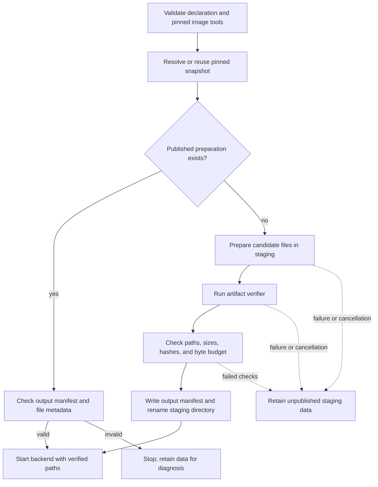

<!-- SPDX-FileCopyrightText: Copyright (c) 2026 NVIDIA CORPORATION & AFFILIATES. All rights reserved. -->
<!-- SPDX-License-Identifier: Apache-2.0 -->

# Inline Recipe Design

An inline recipe describes model-specific preparation and serving requirements without adding a model-specific backend to the SDK.
The [accepted scope](scope.md) governs implementation changes.
The [recipe guide](../recipes.md) owns the declaration and executable protocol; this page explains their design.

## Why the Contract Is Data

Ordinary safetensors loading and Qwen3.8 preparation share downloads, storage, supervision, and backend startup.
Qwen3.8 additionally needs model-specific tools, patches, memory requirements, and verification.
Keeping those details in a compiled recipe enum made adding or changing a model depend on SDK changes.

The [inline declaration](https://github.com/NVIDIA/NemoClaw/commit/b71671aa33) moved those requirements into a versioned contract.
The [execution protocol](https://github.com/NVIDIA/NemoClaw/commit/5585add1e7) lets the runtime invoke pinned image executables with structured JSON.
The later [compatibility removal](https://github.com/NVIDIA/NemoClaw/commit/c9bf619774) deleted the built-in model backend and old completion record reader.

The runtime image supplies executable code; the YAML identifies that code and declares what it needs.
The artifact's verifier decides whether prepared files are meaningful for its model.
The shared runtime checks the verifier's output structure, paths, hashes, byte budget, and publication state.
Both checks are necessary: a matching file hash alone cannot prove that a model-specific transformation was correct.

## Verify Before Publishing Prepared Data

Preparation can take hours or leave partial output after interruption.
The runtime therefore prepares files in a staging directory, writes one output manifest after verification, and atomically renames the directory into place.
The manifest contains the preparation identity and verified files so later observations can check retained data without rerunning the tools.
The final directory and its manifest are the prepared result; no separate completion flag or file is needed.

The diagram shows where candidate files become a published preparation:

For example, a preparation tool can finish writing a file and then return malformed verification output.
The file remains a candidate; it does not become an accepted preparation merely because it exists.
The [verification failure tests](https://github.com/NVIDIA/NemoClaw/commit/d14bd994bf) cover malformed output, duplicate paths, traversal, oversized output, and wrong hashes.
The current [preparation lifecycle](../../crates/nemoclaw-sdk/src/recipes/preparation.rs) performs the final checks and directory rename.

An explicit cache import follows the same rule.
It offers old files to the new verifier as candidates; it does not transfer trust from an old output manifest.
The complete declaration participates in the preparation key, so a serving-only edit currently selects a different preparation identity too.
This favors a single auditable identity over independently versioned preparation and serving contracts.

## Why Preparation Is a Runtime Stage

Prepared files share the inference service's retained storage and recovery lifecycle.
They do not need an independently running controller or a separate OpenTofu resource to resume unfinished work.
The runtime can prepare and verify them before backend startup while the provider retains the service and storage bindings.

The [inline live validation](https://github.com/NVIDIA/NemoClaw/commit/b402353743) reused Qwen packed files after verification and preserved identities across unchanged apply and export/reapply.
Those test results supported keeping preparation inside the runtime stage.
The results apply to the recorded images and DGX Spark setup; they do not qualify every recipe or later image rebuild.

The build boundary follows the same ownership rule.
The [artifact-manifest refactor](https://github.com/NVIDIA/NemoClaw/commit/47d00d62a6) fixed an ordinary vLLM build that still read Qwen-specific pins.
Each artifact directory now declares its own inputs and retains its sources and licenses.
Recipe executables remain trusted image code; their hashes verify identity and do not sandbox their behavior.

## Inline Recipe Contract Validation

The inline recipe validation kept one inference-service resource and independent retained storage.
Both the Qwen recipe and ordinary Qwen3-4B returned actual Fabric OpenClaw responses on DGX Spark.
The Qwen import required verification but no download or repack; unchanged apply and export/reapply preserved runtime identities, start time, and cache metadata.
[The recorded test results](../validation/rust-inline-recipes-linux-arm64.json) identify the tested revisions and exclude native-agent state migration and other GPUs.

The declaration includes resource requirements and typed vLLM settings so model-specific assumptions are explicit in YAML.
Image labels declare required capabilities and protocol support.
Executable invocation uses structured input without shell interpolation or a dynamic library.
A future file or reference form could resolve into the same inline structure; it is not implemented by this contract.

Recipe output manifests and image capabilities use the existing engine-scoped Docker observation boundary.
OpenShell refresh and export retain the shared API readers; execution, downloads, and active probes remain direct.
Adding a collector at the same engine boundary would duplicate that responsibility without moving observations to a new host.

Model-specific sources, licenses, and build manifests remain with their artifacts.

## Built-in Recipe Removal

The cleanup at `c9bf619774` removes the built-in Qwen3.8 implementation from the shared runtime code and rejects the retired backend name.
It also removes the SDK compatibility facade, old runtime environment variable, and old executable alias.
Both rebuilt images returned an agent response through OpenShell on DGX Spark.

See [cleanup validation](../validation/rust-recipe-removal-linux-arm64.json) for the tested source, image pins, retained-data checks, and qualification limits.
