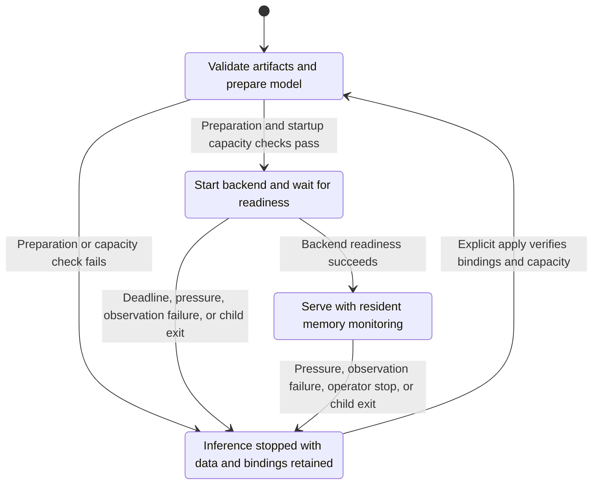

<!-- SPDX-FileCopyrightText: Copyright (c) 2026 NVIDIA CORPORATION & AFFILIATES. All rights reserved. -->
<!-- SPDX-License-Identifier: Apache-2.0 -->

# Runtime and Model Design

The runtime manages the lifetime of inference inside its container, including preparation, startup, readiness, and protective shutdown.
The [accepted scope](scope.md) governs implementation changes.
The opening sections explain the current design.
The later findings describe stages that predate [removal of built-in recipes and runtime aliases](recipes.md).

## Separate What Changes Independently

A model change, a hardware measurement, and a process exit answer different questions.
The first selects artifacts and serving settings; the second determines available capacity; the third requires a lifecycle decision.
Keeping those decisions separate lets an ordinary fixture process exercise the supervisor without loading a model or requiring a GPU.

The [supervisor extraction](https://github.com/NVIDIA/NemoClaw/commit/4fee9768e2) removed its need for a complete DGX Spark service configuration.
The [module separation](https://github.com/NVIDIA/NemoClaw/commit/8d998e02d2) then assigned artifact preparation, hardware rules, and backend behavior to their respective owners.
An inline recipe supplies model-specific tools; vLLM is the serving backend.
Direct hardware checks use recipe-declared compatibility or an explicit `spec.services.<name>.hardware` contract for ordinary models.
Every named profile validates GPU family and observed compute capability independently of memory accounting.
The catalog declares unified or dedicated memory: unified profiles budget host RAM with a reserve, while dedicated profiles require GPU total/free counters and check host RAM separately.
Both collectors preserve unsupported framebuffer counters without guessing a memory architecture; failed queries or incomplete observations stop the operation.
GPU-only profiles require an explicit host architecture, while system profiles fix ARM64.
Custom dedicated GPU requirements retain their Linux AMD64 contract.
Hardware identity does not select device placement or parallelism: current collectors require one GPU and the backend uses tensor parallel size 1.
All paths retain resident memory protection; see [hardware profiles](../models.md#choose-a-hardware-profile) for configuration and qualification limits.

For example, changing a recipe's preparation executable should not change how the supervisor terminates a process group.
Changing a memory threshold should not change the model snapshot's identity.
These boundaries allow focused tests, but they do not qualify an additional backend or GPU.

Ordinary models and inline recipes resolve their serving settings into one vLLM argument builder.
It emits selected options directly; the Hugging Face module owns model identity and snapshot resolution.
The runtime calls backend and hardware functions directly.

## Why the Watchdog Lives with Inference

Model loading and serving can continue after the CLI exits.
Memory protection therefore runs inside the inference runtime, where it can observe its host and stop its owned process group.
The CLI's operation lifetime does not determine the watchdog's lifetime.

The diagram shows the inference lifecycle and its explicit recovery boundary:

The startup deadline applies while the backend is loading; download and preparation have separate limits.
A failed readiness check does not prove that the container was never created.
The SDK retains provider state and persistent storage so recovery can reconcile the service without discarding data.
The Docker provider may restart or replace disposable compute during explicit apply.

After a protective stop, Docker does not automatically restart inference.
An immediate restart could repeat the same memory demand before the operator changes the condition that caused shutdown.
Explicit apply verifies retained storage and reconciles compute; the hosted runtime rechecks startup capacity before serving.

The [watchdog diagnostic correction](https://github.com/NVIDIA/NemoClaw/commit/35199ef56d) shows why the reason for a stop also matters.
A memory parser incorrectly assumed that Linux `MemAvailable` must exceed `MemFree`.
That observation failure required a different fix from real memory pressure, but the original diagnostic did not distinguish them.
The [supervisor](../../crates/nemoclaw-sdk/src/services/runtime/supervisor.rs) now reports pressure, failed observations, closed sample streams, and operator trips separately.
The parser validates free and available memory independently against total memory; refer to the [kernel memory field definitions](https://www.kernel.org/doc/html/v6.5/filesystems/proc.html).

## Why Fabric Owns the Agent Process

There are two process lifecycles in a managed deployment: the inference runtime and the agent inside its OpenShell sandbox.
The inference supervisor protects model serving.
Fabric owns the agent runtime, while OpenShell supplies sandbox isolation and inference routing.

The [single OpenClaw path](https://github.com/NVIDIA/NemoClaw/commit/90472172f3) removed a standalone bootstrap that duplicated agent lifecycle and configuration behavior.
Choosing managed inference therefore does not require choosing a different OpenClaw launcher.
Once Fabric became the only integration, the [harness-only schema](https://github.com/NVIDIA/NemoClaw/commit/207cdf9472) removed a constant `type` field.

Native agent configuration remains the agent's responsibility where NemoClaw has no deployment invariant to enforce.
For Pi, [delegating model metadata validation](https://github.com/NVIDIA/NemoClaw/commit/85be561d33) avoided maintaining a second, incomplete copy of Pi's schema.
NemoClaw still supplies the declared route model ID and OpenShell endpoint.
Refer to [agent runtime usage](../agents.md) for supported combinations and native access.

## Runtime Boundaries

The runtime crate follows process lifetime, not hardware identity.
It builds one `nemoclaw-runtime` executable.
Within the existing crates:

| Concern | Owner |
|---|---|
| Process lifetime, cancellation, status, readiness deadline | Shared runtime supervisor |
| Memory measurements, GPU detection, capacity and protection rules | Hardware modules and validated profiles |
| Snapshot pins, preparation identity, PLE tools, patches and model tuning | Versioned recipe artifacts and their typed adapter |
| Launch arguments and readiness probe | Backend modules |

The recipe selects a qualified backend/hardware combination.
The named service selects its installer with `kind: vllm`; this does not add supported combinations or an arbitrary launch-argument mechanism.
A new hardware profile or backend normally adds a module and records test results for the new configuration.

A crate is justified by a dependency or deployment boundary, not a new GPU name.

Acceptance uses a real fixture process with no DGX Spark configuration to exercise supervisor deadlines, cancellation, readiness, pressure and failed observations.
A separate HTTP fixture exercises backend readiness.
Reference preparation keys, capacity decisions and the observed pre-refactor vLLM argument vector protect compatibility.

The [live image-change test](../testing/live.md#spark-and-fabric) requires plan and apply to replace only the inference service.
[Separate tests](../testing/fixtures.md#runtime-boundaries) check storage retention, prepared-data reuse, and supervisor recovery; the [generic model lifecycle](../testing/live.md#generic-models) also checks an agent reply and export/reapply.
A second real backend remains the next test of how well the modules generalize.

The [refactor acceptance run](../validation/rust-runtime-boundaries-linux-arm64.json) passed the live image upgrade in 646 seconds.
Only the inference process identity changed; cached artifact completion records and every independent binding were preserved.
The agent replied `FOUR`, followed by unchanged apply and export/reapply.

An independent offline rebuild produced the same runtime executable hash.
This qualifies the separation against the existing recipe, not another backend.

## One OpenClaw Deployment Path

OpenClaw uses Fabric (`harness: {kind: openclaw}`) for both external and managed dependencies.
The standalone Node bootstrap and its image recipe are removed.
Gateway and inference ownership do not require a different agent launcher.

Fabric owns the native OpenClaw gateway; native commands and channel settings remain available through sandbox access.
Other harnesses retain their external-service qualification boundary.

Missing or unsupported runtime labels are failed observations, never absence.
Old standalone state is not silently converted; its previous bundle remains necessary for export or teardown.
Sandbox identities and agent data are not migrated by changing the agent type in YAML.

The sandbox selects a typed harness configuration; agents select inference configurations.
Both support inline definitions or application references; tools and integration selections remain per agent.
A constant `type: fabric` added no selection, so it is removed.
The harness still determines the same `fabric-<kind>` runtime identity and OpenTofu resource graph.

Configuration digests change because the serialized document changes; old retained intent is not automatically migrated.

## Model Choice Is Data, Not a Compiled Recipe Constant

The generic `vllm` backend accepts a public Hugging Face repository and immutable commit without a model allowlist.
Runtime image compatibility is bound to the backend, not to a model revision label.
The served model name follows the repository, and model storage identity includes both repository and revision.

The model resolver discovers a checksummed inference snapshot.
The default service plan does not read model metadata, download weights, or prepare a model.
The runtime resolves and validates the snapshot during startup.
Apply retains resumable downloads and one model manifest containing expected files and their verification metadata.
Runtime preparation and recovery use that manifest; [retained model files](../models.md#retained-model-files) describes format compatibility.
Orchestration consumes the runtime's current status instead of repeating its artifact verification.

Authentication, transport, partial inventories and changed artifacts are errors, never resource absence.

The PLE recipe for Qwen3.8 is separate from ordinary safetensors loading.
A different model must not inherit its memory estimate, MTP, parser, cache dtype or preparation tools.
Generic serving declares a total GPU budget and optional native parsers; the existing hardware profile and resident memory protection remain shared.

Compatibility still depends on the selected image, model architecture and available capacity.
Supporting arbitrary repository names does not establish support for remote model code or every checkpoint format.

Live model selection exposed two independent compatibility boundaries.
Qwen3-0.6B loaded and answered the first agent probe, but failed the repeated reply contract.
Qwen3-4B required 4.5 GiB of KV cache for a 32K context, so the initial 4 GiB setting failed startup safely; declaring 6 GiB allowed it to load from the retained snapshot.

Weight size alone cannot prove that serving settings or agent behavior will work.
Keep those failures explicit rather than treating a downloadable model as a qualified agent backend or weakening the agent probe.

With the corrected settings, Qwen3-4B passed actual Fabric OpenClaw replies, unchanged apply, export/reapply, and watchdog stop with explicit recovery.
Resource identities and snapshot completion records stayed stable during recovery; intentional destroy retained storage, and a later apply reused it.
The same generic runtime image served both tested models.

See the [recorded test results](../validation/rust-selected-model-linux-arm64.json).
