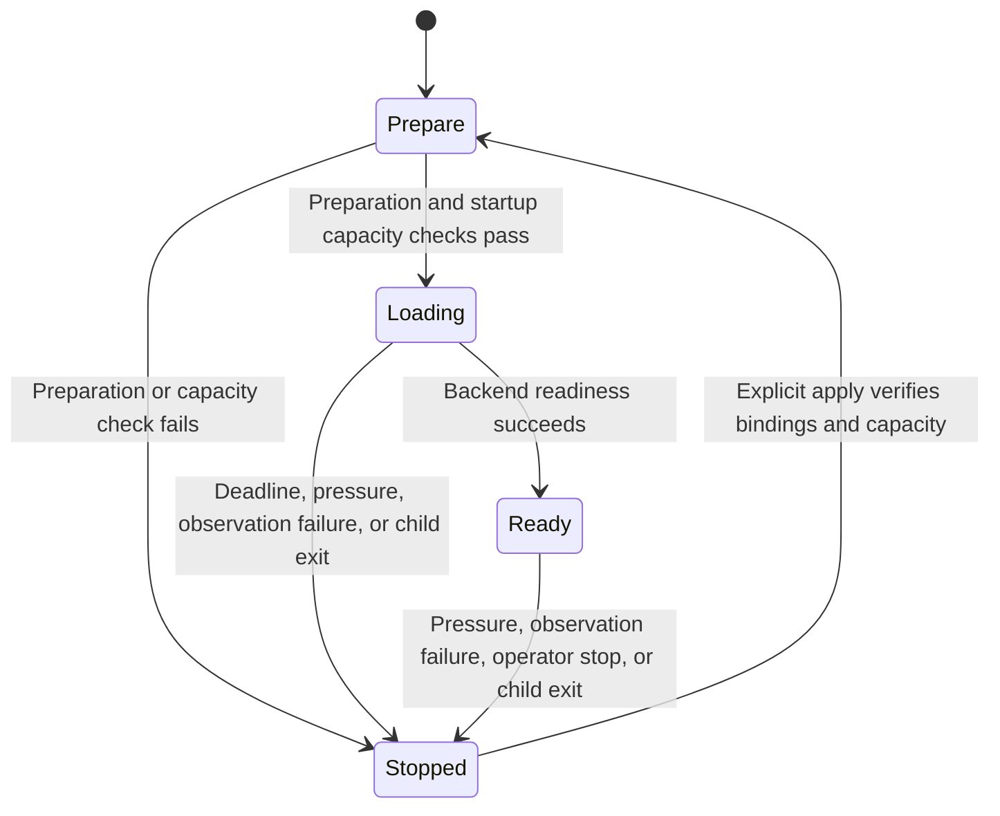

<!-- SPDX-FileCopyrightText: Copyright (c) 2026 NVIDIA CORPORATION & AFFILIATES. All rights reserved. -->
<!-- SPDX-License-Identifier: Apache-2.0 -->

# Runtime and Model Design

The inference runtime owns preparation, startup, readiness, and protective shutdown inside its container.
The [accepted scope](scope.md) defines its requirements.

## Separate What Changes Independently

Model artifacts, hardware capacity, and process lifetime change independently.
Keeping their owners separate lets fixture processes exercise supervision without a model or GPU.
The runtime builds one `nemoclaw-runtime` executable with these boundaries:

| Concern | Owner |
|---|---|
| Process lifetime, cancellation, status, readiness deadline | Shared supervisor |
| Memory and GPU observations, capacity and protection rules | Hardware modules and validated profiles |
| Model identity and snapshot resolution | Hugging Face module |
| Model-specific tools, patches, preparation, and tuning | Versioned recipe artifacts |
| Launch arguments and readiness probe | Backend modules |

Ordinary models and inline recipes use one vLLM argument builder.
Hardware requirements come from the recipe or an explicit service hardware contract.
Named profiles check GPU family and compute capability separately from memory capacity; failed or incomplete observations stop the operation.
Collectors preserve unsupported framebuffer counters without inferring a memory architecture.
Hardware identity does not select device placement or parallelism.
See [hardware profiles](../models.md#choose-a-hardware-profile) for memory accounting, supported configurations, and qualification limits.

A new backend or hardware profile normally adds a module and tests for its configuration.
A new crate requires a dependency or deployment boundary and a consumer.

## Why the Watchdog Lives with Inference

Loading and serving continue after the CLI exits, so memory protection runs beside inference and can stop its owned process group.

The loading deadline is separate from download and preparation limits.
The [supervisor](../../crates/nemoclaw-sdk/src/services/runtime/supervisor.rs) distinguishes pressure, observation failures, closed sample streams, and operator trips so recovery addresses the cause.
A protective stop retains data and bindings and must not trigger an automatic restart loop that repeats the same memory demand.
Explicit apply may restart or replace disposable compute; the runtime rechecks capacity before serving.
See [runtime recovery](../models.md#diagnose-and-recover-a-stopped-runtime) for operator steps.

## Why Fabric Owns the Agent Process

Fabric owns the agent runtime inside the OpenShell sandbox; OpenShell supplies isolation and inference routing.
Managed and external dependencies use the same Fabric launch path.
NemoClaw supplies deployment settings such as model IDs and endpoints, while native agent configuration remains the agent's responsibility where no deployment invariant applies.
This avoids maintaining a second agent schema or launcher.
See [agent runtimes](../agents.md) for harness configuration and native access.

Missing or unsupported runtime labels are failed observations, never absence.
Changing a harness does not migrate sandbox identity or agent data.
Old standalone OpenClaw state requires its original bundle for export or teardown; retained intent is not automatically migrated.

## Model Choice and Retained Data

The generic vLLM backend accepts a public Hugging Face repository and immutable revision without a model allowlist.
Image compatibility follows the backend; model storage identity includes the repository and revision.
Parser acceptance does not establish image, checkpoint, capacity, or agent compatibility.

The default service plan neither reads model metadata nor downloads or prepares a model.
At startup, the runtime resolves a checksummed snapshot and retains resumable downloads and a manifest of expected files and verification metadata.
Orchestration consumes runtime status instead of repeating artifact verification.
Authentication or transport failures, incomplete inventories, and changed artifacts are errors, never absence.
See [retained model files](../models.md#retained-model-files) for format compatibility.

Model-specific preparation belongs in an [inline recipe](recipes.md).
Ordinary models must not inherit another model's memory estimates, parsers, tuning, or preparation tools.
Weight size alone cannot establish that serving settings or agent behavior will work.

## Validation

[Runtime fixtures](../testing/fixtures.md#runtime-boundaries) test supervision, readiness, preparation identity, capacity, retained data, and recovery without a GPU.
[Recorded runtime](../validation/rust-runtime-boundaries-linux-arm64.json) and [model-selection results](../validation/rust-selected-model-linux-arm64.json) cover their named images and hardware, including inference responses and export/reapply.
They do not qualify another backend or arbitrary model.
