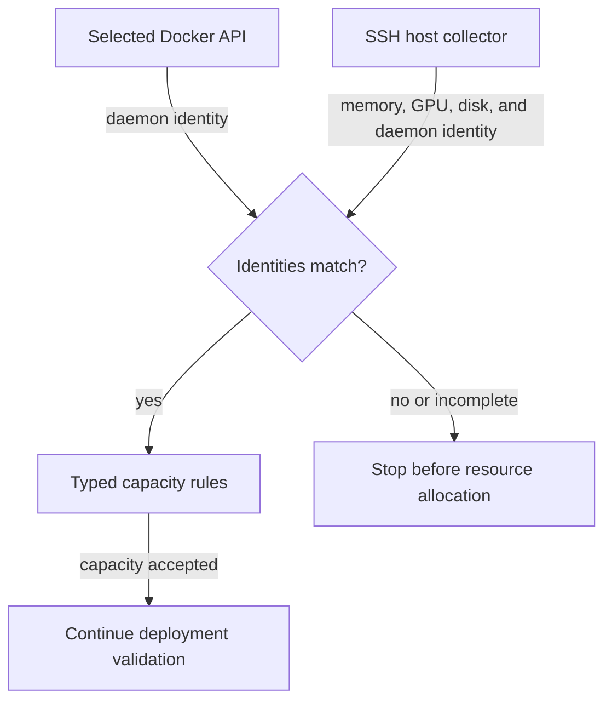

<!-- SPDX-FileCopyrightText: Copyright (c) 2026 NVIDIA CORPORATION & AFFILIATES. All rights reserved. -->
<!-- SPDX-License-Identifier: Apache-2.0 -->

# Execution-Engine Assumptions

This reference describes the checked-in engine boundaries.
The [execution-target findings](design/execution-targets.md) retain the validation results that established them.
Use [the SSH service guide](remote-service.md) for deployment instructions.

“Client host” means the host running the SDK, CLI, provider, or collector.
“Engine host” means the daemon’s execution and storage namespace.
A forwarded Unix socket does not establish that those hosts are the same.

A distinct daemon ID does not establish a distinct physical GPU or memory pool.

## Connections and Identity

| Boundary and owner | Constraint |
|---|---|
| SDK `docker/mod.rs` and `docker/ssh.rs` | Explicit Unix sockets select local Docker or Podman API connections on Unix clients; SSH endpoints select Docker. HTTP/TLS engine URLs and environment-based discovery are unavailable. |
| SDK `docker/` and `managed/backend.rs` | Connection resolution must select the same endpoint for read, ensure, remove, validation, readiness, and export. |
| Provider `provider.rs`; SDK `services/registry.rs` and `services/installers/ollama/backend.rs` | Ollama’s engine connection is separate from its HTTP model API. The SDK and provider must select the same daemon. |
| SDK `config/` and `managed/spec.rs` | Managed gateways select one local Docker or Podman compute driver for every sandbox. Managed inference can declare independent SSH placement and publication. |
| SDK `managed/storage.rs`, `managed/gateway_storage.rs`, and `managed/observation.rs` | Durable storage bindings combine daemon identity, volume identity, ownership, and generation. Podman gateway bindings use the retained owned network UUID as their namespace anchor. Docker gateway and disposable service compute use native Docker-provider IDs. |
| SDK `openshell/transport.rs`, `state/`, and `bundle/` | Gateway credentials, deployment locks, state, and bundle subprocesses remain client-side. OpenShell RPC observes gateway-owned resources. |

A changed bound endpoint is rejected; there is no target migration or lost-state adoption command.
Unavailable or mismatched identity stops the operation.
The rootless Podman validation found that Podman 4.9.3 changes Docker-compatible `/info.ID` between requests.

[Managed Podman qualification](validation/rust-managed-podman-linux-arm64.md) covers local rootless Podman 5.8.7 on Linux ARM64 after the OpenShell TLS fix.
Its gateway bindings use the retained network UUID together with container identity, volume creation time, and signing keys.
They do not derive identity from the changing compatibility field, a socket path, or a hostname.
This is a gateway-specific binding, not a hardware or general inference-engine identity.
The earlier [native Podman test results](validation/rust-podman-rootless-linux-arm64.json) cover an external OpenShell gateway and rootless sandbox path.

## Storage and Network Placement

| Boundary and owner | Constraint |
|---|---|
| SDK `managed/spec.rs` gateway launch | Host networking, socket binds, supervisor paths, signing files, and relay paths must exist in the gateway and sandbox daemon’s shared host namespace. Remote inference does not move this gateway topology. |
| SDK `managed/spec.rs`, `managed/mutation.rs`, and `managed/observation.rs` | Bridge identity and published bind addresses belong to the engine host. A local bridge address is not a general cross-host inference address. |
| SDK `managed/gateway_storage.rs` and `managed/observation.rs` | Volume verification uses the selected daemon’s `DockerRootDir`, including non-default roots. It rejects paths outside that root and retains label, creation-time, network, and image checks. |
| Docker provider; SDK `docker/mod.rs` | The provider acquires Docker gateway and service images on the selected daemon. Application-status and credential archive reads use that same daemon. Model downloads belong to the runtime. Failed reads are not absence. |
| SDK `config/`, `compile.rs`, and `openshell/probes.rs` | Local managed inference uses bridge publication; SSH services declare a private publication URL. Explicit inference verification sends requests from the sandbox through OpenShell to the configured endpoint. A client-side request cannot prove sandbox reachability. |
| Build crate and `runtimes/` | Build-engine selection is separate from runtime placement. A locally loaded image must be transferred before another daemon can use it. |

Podman gateway observation checks the native effective and bounding capability sets before normalizing the compatibility API representation of `CapDrop=ALL`.
Missing or nonempty sets fail observation.
The gateway stores OpenShell’s extracted runtime binaries under its shared data volume, where both the gateway and Podman can read the same paths.

The runtime retains model storage on destroy.
Do not inspect a remote daemon’s mountpoint as if it were a client-host path.
Refer to [lifecycle behavior](usage.md#destroy) for retained resources and deletion limits.

## Host Observations and Supervision

The default service graph relies on startup checks and resident supervision inside the runtime container.
It does not run a client-side or SSH host-capacity collector.
The optional capacity data source retains the following observation boundary: an engine API result and a host measurement need a common identity before the SDK can use them together.
The diagram shows the fixed SSH collector path; local collection follows the same requirement to match the selected daemon:

This optional check addresses the location of the measurements; it does not reserve capacity.
Capacity can change after validation, so the runtime also checks startup headroom and monitors memory while serving.
A failed collector never authorizes using client-host values as a fallback.

| Boundary and owner | Constraint |
|---|---|
| SDK `services/capacity.rs` and `hardware/` | Explicit capacity observations consume measurements associated with the selected daemon identity. Missing or mismatched observations fail. |
| SDK `hardware/linux.rs` and `hardware/nvidia.rs` | Local collection reads local memory, GPU, architecture, and filesystem capacity. These measurements cannot stand in for a remote engine. |
| SDK `hardware/ssh.rs` and `hardware/ssh_capacity.py` | Explicit managed SSH placement selects the fixed read-only host collector in both SDK and provider. Plain SSH engine connections default to unavailable capacity until an observer is supplied. |
| Runtime `hardware.rs` and `supervisor.rs` | Container-side memory and GPU observations enforce immediate startup and watchdog limits. Another engine’s host, PID, and cgroup visibility requires qualification. |
| SDK `process.rs` | Process groups and Linux process identity govern local helper cleanup, separately from remote runtime resources. |

The SSH collector requires existing host trust, Python 3, Docker, and NVIDIA tooling.
It rejects a Docker context that points at another host and installs no packages.
When explicitly invoked, the optional collector performs only reads.
Credential reads and application readiness remain direct observations of the selected runtime.

Refresh and export share typed observations from the owning APIs.

The [two-daemon validation](validation/rust-dual-daemon-linux-arm64.json) exercises routing and daemon isolation on one DGX Spark.
It does not qualify a separate physical host, WAN behavior, rootful Podman, or other operating systems.

Paths labeled SDK are relative to `crates/nemoclaw-sdk/src`.
Provider and runtime paths are relative to their respective crate’s `src` directory.
