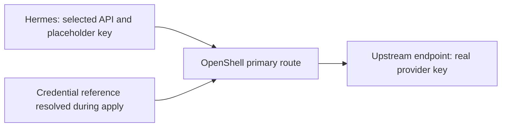

<!-- SPDX-FileCopyrightText: Copyright (c) 2026 NVIDIA CORPORATION & AFFILIATES. All rights reserved. -->
<!-- SPDX-License-Identifier: Apache-2.0 -->

# Configure Inference APIs, Limits, and Authentication

Set `inferenceProviders[].api` to the request API your endpoint accepts.
OpenShell routes the request and supplies the provider credential; selecting an API does not translate requests into a different protocol.

| Harness | API when omitted | Explicit API choices |
|---|---|---|
| OpenClaw, Hermes | `openai-completions` | `openai-completions`, `openai-responses`, `anthropic-messages` |
| Claude | `anthropic-messages` | `anthropic-messages` |
| Codex | `openai-responses` | `openai-responses` |
| Deep Agents, Mini SWE Agent, Nooa, Nooa Bench, Remote Agent | `openai-completions` | `openai-completions` |
| Pi | Native model metadata | Omit provider `api`; see [Pi model selection](agents.md#pi-model-selection) |

Use `provider: anthropic` with `anthropic-messages` and `provider: openai` with either OpenAI API.
The provider name is the local reference used by routes and authentication; it does not select a vendor.
For example, a Nous endpoint using the OpenAI protocol still uses `provider: openai`.

## Build an Image with the Configuration Interface

Explicit API selection, tuning, and authentication require an image built from this revision's Fabric recipe.
The older default image does not implement the new configuration check and will fail readiness with resources retained.

From the repository root on Linux ARM64, with Docker, uv, and a native C/Rust toolchain available:

```sh
python3 image/fabric/build.py --harness openclaw
# For Hermes:
python3 image/fabric/build.py --harness hermes
```

The builder verifies source archives and dependencies, builds a local image, and prints its immutable digest.
It does not publish images.
Use that digest in `sandboxes[].image.ref`.
This local workflow requires a Docker image store that records a repository digest for built images, as the tested containerd image store does.
The sandbox compute daemon must have access to the built image under that digest; a build on another Docker daemon does not make it available to the gateway.
The [tuning example](../examples/inference-tuning.yaml) and [Hermes authentication example](../examples/hermes-auth.yaml) contain zero-digest placeholders that must be replaced before deployment.
Set their gateway and inference endpoints and model IDs for your services, and assign a fresh deployment UID.

Changing an existing sandbox's image, API, tuning, or authentication intent requires replacement.
Ordinary apply rejects these changes rather than replacing the sandbox automatically.
Use a separate deployment when moving from an older image; changing YAML does not migrate native agent state.
For incomplete creation, use the retained state to inspect or destroy the owned resources before starting the new deployment.
See [deployment recovery](usage.md) for the operation workflow.

## Authenticate a Managed vLLM Service

Set `service.authentication: bearer` to generate a private key for a managed vLLM service.
Omission preserves the existing unauthenticated serving behavior.
Build the [runtime image](build.md#build-a-runtime-image) from this revision and use its immutable digest; older images lack the required authentication capability and are rejected before creation.
Do not supply `inferenceProviders[].credential` for a managed service.

The supervisor creates a mode-0600 key in `/data/inference-key` under its persistent writer lock and reuses it after restart.
It passes the key only to the vLLM child process through `VLLM_API_KEY`, then verifies `/v1/models` using bearer authentication before reporting readiness.
Recipe environment maps cannot set `VLLM_API_KEY`.
The SDK reads the key through the verified runtime container identity and installs it in OpenShell's provider credential store.
Agent requests use their OpenShell placeholder credential.
YAML, plans, container launch settings, and OpenTofu state contain no generated key.
The runtime's root user and Docker administrators can read the key and child environment.
The private published HTTP endpoint provides bearer authentication without TLS.

Destroy removes the runtime and provider registration and retains the model volume, including its credential.
Recreation using that retained volume reuses the key.
A missing key after initialization or invalid key metadata stops startup and retains storage for inspection.
Remove the retained volume explicitly when retiring its model data and credential.
Changing an existing service to enable authentication follows the normal runtime replacement rules; YAML does not reconfigure a running server in place.

## Use External Ollama through a Managed Proxy

Use this mode when Ollama and the route's model are already installed on the local Linux Docker host.
Ollama must listen only on a loopback address.
NemoClaw observes its model inventory and never installs, stops, or deletes the daemon or model.
OpenClaw and Hermes can use this proxy with `openai-completions`.

Use a Docker image store that records a repository digest for locally built images, as described in the [image build prerequisites](#build-an-image-with-the-configuration-interface).
Build the proxy image from the repository root:

```sh
docker build -t nc-ollama-proxy image/ollama-proxy
docker image inspect nc-ollama-proxy --format '{{index .RepoDigests 0}}'
```

Use the printed immutable image reference below, choose an available private proxy address reachable by OpenShell, and replace the model digest with the lowercase 64-character value reported by Ollama's `/api/tags` API:

```yaml
# Under spec.inferenceProviders:
- name: local
  provider: openai
  management: external
  endpoint: http://127.0.0.1:11434/v1
  ollamaProxy:
    management: managed
    engine: unix:///var/run/docker.sock
    image: nc-ollama-proxy@sha256:REPLACE_WITH_IMAGE_DIGEST
    endpoint: http://172.20.0.1:11435/v1
    model:
      management: external
      digest: REPLACE_WITH_MODEL_DIGEST
```

The provider's `endpoint` identifies the external daemon; `ollamaProxy.endpoint` identifies the managed proxy and supplies the OpenShell route's upstream URL.
The route's model must name the installed model including its tag, such as `qwen3:4b`.
The proxy uses the host network and checks that the daemon has no listener on a non-loopback address.
Do not also declare `service`, `ollama`, or `credential` on this provider.
All three ownership declarations in this example are optional and preserve these same lifecycle choices when omitted.

The proxy generates a private bearer key in its owned credential volume and reuses it after restart or recreation.
NemoClaw reads that key through the verified container identity when registering the OpenShell provider.
The key does not enter YAML, plans, container launch settings, or OpenTofu state, and the proxy never forwards it to Ollama.
The container's root user and Docker administrators can read its credential volume.
The private HTTP endpoint relies on its configured host-network reachability; it does not provide TLS.

Authenticated access is limited to the selected model through `/v1/models` and `/v1/chat/completions`, including streaming responses.
The proxy verifies the model digest before each request and blocks changed or absent models.
It exposes no model-management API.
Plan and export also reject changed model digests and preserve prior bindings.
Restore the pinned external model before retrying, or use a fresh deployment to select a different installation.

Apply can restart an owned, stopped proxy after its external model passes observation.
A missing or insecure retained key stops startup; it is never regenerated beside initialized storage.
Destroy removes the proxy and OpenShell registration and retains the credential volume; the external daemon and model remain untouched.
Reapplying the original configuration reuses that retained key.
Remove the retained credential volume explicitly when retiring the deployment.

## Tune OpenClaw's Primary Route

Declare tuning in `agents[].inference.routes[].overrides`:

```yaml
overrides:
  model: example-reasoning-model
  contextWindow: 65536
  maxTokens: 8192
  reasoning: true
  reasoningEffort: high
```

`contextWindow` describes model capacity, and `maxTokens` sets OpenClaw's model output limit.
These settings do not resize a managed inference server; configure that service's limits separately.
`reasoning` declares model capability.
`reasoningEffort` sets OpenClaw's default thinking level; `default` leaves the native choice in place.

Omitted fields retain the recipe defaults: 32,768 context tokens, 4,096 output tokens, and reasoning disabled.
Explicit `false` remains distinct from omission in the exported document.
Choose limits and reasoning capabilities that your model supports; the parser checks bounds, not model capabilities.
See the generated [field reference](reference/configuration.md) for accepted ranges.

Route tuning is currently supported only by OpenClaw.
Other harnesses reject these fields; Pi has its separate native model metadata interface.
The SDK verifies the configured OpenClaw API, model limits, and explicitly selected thinking level without rewriting drifted configuration.
Unrelated native settings, including channels and plugins, remain owned by OpenClaw.

## Authenticate Hermes through the Provider

Declare an external HTTPS provider with a credential reference, then reference it from both the route and Hermes authentication:

```yaml
# Under spec.inferenceProviders:
- name: nous
  provider: openai
  api: openai-completions
  endpoint: https://inference-api.nousresearch.com/v1
  credential:
    env: NOUS_API_KEY

# Under the Hermes agent:
auth:
  method: api-key
  providerRef: nous
inference:
  routes:
    - name: primary
      providerRef: nous
      overrides:
        model: moonshotai/kimi-k2.6
```

Supply `NOUS_API_KEY` to the applying process through your secret-management mechanism.
The SDK resolves the reference and supplies the credential to the OpenShell provider.
Hermes sends requests through `https://inference.local/v1` using a sandbox placeholder key; the real upstream key is not added to its launch environment or exported YAML.
The auth reference must name the primary route's credential-bearing provider.
That provider may also use a generated credential from a [managed vLLM service](#authenticate-a-managed-vllm-service) or [Ollama proxy](#use-external-ollama-through-a-managed-proxy).
Interactive Hermes login and separate authentication providers are unsupported.

The gateway retains the provider credential until the owned provider is removed or updated.
Destroy removes the owned provider registration; it does not revoke the upstream key.
Export and destroy do not require resolving the inference key again.
Remove the applying process's environment value when finished, and revoke the upstream key through its issuer when appropriate.



## Verify the Result

Apply checks the agent configuration and sends an inference probe using the selected API.
Export compares the retained intent with the observed launch settings and agent configuration.
Changed or missing settings stop export and preserve deployment state for inspection.
An unchanged exported document can be reapplied without restarting the sandbox.

The deterministic lifecycle fixture exercises apply, CLI export, unchanged reapply, drift rejection, and destroy.
The [offline harness fixture](testing/fixtures.md#inference-api-fixtures) checks actual request paths with local protocol servers; it does not qualify a public endpoint, model quality, or live Nous authentication.

## Additional Inference Workflows

The documented service paths are external API endpoints, managed Ollama, [external Ollama through a managed proxy](#use-external-ollama-through-a-managed-proxy), and [managed vLLM](models.md).
Use [inline recipes](recipes.md) for declared model preparation and [SSH placement](remote-service.md) for the implemented remote-engine contract.

| Workflow or claim | Documentation status |
|---|---|
| Managed llama.cpp or NVIDIA NIM installation | **TBD** — no corresponding managed backend in the current configuration contract |
| Managed model router and model-pool lifecycle | **TBD** — requires implementation and lifecycle evidence |
| Distributed inference across multiple Sparks or Stations | **TBD** — SSH engine placement does not establish multi-node inference |
| Separate physical inference host | **TBD** — requires qualification beyond the retained same-host two-daemon result |
| Vendor-specific catalog selection and validation | **TBD** — compatible API selection does not implement the earlier onboarding catalogs |
| End-to-end hosted-provider guides for NVIDIA, OpenAI, Anthropic, Gemini, OpenRouter, and Nous | **TBD** — qualify the specific endpoint, API, harness, and model before promising compatibility |
| Gated model repositories, custom remote-code models, GGUF, and nested checkpoints in the generic managed backend | **TBD** — outside the current [managed-model contract](models.md) |

These gaps do not prevent use of a separately verified external endpoint with an accepted API.
They do prevent treating an old provider or platform guide as evidence for the current implementation.
