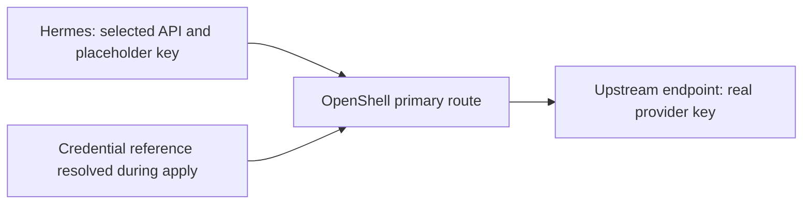

<!-- SPDX-FileCopyrightText: Copyright (c) 2026 NVIDIA CORPORATION & AFFILIATES. All rights reserved. -->
<!-- SPDX-License-Identifier: Apache-2.0 -->

# Configure Inference APIs, Limits, and Authentication

Set `inferenceProviders[].api` to the request API your endpoint accepts.
OpenShell routes the request and supplies the provider credential; selecting an API does not translate requests into a different protocol.

| Harness | API when omitted | Explicit API choices |
|---|---|---|
| OpenClaw, Hermes | `openai-completions` | `openai-completions`, `openai-responses`, `anthropic-messages` |
| Claude | `anthropic-messages` | `anthropic-messages` |
| Codex | `openai-responses` | `openai-responses` |
| Deep Agents, Mini SWE Agent, Nooa, Nooa Bench, Remote Agent | `openai-completions` | `openai-completions` |
| Pi | Native model metadata | Omit provider `api`; see [Pi model selection](agents.md#pi-model-selection) |

Use `provider: anthropic` with `anthropic-messages` and `provider: openai` with either OpenAI API.
The provider name is the local reference used by routes and authentication; it does not select a vendor.
For example, a Nous endpoint using the OpenAI protocol still uses `provider: openai`.

## Build an Image with the Configuration Interface

Explicit API selection, tuning, and authentication require an image built from this revision's Fabric recipe.
The older default image does not implement the new configuration check and will fail readiness with resources retained.

From the repository root on Linux ARM64, with Docker, uv, and a native C/Rust toolchain available:

```sh
python3 image/fabric/build.py --harness openclaw
# For Hermes:
python3 image/fabric/build.py --harness hermes
```

The builder verifies source archives and dependencies, builds a local image, and prints its immutable digest.
It does not publish images.
Use that digest in `sandboxes[].image.ref`.
This local workflow requires a Docker image store that records a repository digest for built images, as the tested containerd image store does.
The sandbox compute daemon must have access to the built image under that digest; a build on another Docker daemon does not make it available to the gateway.
The [tuning example](../examples/inference-tuning.yaml) and [Hermes authentication example](../examples/hermes-auth.yaml) contain zero-digest placeholders that must be replaced before deployment.
Set their gateway and inference endpoints and model IDs for your services, and assign a fresh deployment UID.

Changing an existing sandbox's image, API, tuning, or authentication intent requires replacement.
Ordinary apply rejects these changes rather than replacing the sandbox automatically.
Use a separate deployment when moving from an older image; changing YAML does not migrate native agent state.
For incomplete creation, use the retained state to inspect or destroy the owned resources before starting the new deployment.
See [deployment recovery](usage.md) for the operation workflow.

## Tune OpenClaw's Primary Route

Declare tuning in `agents[].inference.routes[].overrides`:

```yaml
overrides:
  model: example-reasoning-model
  contextWindow: 65536
  maxTokens: 8192
  reasoning: true
  reasoningEffort: high
```

`contextWindow` describes model capacity, and `maxTokens` sets OpenClaw's model output limit.
These settings do not resize a managed inference server; configure that service's limits separately.
`reasoning` declares model capability.
`reasoningEffort` sets OpenClaw's default thinking level; `default` leaves the native choice in place.

Omitted fields retain the recipe defaults: 32,768 context tokens, 4,096 output tokens, and reasoning disabled.
Explicit `false` remains distinct from omission in the exported document.
Choose limits and reasoning capabilities that your model supports; the parser checks bounds, not model capabilities.
See the generated [field reference](reference/configuration.md) for accepted ranges.

Route tuning is currently supported only by OpenClaw.
Other harnesses reject these fields; Pi has its separate native model metadata interface.
The SDK verifies the configured OpenClaw API, model limits, and explicitly selected thinking level without rewriting drifted configuration.
Unrelated native settings, including channels and plugins, remain owned by OpenClaw.

## Authenticate Hermes through the Provider

Declare an external HTTPS provider with a credential reference, then reference it from both the route and Hermes authentication:

```yaml
# Under spec.inferenceProviders:
- name: nous
  provider: openai
  api: openai-completions
  endpoint: https://inference-api.nousresearch.com/v1
  credential:
    env: NOUS_API_KEY

# Under the Hermes agent:
auth:
  method: api-key
  providerRef: nous
inference:
  routes:
    - name: primary
      providerRef: nous
      overrides:
        model: moonshotai/kimi-k2.6
```

Supply `NOUS_API_KEY` to the applying process through your secret-management mechanism.
The SDK resolves the reference and supplies the credential to the OpenShell provider.
Hermes sends requests through `https://inference.local/v1` using a sandbox placeholder key; the real upstream key is not added to its launch environment or exported YAML.
The auth reference must name the primary route's credential-bearing provider.
Interactive Hermes login and separate authentication providers are unsupported.

The gateway retains the provider credential until the owned provider is removed or updated.
Destroy removes the owned provider registration; it does not revoke the upstream key.
Export and destroy do not require resolving the inference key again.
Remove the applying process's environment value when finished, and revoke the upstream key through its issuer when appropriate.



## Verify the Result

Apply checks the agent configuration and sends an inference probe using the selected API.
Export compares the retained intent with the observed launch settings and agent configuration.
Changed or missing settings stop export and preserve deployment state for inspection.
An unchanged exported document can be reapplied without restarting the sandbox.

The deterministic lifecycle fixture exercises apply, CLI export, unchanged reapply, drift rejection, and destroy.
The [offline harness fixture](testing/fixtures.md#inference-api-fixtures) checks actual request paths with local protocol servers; it does not qualify a public endpoint, model quality, or live Nous authentication.
