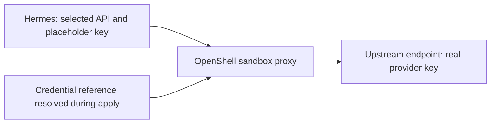

<!-- SPDX-FileCopyrightText: Copyright (c) 2026 NVIDIA CORPORATION & AFFILIATES. All rights reserved. -->
<!-- SPDX-License-Identifier: Apache-2.0 -->

# Configure Inference APIs, Limits, and Authentication

Choose who operates the inference service, then select the API and model used by the agent.
A deployment can select up to 32 inference providers across its sandboxes.
Use a route-inline `provider` or select an enclosing `inferenceProviders` definition with `providerRef`; see [definitions and references](configuration-references.md).

The [earlier native-inference attempt](validation/rust-native-inference-linux-arm64.md#live-attempt-and-blocker) records a blocker at its tested OpenShell revision.
Use the current images and verify your chosen harness and model; historical results do not qualify every supported configuration.

OpenShell's managed inference-route API has been removed at our pinned development revision.
For each selected provider, NemoClaw creates an owned profile binding credentials to its host, port, and API path, attaches the provider to the sandbox, and configures native model connections.
For uncredentialed endpoints, a dummy client key satisfies SDKs that require a nonempty key; no provider credential is stored.
The model ID is client configuration, not a proxy-enforced model restriction; the attached provider authorizes its configured API path.
The YAML `routes` field currently names model configuration; it no longer creates an OpenShell route resource.
See [state migration](state.md#native-inference-migration) before changing an existing deployment.

## Give an Agent Multiple Model Choices

OpenClaw and Pi agents can select different models from one or more providers.
Declare named `inference.routes` and set `inference.default` to the initial choice when there is more than one route.
Omitting `default` selects the sole route; duplicate names and missing defaults are errors.
Use `inferenceRef` to reuse the whole selection without repeating it.

The [multiple-model example](../examples/multiple-models.yaml) gives a researcher smart and fast choices and a writer only the fast model.
It assumes an existing endpoint serving both model IDs; it does not provision that server or download either model.
Select a gateway, current agent image, endpoint, and models using the prerequisites below before applying it with a fresh deployment UID and state directory.

The adapter configures each agent's native model aliases, initial model, and model-selection policy.
The model-selection policy restricts the native agent; OpenShell enforces provider access at its sandbox boundary.
This configuration supplies no automatic fallback, consultation between models, or agent delegation behavior.
Apply installs provider attachments and checks the declared agent configuration without requesting model responses.
Missing credential references still fail deployment; actual endpoint authentication and model compatibility require explicit inference verification.
Use native requests to verify model selection through the agent interface separately.
Parser and native configuration tests do not establish model quality or live-provider compatibility.

OpenClaw and Pi support up to 32 routes per inference definition.
Other harnesses keep one choice.
For OpenClaw, `reasoningEffort` sets the agent's initial default reasoning level; other choices must omit it or use `default`.
Native reasoning changes remain a harness operation.
Managed Ollama and its proxy currently manage one selected model; vLLM choices must use its declared served model.
Additional models can use external providers alongside that managed provider.
Changing OpenClaw model choices changes the sandbox launch specification and requires a fresh deployment.
For Pi, see [model selection and updates](agents.md#pi-model-selection).

## Combine Local and Hosted Providers

The [multiple-provider example](../examples/multiple-providers.yaml) gives a researcher a hosted smart model and a local fast model; the writer selects only the local model.
Each route selects its own `provider` or `providerRef`, with that provider's API and credential reference.
The sandbox attaches the union of those selections, deduplicated by definition identity.
Unused definitions add no resources, credential requirements, or network grants.
Selected definitions must have distinct provider names within their [definition scope](configuration-references.md).
Different sandboxes can reuse local provider names.

Replace the example endpoints, model IDs, deployment UID, and image for your environment.
The local server and hosted API must already exist and satisfy the [external endpoint prerequisites](#prepare-an-external-endpoint).
Set `HOSTED_API_KEY` on the applying host; requests to a real hosted API may incur charges.
Use the [deployment workflow](usage.md) with fresh state, then verify each configured model through its native agent interface.

OpenShell receives a distinct provider credential key for each credentialed registration; the sandbox receives placeholders rather than the resolved upstream keys.
Every attached provider is available at the sandbox boundary.
Each agent runs in its own sandbox; its model-selection policy does not further restrict credentials or network access for other processes in that sandbox.
Use separate deployments when you need independent teardown.
NemoClaw observes the full attachment set and rejects missing or unexpected attachments.

Multiple selected providers can each own a vLLM service, with independent storage and separate generated credentials when `service.authentication: bearer` is configured.
Services on the same engine require distinct publication addresses and the same managed network CIDR.
Plan checks their combined GPU budgets and startup memory; the runtime rechecks available memory before starting inference and keeps its memory watchdog active.
An existing GPU process alone does not reject startup when measured capacity is sufficient.
Managed Ollama and Ollama proxies still share a singleton lifecycle: at most one selected provider may use either mode.
Multiple sandboxes can share any selected provider.
Managed vLLM resource identities now include the provider identity; use a fresh deployment and the previous bundle for export or teardown of older singleton state.
The current tests establish configuration, compilation, API attachment, and drift behavior against fixtures; live multi-provider qualification remains separate.

## Choose a Service Mode

| Situation | Configuration and owning guide | Example to adapt |
|---|---|---|
| You already operate a compatible endpoint or have a hosted API | External `endpoint`, matching `provider`/`api`, and a credential reference when required | [OpenClaw external endpoint](../examples/inference-tuning.yaml), [Hermes authentication](../examples/hermes-auth.yaml) |
| NemoClaw should run Ollama and manage its model lifecycle | Declare `ollama`, a local engine, an existing Docker network, a pinned image, and a reachable private endpoint | [Managed Ollama](#run-managed-ollama) |
| Ollama and its model already run locally and must remain external | Declare `ollamaProxy` to manage an authenticated proxy for one installed model digest | [Proxy configuration](#use-external-ollama-through-a-managed-proxy) |
| NemoClaw should download and serve a pinned public model with vLLM | Declare `service` with the runtime image, repository revision, capacity, and serving settings; see [managed models](models.md) | [Generic vLLM](../examples/spark/vllm.yaml) |
| The Docker daemon running vLLM is reached through SSH | Select explicit `service.placement` and a private `service.publication` endpoint; follow [remote service](remote-service.md) | [Remote vLLM](../examples/spark/remote-vllm.yaml) |
| The model requires preparation tools or runtime patches | Package reviewed tools in an immutable image and declare an [inline recipe](recipes.md) | [Inline Qwen3.8 recipe](../examples/spark/spark-inline.yaml) |

Service ownership does not depend on the harness; the service must support the [request API](#choose-the-request-api) selected by that harness.
The [harness matrix](reference/fabric-harnesses.md) distinguishes accepted configurations from live qualification.
Examples use the SDK default image or an explicit image digest, plus deployment identities and environment-specific endpoints.
Build/select your own matching images and replace those values before use.
An accepted example is a configuration contract; [validation records](validation/README.md) identify which combinations completed live inference and at which revision.

## Choose the Request API

Set `api` on the selected provider, whether inline or referenced, to the request API your endpoint accepts.
OpenShell authorizes native endpoint access and substitutes the provider credential; selecting an API does not translate requests into a different protocol.

| Harness | API when omitted | Explicit API choices |
|---|---|---|
| OpenClaw, Hermes | `openai-completions` | `openai-completions`, `openai-responses`, `anthropic-messages` |
| Claude | `anthropic-messages` | `anthropic-messages` |
| Codex | `openai-responses` | `openai-responses` |
| Deep Agents, Mini SWE Agent, Nooa, Nooa Bench, Remote Agent | `openai-completions` | `openai-completions` |
| Pi | Native model metadata | Omit provider `api`; see [Pi model selection](agents.md#pi-model-selection) |

Use `provider: anthropic` with `anthropic-messages` and `provider: openai` with either OpenAI API.
The provider name is the local reference used by routes; it does not select a vendor.
For example, a Nous endpoint using the OpenAI protocol still uses `provider: openai`.

### Prepare an External Endpoint

Before writing its provider declaration, obtain the base URL, API, exact model ID, required credential, and model limits from the endpoint operator.
Confirm that the selected harness accepts that API in the table above.
For a credentialed endpoint, declare an HTTPS URL and an environment reference; [credential ownership](security.md#credentials-and-authentication) describes where the resolved key persists.
Uncredentialed HTTP inference endpoints must use literal private or loopback addresses.

The endpoint must be reachable from the sandbox's OpenShell proxy, not just from your client terminal.
A loopback URL refers to the network namespace making the request.
For a local external Ollama daemon, use the [managed proxy](#use-external-ollama-through-a-managed-proxy) contract instead of assuming that the gateway can reach the client's loopback interface.

Use the route's `overrides.model` for the upstream model ID.
Native agents send the configured model ID to the native endpoint using an OpenShell placeholder credential; they do not need the real upstream key in their YAML or sandbox environment.
Confirm a native agent reply after apply using [verification levels](#verify-the-result).
Named-provider walkthroughs remain [TBD](#additional-inference-workflows) until their endpoint/API/model combinations are qualified.

## Build an Image with the Configuration Interface

Explicit API selection, tuning, and authentication require an image built from this revision's Fabric recipe.
Images built for the former `inference.local` route are incompatible; rebuild before creating a native-inference deployment.

Follow the [agent image build prerequisites](build.md#build-agent-images), then run from the repository root:

```sh
# On Linux ARM64:
docker buildx bake openclaw --load
# For Hermes:
docker buildx bake hermes --load
# On Linux AMD64:
AGENT_PLATFORM=linux/amd64 docker buildx bake deepagents --load
```

These commands load `nc-fabric:openclaw`, `nc-fabric:hermes`, and `nc-fabric:deepagents` locally.
Linux AMD64 also supports the OpenClaw target through the same `AGENT_PLATFORM` selector.
Follow [image digest selection](build.md#build-agent-images) and use the matching immutable reference in `sandboxes[].image.ref`.
The sandbox compute daemon must have access to the built image under that digest; a build on another Docker daemon does not make it available to the gateway.
The [tuning example](../examples/inference-tuning.yaml) and [Hermes authentication example](../examples/hermes-auth.yaml) contain zero-digest placeholders that must be replaced before deployment.
Set their gateway and inference endpoints and model IDs for your services, and assign a fresh deployment UID.

Changing an existing sandbox's image, API, tuning, or authentication intent requires replacement.
Ordinary apply rejects these changes rather than replacing the sandbox automatically.
Use a separate deployment when moving from an older image; changing YAML does not migrate native agent state.
For incomplete creation, use the retained state to inspect or destroy the owned resources before starting the new deployment.
See [deployment recovery](usage.md) for the operation workflow.

## Run Managed Ollama

Use the [managed Ollama example](../examples/managed-ollama.yaml) with a harness using OpenAI Completions.
Before planning, select your own deployment UID, current agent image, immutable `ollama/ollama@sha256:...` image, and route model including its tag.
This backend uses a local Docker engine and an existing network that supports published container ports.
It does not create that network.
Do not select Docker's `host` network: the managed container contract publishes container port 11434 to the address and port in the provider endpoint.

The endpoint must be an explicit private or loopback IP URL ending in `/v1`, reachable from both the applying process and OpenShell.
The endpoint has no generated bearer credential or TLS in this mode; restrict access through the host's existing network controls.
Do not add `service`, `ollamaProxy`, or a provider `credential` to this declaration.
The current container contract requests no GPU devices.
Use a CPU-sized model for this path; GPU acceleration in this managed contract remains **TBD**.
For an independently operated GPU-enabled Ollama daemon, evaluate the separate [external proxy path](#use-external-ollama-through-a-managed-proxy).

Apply can pull the image and model, creates an owned model volume and container, and checks readiness without generation.
Ensure the engine can fetch the image and the container can fetch the model, with enough storage and host memory for both.
From the directory containing your adapted `deployment.yaml`:

```sh
nemoclaw plan --state-dir .local/ollama deployment.yaml
nemoclaw apply --state-dir .local/ollama deployment.yaml
nemoclaw export --state-dir .local/ollama --output observed.yaml
```

Inspect the plan before applying and use the export only after it succeeds.
The SDK pulls a model through `/api/pull` only after a complete `/api/tags` inventory confirms it is absent.
Ollama model tags are mutable; NemoClaw records the observed digest in model state, but this does not turn the requested tag into an immutable pin.
The generic vLLM backend instead requires an immutable repository revision before download.
Successful apply establishes the configuration and readiness checks described under [verification](#verify-the-result); verify a native reply separately.

If the owned container is stopped, apply can start it and then inspect its model inventory.
An inaccessible or malformed inventory does not authorize another model pull.
After an interrupted pull, retain the original YAML and state and explicitly reapply after correcting the reported failure.
Destroy removes the owned service and OpenShell registration while retaining model storage and the pre-existing network.
See [state retention](state.md) before removing any retained data.

The [service contract](../crates/nemoclaw-sdk/src/ollama/service.rs), [model lifecycle](../crates/nemoclaw-sdk/src/ollama/models.rs), and [recovery test results](validation/rust-ollama-recovery-linux-arm64.json) support this procedure.
The [original live result](validation/rust-ollama-linux-arm64.json) used CPU inference and records the host-network port-publication failure; it does not qualify GPU execution.

## Authenticate a Managed vLLM Service

Set `service.authentication: bearer` to generate a private key for a managed vLLM service.
Omission preserves the existing unauthenticated serving behavior.
Build the [runtime image](build.md#build-a-runtime-image) from this revision and use its immutable digest; older images lack the required authentication capability and are rejected before creation.
Do not supply `inferenceProviders[].credential` for a managed service.

The supervisor creates a mode-0600 key in `/data/inference-key` under its persistent writer lock and reuses it after restart.
It passes the key only to the vLLM child process through `VLLM_API_KEY`, then verifies `/v1/models` using bearer authentication before reporting readiness.
Recipe environment maps cannot set `VLLM_API_KEY`.
The SDK reads the key through the verified runtime container identity and installs it in OpenShell's provider credential store.
Agent requests use their OpenShell placeholder credential.
YAML, plans, container launch settings, and OpenTofu state contain no generated key.
The runtime's root user and Docker administrators can read the key and child environment.
The private published HTTP endpoint provides bearer authentication without TLS.

Destroy removes the runtime and provider registration and retains the model volume, including its credential.
Recreation using that retained volume reuses the key.
A missing key after initialization or invalid key metadata stops startup and retains storage for inspection.
Remove the retained volume explicitly when retiring its model data and credential.
Changing an existing service to enable authentication follows the normal runtime replacement rules; YAML does not reconfigure a running server in place.

## Use External Ollama through a Managed Proxy

Use this mode when Ollama and the route's model are already installed on the local Linux Docker host.
Ollama must listen only on a loopback address.
NemoClaw observes its model inventory and never installs, stops, or deletes the daemon or model.
OpenClaw, Hermes, Deep Agents, and Pi can use this proxy with `openai-completions`.
For Pi, omit provider `api` and supply `piModel` metadata when the model is absent from its registry; see the [Pi example](../examples/fabric-pi.yaml).

Use a Docker image store that records a repository digest for locally built images, as described in the [image build prerequisites](#build-an-image-with-the-configuration-interface).
Build the proxy image from the repository root:

```sh
docker buildx bake ollama-proxy --load
docker image inspect nc-fabric:ollama-proxy --format '{{index .RepoDigests 0}}'
```

Use the printed immutable image reference below, choose an available private proxy address reachable by OpenShell, and replace the model digest with the lowercase 64-character value reported by Ollama's `/api/tags` API:

```yaml
# Under spec.inferenceProviders:
- name: local
  provider: openai
  management: external
  endpoint: http://127.0.0.1:11434/v1
  ollamaProxy:
    management: managed
    engine: unix:///var/run/docker.sock
    image: nc-fabric@sha256:REPLACE_WITH_IMAGE_DIGEST
    endpoint: http://172.20.0.1:11435/v1
    model:
      management: external
      digest: REPLACE_WITH_MODEL_DIGEST
```

The provider's `endpoint` identifies the external daemon; `ollamaProxy.endpoint` identifies the managed proxy and supplies the native inference URL.
The route's model must name the installed model including its tag, such as `qwen3:4b`.
The proxy uses the host network and checks that the daemon has no listener on a non-loopback address.
Do not also declare `service`, `ollama`, or `credential` on this provider.
All three ownership declarations in this example are optional and preserve these same lifecycle choices when omitted.

The proxy generates a private bearer key in its owned credential volume and reuses it after restart or recreation.
NemoClaw reads that key through the verified container identity when registering the OpenShell provider.
The key does not enter YAML, plans, container launch settings, or OpenTofu state, and the proxy never forwards it to Ollama.
The container's root user and Docker administrators can read its credential volume.
The private HTTP endpoint relies on its configured host-network reachability; it does not provide TLS.

Authenticated access is limited to the selected model through `/v1/models` and `/v1/chat/completions`, including streaming responses.
The proxy verifies the model digest before each request and blocks changed or absent models.
It exposes no model-management API.
Plan and export also reject changed model digests and preserve prior bindings.
Restore the pinned external model before retrying, or use a fresh deployment to select a different installation.

Apply can restart an owned, stopped proxy after its external model passes observation.
A missing or insecure retained key stops startup; it is never regenerated beside initialized storage.
Destroy removes the proxy and OpenShell registration and retains the credential volume; the external daemon and model remain untouched.
Reapplying the original configuration reuses that retained key.
Remove the retained credential volume explicitly when retiring the deployment.

## Tune OpenClaw's Primary Route

Declare tuning in `agent.inference.routes[].overrides`:

```yaml
overrides:
  model: example-reasoning-model
  contextWindow: 65536
  maxTokens: 8192
  reasoning: true
  reasoningEffort: high
```

`contextWindow` describes model capacity, and `maxTokens` sets OpenClaw's model output limit.
These settings do not resize a managed inference server; configure that service's limits separately.
`reasoning` declares model capability.
`reasoningEffort` sets OpenClaw's default thinking level; `default` leaves the native choice in place.

Omitted fields retain the recipe defaults: 32,768 context tokens, 4,096 output tokens, and reasoning disabled.
Explicit `false` remains distinct from omission in the exported document.
Choose limits and reasoning capabilities that your model supports; the parser checks bounds, not model capabilities.
See the generated [field reference](reference/configuration.md) for accepted ranges.

Deep Agents, mini-swe-agent, and remote-agent also accept `maxTokens`, which is passed through Fabric to the native model client.
The other tuning fields remain OpenClaw-specific; Pi accepts its native model metadata through `piModel`.
The SDK verifies the configured OpenClaw API, model limits, and explicitly selected thinking level without rewriting drifted configuration.
Unrelated native settings, including channels and plugins, remain owned by OpenClaw.

## Authenticate Hermes through the Provider

Declare an external HTTPS provider with a credential reference, then select it from the route and enable Hermes authentication:

```yaml
# Under spec.inferenceProviders:
- name: nous
  provider: openai
  api: openai-completions
  endpoint: https://inference-api.nousresearch.com/v1
  credential:
    env: NOUS_API_KEY

```

On the Hermes agent:

```yaml
auth:
  method: api-key
inference:
  routes:
    - name: primary
      providerRef: nous
      overrides:
        model: moonshotai/kimi-k2.6
```

Supply `NOUS_API_KEY` to the applying process through your secret-management mechanism.
The SDK resolves the reference and supplies the credential to the OpenShell provider.
Hermes sends requests to the selected provider endpoint using an endpoint-bound sandbox placeholder key; the real upstream key is not added to its launch environment or exported YAML.
Authentication derives its provider from the primary route, including when that provider is inline.
The selected provider must carry a credential.
That provider may also use a generated credential from a [managed vLLM service](#authenticate-a-managed-vllm-service) or [Ollama proxy](#use-external-ollama-through-a-managed-proxy).
Interactive Hermes login and separate authentication providers are unsupported.

Omit the former `auth.providerRef` field; it is rejected.
Retained Hermes intent containing that field is not migrated automatically; editing only the input YAML does not update saved intent.
Use the matching previous bundle for export or teardown of that deployment.

The gateway retains the provider credential until the owned provider is removed or updated.
Destroy removes the owned provider registration; it does not revoke the upstream key.
Export and destroy do not require resolving the inference key again.
Remove the applying process's environment value when finished, and revoke the upstream key through its issuer when appropriate.



## Share a Gateway across Deployments

Each deployment UID derives a distinct OpenShell workspace containing its provider profile, provider registration, and sandbox.
Separate YAML files with fresh UIDs and separate state directories can use the same external gateway with separate provider attachments.
Use the gateway operator's authorization for each workspace and [select the matching workspace](interfaces.md#select-the-gateway-and-workspace) for native access.
Giving two documents the same UID does not create independent deployments.

Use checked `nemoclaw export` to inspect provider, sandbox, and native agent configuration against retained intent.
Ambient provider or native-configuration edits can produce drift; they are not a NemoClaw reconnect or model-switch procedure.
Follow [the change path](usage.md#choose-the-change-path) to update desired state and verify a reply afterward.
The [compiler](../crates/nemoclaw-sdk/src/compile.rs) and [resource mutation](../crates/nemoclaw-sdk/src/openshell/mutation.rs) define workspace ownership.

## Understand Timeout Budgets

Choose the budget for the phase that failed; extending an agent turn does not extend model loading or readiness.

| Phase | Current budget and setting |
|---|---|
| OpenClaw agent turn and native provider request | Selected harness's `execution.timeoutSeconds`; defaults to 600 seconds; see [execution defaults](agents.md#openclaw-execution-settings) |
| Managed vLLM backend loading | `service.serving.startupTimeoutSeconds`; omitted or zero selects 1,800 seconds; explicit values 60–3,600 |
| Managed vLLM readiness from the SDK, including model preparation | Fixed 9-hour wait; expiration leaves the owned container, watchdog, and data in place |
| Each packaged recipe preparation or verification execution | Fixed 8-hour limit; staged data remains after failure |
| Managed gateway readiness | Fixed 90-second wait |
| Sandbox/agent readiness | Fixed 120-second wait |
| Explicit SDK API probe (`OpenShell::inference_ready`) | Fixed 90-second sandbox execution; non-Pi HTTP probes abort after 80 seconds |
| Explicit SDK agent probe (`OpenShell::agent_response`, OpenClaw/Hermes) | OpenClaw: 300-second native turn; local Hermes: 280-second HTTP request within a 300-second Fabric probe; Relay Hermes: 300-second Fabric probe; all have a 360-second sandbox-execution bound |

These are phase limits, not a promised total duration for apply.
Other bounded observations can fail earlier, and request or transport failures are not automatically retried as mutations.
The old onboarding timeout environment variables are not configuration inputs for these SDK paths.
Use the [field reference](reference/configuration.md), [probe implementation](../crates/nemoclaw-sdk/src/openshell/probes.rs), [deployment readiness](../crates/nemoclaw-sdk/src/deployment/runtime.rs), and [recipe runner](../crates/nemoclaw-runtime/src/inline_recipe.rs) for the current boundaries.
For a stopped managed service, inspect its [retained status](models.md#diagnose-and-recover-a-stopped-runtime) before choosing recovery.

## Verify the Result

Apply checks resource ownership, agent configuration, and readiness without requesting model or agent responses.
Managed services retain startup, model-inventory, capacity, and memory-supervision checks.
Export compares the retained intent with the observed launch settings and agent configuration.
Changed or missing settings stop export and preserve deployment state for inspection.
An unchanged exported document can be reapplied without restarting the sandbox.

| Check | What success establishes | What it does not establish |
|---|---|---|
| Parse and plan | Accepted fields and observed ownership/configuration; a `deferred` list identifies checks that cannot run yet | No runtime creation, model request, or complete result for deferred stages |
| Apply readiness | Required managed services are ready and the sandbox has the declared agent configuration | Successful generation, upstream inference credentials, or a native agent conversation |
| Export | Observed configuration agrees with retained intent | An inference request or native-data backup |
| A reply through your chosen native interface | That interface, agent, route, and model completed the tested turn | Support for untested providers, models, tools, or long conversations |

An empty `changes` list on apply does not skip configuration or readiness checks.
Operation results no longer contain `agentResponse`.
After apply, send a short prompt through the [native agent interface](agents.md#choose-native-access), or explicitly select an [owned live smoke test](testing/live.md).
Those checks can incur inference charges and may affect agent history; failure does not undo a successful deployment.
The SDK retains `OpenShell::inference_ready` and the OpenClaw/Hermes `OpenShell::agent_response` checks for explicit callers with a verified sandbox binding; the CLI has no separate verification command.
Changing a model can expose API, context, or tool-format incompatibility even when the endpoint is reachable.
Use [change constraints](usage.md#choose-the-change-path) before changing the API or agent launch settings.

The deterministic lifecycle fixture exercises apply, CLI export, unchanged reapply, drift rejection, and destroy.
The [offline harness fixture](testing/fixtures.md#inference-api-fixtures) checks actual request paths with local protocol servers; it does not qualify a public endpoint, model quality, or live Nous authentication.

## Additional Inference Workflows

The documented service paths are external API endpoints, managed Ollama, [external Ollama through a managed proxy](#use-external-ollama-through-a-managed-proxy), and [managed vLLM](models.md).
Use [inline recipes](recipes.md) for declared model preparation and [SSH placement](remote-service.md) for the implemented remote-engine contract.

| Workflow or claim | Documentation status |
|---|---|
| Managed llama.cpp or NVIDIA NIM installation | **TBD** — no corresponding managed backend in the current configuration contract |
| Managed model router and model-pool lifecycle | **TBD** — requires an implementation and lifecycle test results |
| Distributed inference across multiple Sparks or Stations | **TBD** — SSH engine placement does not establish multi-node inference |
| Separate physical inference host | **TBD** — requires qualification beyond the retained same-host two-daemon result |
| Vendor-specific catalog selection and validation | **TBD** — compatible API selection does not implement the earlier onboarding catalogs |
| End-to-end hosted-provider guides for NVIDIA, OpenAI, Anthropic, Gemini, OpenRouter, and Nous | **TBD** — qualify the specific endpoint, API, harness, and model before promising compatibility |
| Gated model repositories, custom remote-code models, GGUF, and nested checkpoints in the generic managed backend | **TBD** — outside the current [managed-model contract](models.md) |

These gaps do not prevent use of a separately verified external endpoint with an accepted API.
They do prevent treating an old provider or platform guide as verification of the current implementation.
