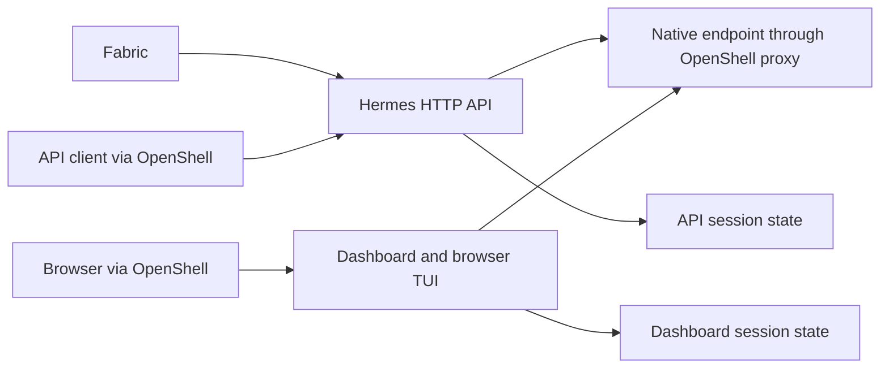

<!-- SPDX-FileCopyrightText: Copyright (c) 2026 NVIDIA CORPORATION & AFFILIATES. All rights reserved. -->
<!-- SPDX-License-Identifier: Apache-2.0 -->

# Access Agent Interfaces

## Select the Gateway and Workspace

Use the pinned OpenShell development CLI at the revision in [versions.json](../versions.json) on the client host.
These selectors choose an existing gateway and deployment; they do not create services or provision credentials.
Run them in every terminal used for forwarding or sandbox commands, from any directory.

For an existing authenticated gateway profile supplied by its operator:

```sh
unset OPENSHELL_GATEWAY_ENDPOINT
export OPENSHELL_GATEWAY=REPLACE_WITH_PROFILE_NAME
```

The profile's endpoint must match `spec.gateway.endpoint` in the deployment YAML.
Its stored authentication must grant access to the deployment workspace.
The endpoint override takes precedence over the profile, which is why this example clears it.
NemoClaw's YAML credential and TLS environment references do not configure the OpenShell CLI's stored profile or credentials.
Provisioning a new authenticated profile, including its issuer or mTLS client certificates, remains **TBD** pending a qualified operator procedure.

For an existing plaintext loopback gateway instead, select its actual endpoint directly:

```sh
unset OPENSHELL_GATEWAY
export OPENSHELL_GATEWAY_ENDPOINT=http://127.0.0.1:17671
```

Replace the example port with the one in your YAML.
Use this variant only when that gateway is already listening on the client host's loopback interface.
Do not replace an authenticated remote endpoint with plaintext or disable TLS verification to make access work.

The workspace name comes from `metadata.uid`, not the deployment or sandbox name.
Paste the exact UID from the applied YAML at the prompt:

```sh
python3 -c 'import hashlib; uid = input("Deployment metadata.uid: ").strip(); print("nc-" + hashlib.sha256(uid.encode()).hexdigest()[:16])'
export OPENSHELL_WORKSPACE=REPLACE_WITH_PRINTED_WORKSPACE
```

This matches the SDK's [workspace derivation](../crates/nemoclaw-sdk/src/config/mod.rs).
The gateway selectors follow the [pinned OpenShell CLI parser and resolver](https://github.com/NVIDIA/OpenShell/blob/b3e4ad4579e24dacfb285924876473b50a04b988/crates/openshell-cli/src/main.rs).
The forward or sandbox command below verifies access to the selected workspace; setting an environment variable alone does not.
On an authentication or missing-sandbox error, check the endpoint, workspace, sandbox name, and operator-provided credentials before changing deployment state.

## OpenClaw Dashboard

Declare `interfaces` inside the selected OpenClaw harness configuration.
The sandbox selects this configuration once, and all its agents share the native gateway.
Use [a shared harness definition](configuration-references.md#reference-a-harness-configuration) to reuse the settings.

```yaml
interfaces:
  dashboard:
    port: 18800
    bind: 127.0.0.1
```

Declaring `dashboard` enables the native control UI with token authentication.
At least one setting is required; omitted port defaults to 18789 and omitted bind defaults to loopback.
Ports 8642 through 8652 are reserved for Hermes.
Binding `0.0.0.0` listens on the sandbox's interfaces; it does not publish a host port.
Omitting `interfaces` preserves the previous headless gateway behavior.

## Build and Apply

Build a fresh OpenClaw image from the repository root with `docker buildx bake openclaw --load`.
Follow the [image prerequisites](inference.md#build-an-image-with-the-configuration-interface), including image availability on the sandbox compute daemon.
Use its immutable digest in the [dashboard example](../examples/openclaw-dashboard.yaml), replacing the zero-digest placeholder, deployment UID, endpoint, and model values.
Apply with the [desired-state workflow](usage.md).
Changing interface settings or images requires a new deployment with a fresh UID and state directory; ordinary apply refuses to replace the sandbox.
Verify the new deployment before separately retiring the old one with its retained state.

The adapter creates a random token in `/sandbox/.openclaw/interface-token`, readable only by the sandbox user.
Native configuration refers to a process environment variable; the actual token is absent from YAML, OpenTofu state, and exported configuration.
The adapter reuses the retained token across process restarts and refuses a missing or insecure token beside existing configuration.
Readiness verifies the native settings and performs an authenticated gateway health RPC.

## Connect through OpenShell

First [select the gateway and workspace](#select-the-gateway-and-workspace).
From the client host, forward the same local and target ports:

```sh
openshell forward service assistant --target-port 18800 --local 127.0.0.1:18800
```

The foreground command forwards through the authenticated OpenShell connection to the sandbox's loopback service.
Open `http://127.0.0.1:18800` in your browser.
Display the token in a private terminal and enter it into the native UI's token field:

```sh
openshell sandbox exec -n assistant -- cat /sandbox/.openclaw/interface-token
```

This command displays a credential; avoid recorded or shared terminal sessions.
Treat it as a credential: do not paste it into YAML, command arguments, logs, or shared URLs.
The generated configuration keeps native device pairing enabled.
If prompted, list pending requests and approve only the request belonging to your browser:

```sh
openshell sandbox exec -n assistant -- /opt/fabric/bin/python /opt/nemoclaw/interfaces.py devices list
openshell sandbox exec -n assistant -- /opt/fabric/bin/python /opt/nemoclaw/interfaces.py devices approve REQUEST_ID
```

The helper supplies the token through the native CLI environment, without putting it into command arguments.
Browser origins are restricted to `localhost` and `127.0.0.1` at the declared port.

Stop forwarding with Ctrl-C.
The adapter stops its owned gateway when Fabric stops; forwarding has a separate client lifetime.
The token remains with retained native state and is removed when that state is deleted.
Do not edit or rotate the token file while the gateway is running.
This version has no token-rotation command; use a new deployment when replacing a compromised credential.

## Diagnose Failures

Configuration drift, a missing token, invalid file permissions, or failed authenticated health checks stop readiness or export.
NemoClaw retains established resource identities and does not overwrite the native configuration to hide drift.
Inspect the [native logs](troubleshooting.md#read-native-service-logs) and retained files, restore the intended settings and credential permissions, and reapply.

Offline fixtures exercise the real native gateway and local protocol endpoints.
They do not establish browser compatibility or qualify a public dashboard deployment.

## Hermes API, Dashboard, and Browser TUI

This procedure uses the default local Hermes adapter with Relay tracing omitted.
The experimental [Relay adapter](agents.md#hermes-relay-tracing) rejects `interfaces` and does not provide these services or their token files.

Hermes exposes a native authenticated API on sandbox loopback port 8642 and a dashboard on port 18789 by default.
The dashboard uses internal port 19119 behind a sandbox-local forwarder.
OpenShell forwarding provides host access; none of these listeners publishes a host port automatically.
The dashboard and its browser TUI share a native session engine and isolated state under `/sandbox/.hermes/profiles/dashboard-home`.
Fabric invokes the separate HTTP API engine under `/sandbox/.hermes`.
Both use the same configured native inference connection; they do not share active conversations, cancellation, or live steering.
Standalone `hermes` terminal sessions also retain native behavior.



Use the [Hermes interface example](../examples/hermes-interfaces.yaml) to override the ports inside its `harness` configuration:

```yaml
interfaces:
  api:
    port: 8643
  dashboard:
    enabled: true
    port: 18800
    internalPort: 19120
    tui:
      enabled: true
```

API ports must be between 8642 and 8652.
Dashboard ports must be unprivileged, distinct from each other, and outside that range; 18642 is also reserved.
The parser checks collisions after applying defaults, so changing one port may require setting the other explicitly.
To disable the dashboard, use only `dashboard: {enabled: false}`; the API remains available for Fabric.
To keep the dashboard while disabling browser chat and its WebSocket endpoints, set `tui.enabled: false`.
This does not disable standalone terminal access.

The pinned Hermes revision always enables browser chat upstream and treats its old `--tui` flag as a no-op.
NemoClaw preserves that enabled default and applies explicit `tui.enabled` through the native browser-chat gate.
This differs from the optional-TUI wording in `origin/main`; an explicit false now disables browser chat.
It does not unify API and dashboard conversations.

### Build and Connect

From the repository root, follow the [image prerequisites](inference.md#build-an-image-with-the-configuration-interface) and run:

```sh
docker buildx bake hermes --load
```

The build includes native dashboard and TUI assets; startup does not install Node dependencies or rebuild assets.
Replace the example's zero-digest image reference with the printed immutable digest and choose your own deployment UID, endpoints, and model.
Use a fresh deployment UID and state directory when changing images or interface settings; existing sandboxes and native configurations are not migrated or replaced automatically.
The [managed Hermes example](../examples/managed-hermes.yaml) uses managed Ollama and disables the dashboard.
Apply using the [desired-state workflow](usage.md).

After [selecting the gateway and workspace](#select-the-gateway-and-workspace), run each desired forward in a separate terminal:

```sh
openshell forward service assistant --target-port 18800 --local 127.0.0.1:18800
openshell forward service assistant --target-port 8643 --local 127.0.0.1:8643
```

Open `http://127.0.0.1:18800` for the dashboard.
Its native loopback bootstrap supplies the browser session token; access relies on the authenticated OpenShell forward and local host access.
Keep forwards bound to loopback and stop them with Ctrl-C.
The API requires its separate bearer credential from `/sandbox/.hermes/interface-token`.
Retrieve it only in a private terminal:

```sh
openshell sandbox exec -n assistant -- cat /sandbox/.hermes/interface-token
```

This displays a credential; avoid recorded terminals, command arguments, exported YAML, and shared URLs.
Supply it through your API client's protected credential facility.
Both API and dashboard tokens are private to the sandbox user, remain in their respective state directories across restarts, and are removed when retained state is deleted.
There is no rotation command; use a fresh deployment to replace a compromised token.
Readiness rejects changed native configuration, missing or insecure token files, or failed authenticated checks.
Restore the intended files and permissions before reapplying; established resources remain retained on failure.

Fabric owns both service processes and the sandbox-local forwarder.
Stopping Fabric stops those processes; client-side OpenShell forwards have their own lifetime.
Offline fixtures verify native HTTP and WebSocket behavior, not browser rendering or live OpenShell forwarding.
