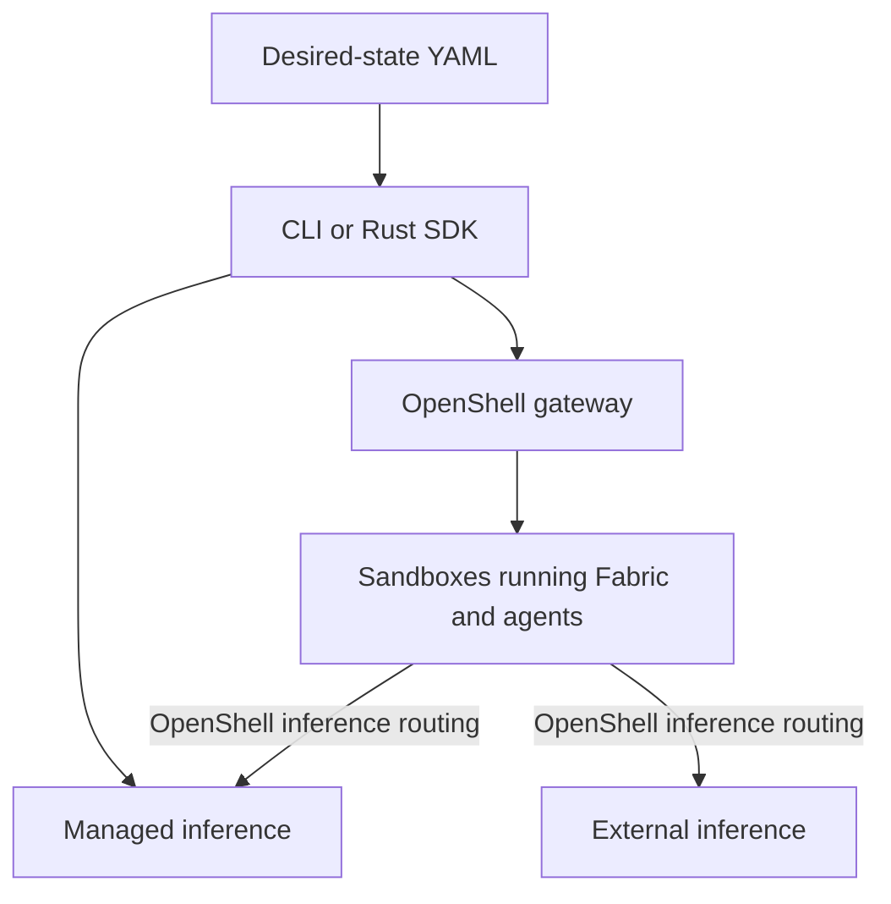

<!-- SPDX-FileCopyrightText: Copyright (c) 2026 NVIDIA CORPORATION & AFFILIATES. All rights reserved. -->
<!-- SPDX-License-Identifier: Apache-2.0 -->

# Understand NemoClaw

NemoClaw manages agent deployments from desired-state YAML.
You declare the gateway, inference providers, sandbox, and agents, then use the CLI or Rust SDK to plan, apply, export, and destroy that deployment.
Start with [prerequisites](prerequisites.md) and [deploy OpenClaw with existing services](get-started.md).

## Choose an Interface

| Interface | Use it to | Guide |
|---|---|---|
| NemoClaw CLI | Operate a deployment from a terminal | [CLI reference](reference/cli.md) |
| Rust SDK | Call deployment operations from a program | [SDK](sdk.md) |
| Bundled OpenTofu provider | Execute the SDK's resource graph through OpenTofu | [Provider](provider.md) |
| OpenShell and native agent interfaces | Access the running agent and its native services | [Agents](agents.md), [interfaces](interfaces.md) |

NemoClaw's CLI has no agent invocation, channel-management, or snapshot command.
See [migration](migration.md) for earlier workflows and remaining documentation gaps.

## Understand the Deployment

A deployment describes a gateway, inference providers, and one to 32 named sandboxes.
Each sandbox hosts one agent through Fabric and selects a harness such as OpenClaw or Pi.
Sandboxes can use different harnesses and share inference definitions.

OpenShell isolates sandboxes and routes their inference requests.
The SDK coordinates deployment operations through OpenTofu; agents and managed services keep running after the CLI exits.

Gateway and inference services can be managed or external independently.
Managed resources follow NemoClaw's [ownership and retention rules](usage.md#resource-ownership); external servers remain under their operators' control.
See [agents](agents.md) for harness choices, [inference](inference.md) for API and service constraints, and [architecture](design/architecture.md) for implementation boundaries.

## Plan for Change and Recovery

Keep the same state directory and matching bundle for every operation on a deployment.
Plan observes without mutating runtime resources; apply computes and checks its own plan.
Unsupported replacement, changed ownership, and incomplete observations stop operations.

Export captures configuration, not native agent data.
Before changing or retiring a deployment, read [recovery](usage.md#updates-and-recovery) and [destroy behavior](usage.md#destroy): sandbox files and conversation history are deleted on destroy.
Use the [documentation index](README.md) to find other tasks.

## Tested Configurations and Limits

The [accepted scope](design/scope.md) defines the product contract; [validation records](validation/README.md) identify tested revisions and environments.
Parser acceptance or a reachable endpoint does not establish working inference.

Enterprise deployment qualification and service-level support commitments: **TBD**.
