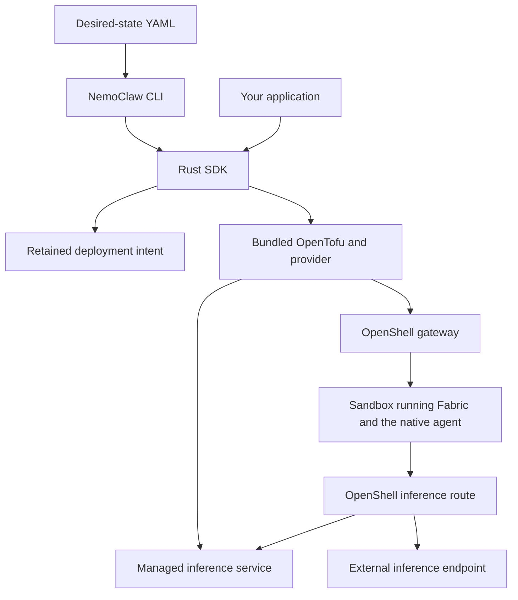

<!-- SPDX-FileCopyrightText: Copyright (c) 2026 NVIDIA CORPORATION & AFFILIATES. All rights reserved. -->
<!-- SPDX-License-Identifier: Apache-2.0 -->

# Understand NemoClaw

NemoClaw manages agent deployments from desired-state YAML.
You declare the gateway, inference provider, sandbox, and agents, then use the CLI or Rust SDK to plan, apply, export, and destroy that deployment.
Start with [prerequisites](prerequisites.md) and [deploy OpenClaw with existing services](get-started.md).

## Choose an Interface

| Interface | Use it to | Guide |
|---|---|---|
| NemoClaw CLI | Operate a deployment from a terminal | [CLI reference](reference/cli.md) |
| Rust SDK | Call deployment operations from a program | [SDK](sdk.md) |
| Bundled OpenTofu provider | Execute the SDK's resource graph through OpenTofu | [Provider](provider.md) |
| OpenShell and native agent interfaces | Access the running agent and its native services | [Agents](agents.md), [interfaces](interfaces.md) |

NemoClaw's CLI has no agent invocation, channel-management, or snapshot command.
See [migration](migration.md) for earlier workflows and remaining documentation gaps.

## Understand the Deployment

The SDK owns deployment behavior and retained intent.
OpenTofu executes the resource graph and keeps resource state; the provider calls the backend operations.
OpenShell owns sandbox isolation and inference routing.
Fabric hosts the native agent process inside the sandbox.

Choose one inference service path for a deployment.
The gateway may also be managed or external.
The diagram separates deployment operations from the agent's requests: the CLI can exit while the agent and managed services keep running.

Each document selects one inference provider and contains one sandbox.
OpenClaw can declare multiple agents sharing the primary inference route; other harnesses require one agent.
Use the [agent guide](agents.md) for accepted harnesses and the [inference guide](inference.md) for their API restrictions.

Managed resources follow NemoClaw's lifecycle and retention rules.
External resources remain under their operator's control, although a deployment can still send requests to them.
Read [resource ownership](usage.md#resource-ownership) before selecting a management mode.

## Choose Your Next Task

| Goal | Start here |
|---|---|
| Deploy an OpenClaw agent using an existing gateway and inference endpoint | [First deployment](get-started.md) |
| Choose an API, endpoint, or managed model service | [Inference](inference.md), [models](models.md) |
| Select a harness or open its native interface | [Agents](agents.md), [interfaces](interfaces.md) |
| Change a deployment or recover a failed operation | [Use desired state](usage.md#updates-and-recovery), [troubleshooting](troubleshooting.md) |
| Preserve data or evaluate a move from the earlier product | [State](state.md), [migration](migration.md) |
| Embed deployment operations in a Rust program | [SDK](sdk.md) |

## Plan for Change and Recovery

Use the same state directory for every operation on a deployment.
Plan observes resources without changing runtime resources; apply computes and checks its own plan.
Unsupported replacement, changed ownership, and incomplete observations stop operations instead of authorizing recreation.

Export captures configuration, not a backup of native agent data.
Read [state](state.md), [recovery](usage.md#updates-and-recovery), and [destroy behavior](usage.md#destroy) before changing or retiring a deployment.

## Evidence and Limits

The [configuration validator](../crates/nemoclaw-sdk/src/config/validation.rs), [SDK lifecycle](../crates/nemoclaw-sdk/src/deployment/mod.rs), and [CLI parser](../crates/nemoclaw-cli/src/args.rs) implement these boundaries.
The [accepted scope](design/scope.md) defines the product contract; [validation records](validation/README.md) identify tested revisions and environments.

Enterprise deployment qualification and service-level support commitments: **TBD**.
