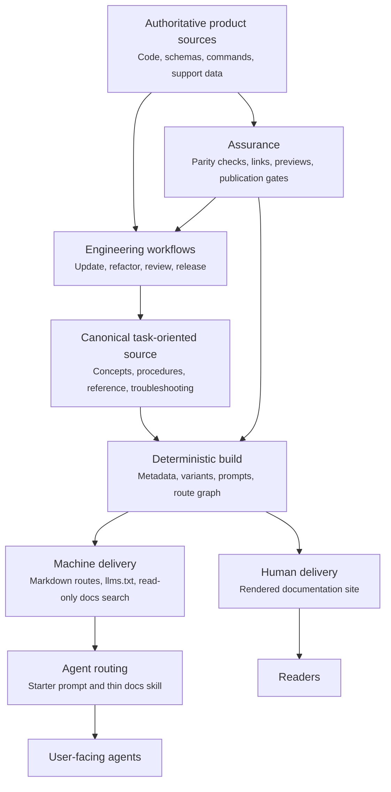

Agent-ready documentation helps an AI agent find the right source, apply it to the user's context, take bounded action, and verify the result.
It serves people and agents from one governed source instead of maintaining a website, prompt library, and skill catalog as separate bodies of content.

This page defines the architecture for that system.
The file names and tools are NemoClaw examples, but the contracts apply to any docs-as-code stack.

<Note>
Making HTML available to a model is not enough.
An agent-ready system needs explicit retrieval paths, task metadata, stable routes, safety boundaries, and evidence that the published guidance still matches the product.
</Note>

## Define the Product Contract

Start with observable outcomes instead of selecting tools.
A reliable agentic documentation system supports the following contract.

| Capability | Contract | Evidence |
|---|---|---|
| Discover | The agent can identify the relevant document for a user task. | A task query returns the intended page and variant. |
| Retrieve | The agent can fetch clean, current, citable content. | A stable Markdown route or read-only search tool returns the canonical source. |
| Apply | The guidance includes decisions, prerequisites, steps, and boundaries. | The agent produces instructions scoped to the user's environment. |
| Act | The agent knows which operations are safe, which need approval, and which are out of scope. | Workflow instructions stop before credentials, destructive changes, or unsupported surfaces. |
| Verify | Every procedure ends with an observable success check. | The agent runs or recommends the documented validation step. |
| Maintain | Product changes can be traced to documentation owners and release evidence. | Pull-request gates detect stale, missing, or unpublished guidance. |

Treat failures in any row as documentation defects.
A polished site with weak retrieval or verification is not agent-ready.

## Use a Layered Architecture

Keep content, delivery, routing, workflow, and assurance separate so each layer has one responsibility.



The source remains authoritative throughout the loop.
Prompts, skills, generated variants, search indexes, and rendered pages are delivery or control artifacts, not alternate sources of truth.

## Establish One Canonical Owner

Write each fact once in its authoritative layer, then produce the human and machine experiences from one publication source.
Product behavior may be authoritative in code, schemas, command metadata, or support data, while the documentation corpus remains the canonical published explanation.
Generate structured reference content from product sources when practical and use parity tests when prose must remain hand-written.

NemoClaw uses MDX under `docs/` as its user-facing source of truth and generates agent-specific pages during the docs build.

Apply these source rules:

- Give each page one primary concept or user task.
- Organize procedures around the reader journey from choosing through setup, operation, validation, and troubleshooting.
- Keep reusable troubleshooting and reference facts with one canonical owner, then link to that owner.
- Generate tables and reference values from authoritative product data when that removes manual synchronization.
- Store navigation and route slugs in a machine-readable index.
- Declare intentional partial variant scope in source metadata and validate it against published navigation membership.
- Treat generated pages as disposable build output and never edit them by hand.
- Preserve published routes with direct redirects when content moves.

Use frontmatter to describe the page for both people and retrieval systems.
The human description explains the value of the page, while the agent description states what the page helps with and when to select it.

```yaml
---
title: "Configure a Private Package Registry"
description: "Connect the product to a private package registry and verify authenticated downloads."
description-agent: "Configures and validates private package registry access. Use when users ask about registry credentials, package download failures, or enterprise package mirrors."
keywords: ["private registry", "package authentication", "enterprise mirror"]
content:
  type: "how_to"
---
```

Good routing metadata names the user intent, scope, and likely trigger phrases.
It does not repeat the page body or make unsupported product claims.

## Publish Machine-Readable Delivery Paths

Publish clean content through more than one retrieval path because agent environments have different capabilities.
Use this retrieval order:

1. Search a read-only documentation service when the client supports a structured tool such as Model Context Protocol (MCP).
2. Fetch a lightweight documentation index such as `llms.txt` when structured search is unavailable.
3. Fetch the specific Markdown page returned by search or listed in the index.
4. Fall back to rendered HTML only when a clean machine-readable route is unavailable.

Each path should resolve to the same release and canonical page.
Do not make the agent reconcile copied content from several repositories or prompt bundles.

Machine delivery is ready when the following checks pass:

- Every published task page has a stable Markdown representation.
- The documentation index contains the current public route set.
- Search results return source URLs that an answer can cite.
- Variant-specific queries do not silently mix incompatible instructions.
- Moved pages redirect directly to a current published destination.
- Private drafts and unsupported features do not enter the public index.

NemoClaw exposes its canonical pages through Markdown routes, `llms.txt`, and a read-only docs MCP server.
The [Use NemoClaw Docs with Your Coding Agents](../agent-skills) page shows the user-facing retrieval flow.

## Keep Agent Routing Thin

Use prompts and skills to route the agent, not to store another copy of the docs.
A routing layer should tell the agent where to look, how to choose a source, and what response constraints to follow.

A small routing skill needs only the following elements:

- The canonical search endpoint and fallback documentation index.
- The preferred order for retrieving pages.
- The main task areas and their starting pages.
- Variant or platform selection rules.
- Safety requirements for approvals, credentials, and destructive actions.
- Citation and verification requirements.

This pattern keeps the routing artifact stable while the product documentation changes frequently.
It also avoids large generated skills that drift from the public site, consume context, and create ambiguous ownership.

Pair the routing skill with a starter prompt for users who have not installed project instructions.
Keep the starter prompt in a standalone canonical file, generate any website component from that file, and test that embedded or pinned copies still match it.

## Related Topics

- [Automate Documentation Workflows](automate-documentation-workflows) explains how to place documentation work inside the engineering loop.
- [Generate Documentation Variants](generate-documentation-variants) explains shared-source variant generation.
- [Govern and Evaluate Agentic Documentation](govern-agentic-documentation) defines publication boundaries and quality measures.
