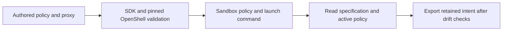

<!-- SPDX-FileCopyrightText: Copyright (c) 2026 NVIDIA CORPORATION & AFFILIATES. All rights reserved. -->
<!-- SPDX-License-Identifier: Apache-2.0 -->

# Configure Sandbox Policy and Proxy

Use `sandboxes[].network.policy.explicit` to declare filesystem, process, and egress policy, and `network.proxy` to select the agent's HTTP proxy.
Start from [the explicit-policy example](../examples/explicit-policy.yaml) and follow [deployment usage](usage.md) to plan, apply, and export it.

Before applying, select a fresh deployment UUID, an available gateway and inference endpoint, and an immutable agent image available to the runtime.
The proxy must already exist and be reachable from the sandbox.
Check that policy paths and process identities exist in that image.
Apply creates the sandbox and grants the access declared by the policy.

## Choose a Policy

Omitting `network`, or declaring `tier: isolated`, selects the existing isolated preset.
That preset permits inference routing without general egress and supplies the SDK's filesystem grants and process identity.

An explicit policy replaces the entire preset.
Omit `tier` when declaring `policy.explicit`; combining a nonempty tier with an explicit policy is rejected.
Omitted fields inside an explicit policy follow OpenShell defaults, so copy the filesystem and process settings you intend to retain.
An empty `network_policies` map grants no general egress.

The example grants `/usr/bin/curl` access to `GET /docs/**` on `docs.example.com:443`, with TLS inspection and enforcement enabled.
Replace that example destination and executable with the API and binary your workload uses.
A binary grant for curl does not grant the same access to Python or Node.js.

The input supports TCP destinations and REST, WebSocket, JSON-RPC, and MCP inspection settings.
Unknown fields and unsupported combinations are rejected.
Middleware, inline credentials, credential-provider bindings, GraphQL, and SQL policy settings are outside this configuration contract.
The pinned OpenShell parser and validator check protocol-specific rules, destination restrictions, paths, and process identities.
See the [generated field reference](reference/configuration.md#explicitpolicy) for the complete input surface.

`landlock.compatibility: best_effort` permits startup when the host cannot enforce Landlock restrictions.
Use `hard_requirement` to require enforcement; the `strict` spelling used by main's exported schema maps to `hard_requirement`.
Kernel enforcement still requires qualification on the deployment host.

## Select the Agent Proxy

```yaml
network:
  tier: isolated
  proxy:
    host: 10.200.0.1
    port: 3128
```

The address is relative to the sandbox's network environment.
Declare both fields; the host accepts a hostname or IPv4 address, and the port must be between 1 and 65535.
The host must not contain a URL scheme, credentials, or a path.
This setting selects an existing proxy; it creates no listener and changes no gateway network or egress grants.

The launch command sets uppercase and lowercase HTTP/HTTPS proxy variables after OpenShell injects its environment.
It sets `NO_PROXY` and `no_proxy` to localhost, loopback addresses, and the selected proxy host, and enables Node.js environment-proxy handling.
Omitting `proxy` preserves the supervisor's existing proxy behavior.

## Verify and Change the Configuration



Use the plan/apply/export commands in [deployment usage](usage.md), then reapply the exported document.
A successful unchanged reapply preserves the sandbox identity and creates no replacement.
Export compares the observed policy and proxy launch settings with retained intent and checks that a ready sandbox has loaded the matching policy revision.
Missing policy observations or drift stop export; they do not produce a partial configuration.

Policy and proxy changes require sandbox replacement, which ordinary apply rejects.
Back up sandbox files and conversation history before using the explicit [destroy and recreate procedure](usage.md#destroy).
Destroy deletes those sandbox files; retained workspace and model storage follow the existing lifecycle rules.
If an operation fails, preserve the state directory, resolve the reported observation or configuration problem, and retry with the retained configuration.

Local fixture tests exercise creation, drift detection, and export/reapply behavior.
They do not establish proxy reachability or kernel enforcement on a live host.
