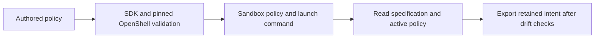

<!-- SPDX-FileCopyrightText: Copyright (c) 2026 NVIDIA CORPORATION & AFFILIATES. All rights reserved. -->
<!-- SPDX-License-Identifier: Apache-2.0 -->

# Configure Sandbox Policy

Use `sandboxes[].network.policy.explicit` to declare filesystem, process, and egress policy.
Start from [the explicit-policy example](../examples/explicit-policy.yaml) and follow [deployment usage](usage.md) to plan, apply, and export it.

Before applying, select a fresh deployment UUID, an available gateway and inference endpoint, and an immutable agent image available to the runtime.
Check that policy paths and process identities exist in that image.
Apply creates the sandbox and grants the access declared by the policy.

## Choose a Policy

Omitting `network`, or declaring `tier: isolated`, selects the image's advertised filesystem and process defaults.
NemoClaw adds the declared inference and search endpoint grants without granting general egress.
Those managed grants use only the selected adapter's executable paths resolved during image assembly.

An explicit policy replaces the entire preset.
Omit `tier` when declaring `policy.explicit`; combining a nonempty tier with an explicit policy is rejected.
Omitted fields inside an explicit policy follow OpenShell defaults, so copy the filesystem and process settings you intend to retain.
An empty `network_policies` map grants no general egress.

The example grants `/usr/bin/curl` access to `GET /docs/**` on `docs.example.com:443`, with TLS inspection and enforcement enabled.
Replace that example destination and executable with the API and binary your workload uses.
A binary grant for curl does not grant the same access to Python or Node.js.

The input supports TCP destinations and REST, WebSocket, JSON-RPC, and MCP inspection settings.
Unknown fields and unsupported combinations are rejected.
Middleware, inline credentials, credential-provider bindings, GraphQL, and SQL policy settings are outside this configuration contract.
The pinned OpenShell parser and validator check protocol-specific rules, destination restrictions, paths, and process identities.
See the [generated field reference](reference/configuration.md#explicitpolicy) for the complete input surface.

`landlock.compatibility: best_effort` permits startup when the host cannot enforce Landlock restrictions.
Use `hard_requirement` to require enforcement.
Kernel enforcement still requires qualification on the deployment host.

## Runtime Filesystem Access

When an explicit policy declares `filesystem_policy`, NemoClaw checks that it permits reads of the selected harness's runtime directories.
The same checks apply to inline harnesses and `harnessRef`, separately for every sandbox.

Selected-image assessment checks the Fabric descriptor's required files, the adapter's image-owned `runtime_files`, and the runtime manifest's `required_paths`.
The packaged image declares `/opt/fabric` and `/opt/nemoclaw`; a relocated image declares its own paths.
A missing grant makes compatibility `unsupported` and fails plan; `observation_json.compatibility` names the path.
Images without runtime metadata, such as direct Bake builds, fail planning; follow [image rebuilding and selection](build.md#build-agent-images).
Document parsing validates policy syntax without assuming an image layout.
These checks do not establish every path a harness reads; verify additional harness paths against the selected image before applying.

A read-only or read-write grant for the directory or a parent directory satisfies the check.
For example, `/opt` covers the runtime directories beneath it; `/opt/fabric-source` does not cover `/opt/fabric`.
Use absolute sandbox paths without `..`; validation does not resolve image symlinks or inspect the client's filesystem.
`include_workdir` does not grant access to these runtime directories.
An omitted `filesystem_policy` retains OpenShell defaults and is outside this explicit-grant check.

Each error names the required path; edit the authored policy and rerun plan.
NemoClaw does not add filesystem grants automatically.
The image catalog records adapter requirements and runtime files, not a complete filesystem or executable inventory.
These checks do not verify arbitrary policy paths, process identities in the image, Unix permissions, writable state directories, or kernel enforcement; those still require runtime verification.

## Choose TLS Inspection and Enforcement

For an explicit endpoint with a supported application protocol, choose TLS handling and request enforcement separately:

| Endpoint setting | Behavior in the pinned OpenShell implementation |
|---|---|
| Omit `tls` | Automatic TLS detection and termination for inspectable traffic |
| `tls: skip` | Raw TCP tunnel with no TLS termination, HTTP inspection, or credential injection |
| `enforcement: enforce` | Enforce the configured application-level request rules on inspected traffic |
| `enforcement: audit`, or omit `enforcement` | Audit application-level decisions rather than block requests based on those rules |

`tls: terminate` and `tls: passthrough` are rejected by OpenShell v0.1.2.
Remove either field to keep automatic TLS handling.

Destination and executable grants still determine which connections are allowed.
An allowed raw tunnel cannot enforce encrypted HTTP methods/paths or replace a placeholder credential inside the request.
Do not choose `tls: skip` for an endpoint that relies on those controls, including the declared Brave integration's credential injection.
Use explicit `enforcement: enforce` when the policy must reject disallowed inspected requests.
The checked-in example uses that enforcement setting with automatic TLS handling.

The [pinned parser](https://github.com/NVIDIA/OpenShell/blob/6648bd0c290efbc41ba131ee9831ee45cd431f94/crates/openshell-supervisor-network/src/l7/mod.rs) and [proxy](https://github.com/NVIDIA/OpenShell/blob/6648bd0c290efbc41ba131ee9831ee45cd431f94/crates/openshell-supervisor-network/src/proxy.rs) define these behaviors.
The [SDK policy validator](../crates/nemoclaw-sdk/src/config/network.rs) accepts only supported field combinations; a field's presence in the schema does not bypass protocol validation.
Live enforcement and application trust on your host remain qualification requirements.
Follow [policy change constraints](#verify-and-change-the-configuration) before changing a deployed policy.

## Use an Upstream Proxy

OpenShell owns the workload's proxy environment and routes traffic through its policy proxy.
Configure an upstream corporate proxy through the external gateway's OpenShell compute-driver settings, following the [pinned upstream proxy contract](https://github.com/NVIDIA/OpenShell/blob/6648bd0c290efbc41ba131ee9831ee45cd431f94/crates/openshell-supervisor-network/src/upstream_proxy.rs).
At this revision, chaining applies to TLS CONNECT traffic; plain HTTP still connects directly.
NemoClaw does not expose this driver setting for managed gateways.

## Verify and Change the Configuration

```mermaid
flowchart LR
    YAML["Authored policy"] --> Validate["SDK and pinned OpenShell validation"]
    Validate --> Create["Sandbox policy and launch command"]
    Create --> Observe["Read specification and active policy"]
    Observe --> Export["Export retained intent after drift checks"]
```

Use the plan/apply/export commands in [deployment usage](usage.md), then reapply the exported document.
A successful unchanged reapply preserves the sandbox identity and creates no replacement.
Export compares the observed policy and launch settings with retained intent and checks that a ready sandbox has loaded the matching policy revision.
OpenShell can persist supervisor-added filesystem grants in the active policy revision without recording their source.
NemoClaw accepts only the bounded baseline additions checked by this version; other differences or incomplete observations stop export and preserve state.
OpenShell v0.1.2 applies GPU filesystem additions inside the workload without writing them back to the gateway policy.
This removes the upstream cause of suspected GPU false drift; live GPU export and reapply remain unverified.
Missing policy observations or drift do not produce a partial configuration.

Policy changes require sandbox replacement, which ordinary apply rejects.
External OpenShell policy edits conflict with the declared policy and stop export; they do not bypass that rejection.
Back up sandbox files and conversation history before using the explicit [destroy and recreate procedure](usage.md#destroy).
Destroy deletes those sandbox files; retained workspace and model storage follow the existing lifecycle rules.
If an operation fails, preserve the state directory, resolve the reported observation or configuration problem, and retry with the retained configuration.

### Recover from Runtime Policy Rejection

If OpenShell reports configuration admission as rejected, apply stops its startup wait and reports `sandbox/<name>: OpenShell configuration rejected`, followed by a safe reason.
This check applies while the sandbox is starting and before agent configuration or health requests.
Known gateway diagnostics identify policy, attached-provider, or middleware repair; unrecognized text becomes a fixed configuration-repair message.
The error does not include raw supervisor parser output.
A sandbox that has not reported rejection still follows the ordinary startup wait.

Preserve the state directory: failed apply retains created resource bindings.
If the problem is an attached-provider or credential configuration that can be repaired without replacing the sandbox, correct it and reapply using the retained state.
Apply can deliver that repair; completion still requires OpenShell to accept the configuration.
If the authored sandbox policy must change, use the [destroy and recreate procedure](usage.md#destroy); ordinary apply still refuses policy replacement.
Destroy remains available after the failed first apply and does not require successful admission or readiness.

Local fixture tests exercise creation, rejection, drift detection, and export/reapply behavior.
They do not establish proxy reachability or kernel enforcement on a live host.
