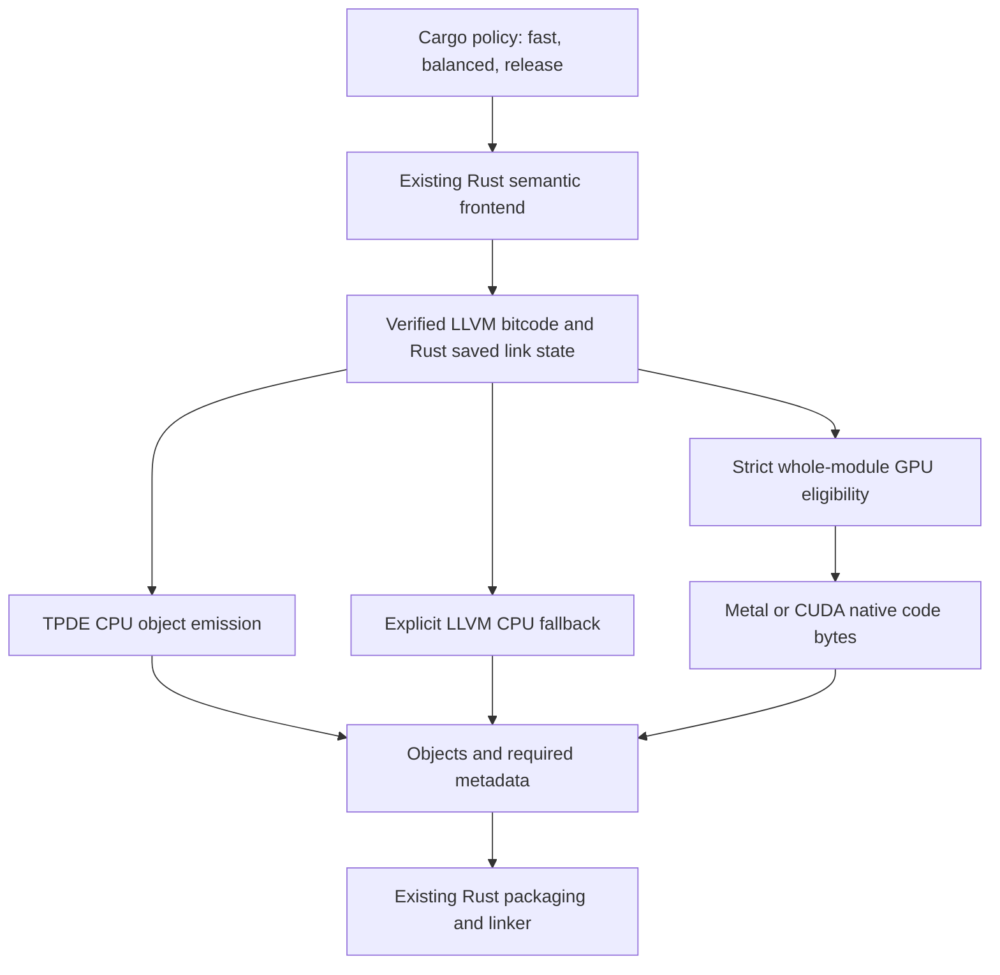

<!-- SPDX-FileCopyrightText: Copyright (c) 2026 NVIDIA CORPORATION & AFFILIATES. All rights reserved. -->
<!-- SPDX-License-Identifier: Apache-2.0 -->

# Compile time first: CPU and GPU object emission

This non-shipping experiment preserves Rust's semantic frontend and replaces
object emission at a pinned Rust 1.98.1 / LLVM 22.1.8 boundary. Compile time is
the first objective. Slower generated programs are acceptable in `fast` mode;
`release` rebuilds through the project's optimizing compiler configuration.
Compiler runtime assets and complete generated executables each have a separate
1.5 times size allowance. Physical GPU execution and compilation speedup are
separate claims.

## Implemented path

Rust retains macros, procedural macros, type and trait checks, borrow checking,
const evaluation, layout, monomorphization, crate metadata, and Cargo build
scripts. The wrapper requests bitcode with `linker-plugin-lto`, materializes the
selected objects, and invokes Rust's saved link step. Receipts verify that
native objects did not already exist before the selected emitter and that
linking did not recompile source. A local bootstrap setting enables this pinned
internal seam; an empty allowed-feature list preserves stable source feature
gating.

The CPU bridge parses serialized input with its own LLVM build; LLVM pointers
never cross library boundaries. TPDE emits Linux ELF for supported inputs.
Unsupported TPDE input and Darwin emission require explicit LLVM fallback.
The compact `rust-llvm-llc` helper uses the compiler's existing shared LLVM
library through its C API. The wrapper passes each crate's actual LLVM
machine-code optimization level, preserving package overrides. The standalone
helper/controller default remains O0; this selection does not add another IR
optimizer pipeline. Development headers and tools belong to validation,
not the runtime budget. See [provenance](fast-backend/PROVENANCE.md).

The GPU emitter accepts a complete eligible LLVM module: public C ABI functions
with zero or one `i64` argument, wrapping constants/copies/add/subtract/multiply,
and return. Unsupported control flow, calls, layouts, protection attributes,
poison flags, and metadata reject eligibility. It does not relax Rust semantics
to increase coverage. CPU metadata generation preserves symbols and required
unwind information. [GEM1](fast-backend/GEM1.md) defines the checked flat packet.

Metal and CUDA run output counting and machine-code emission on physical GPUs.
CUDA performs its prefix scan on the device; Metal currently uses a timed CPU
prefix step. Both retain contexts and bounded buffers across batches. Objects
contain the GPU-generated bytes. The independent CPU encoding oracle is included
in the full module emitter's total cost during qualification.

## Controls and ownership

| Control | Implemented behavior |
| --- | --- |
| `fast` | Root release profile O1, 16 codegen units, LTO off |
| `balanced` | Root release profile O2, 16 codegen units, LTO off |
| `release` | Project release profile and native backend |
| Object backend | `native`, `tpde`, `llvm-bitcode`, or `gpu` |
| GPU requirement | Explicit Metal/CUDA device and tools; fresh CPU-only fallback fails qualification |
| Fallback | Explicit permission, attributed emitter and rejection reason |
| Generated size | Declared reference, consistent complete-file measurement, failing ratio gate |
| Cache reuse | Tool/policy-owned targets; cached GPU lineage never claims a new GPU execution |

Profiles preserve panic, overflow, debug, feature, and target settings; inherited
compiler flags and package-specific profiles retain Cargo precedence. Optimization
can affect native build scripts through Cargo's `OPT_LEVEL`, so whole-build gains
are not solely Rust backend improvements. [POLICY.md](POLICY.md) documents commands.

The build-scoped scheduler validates immutable batches, prerequisites, source
generations, queue/memory budgets, CPU credits, critical-path priority, and
starvation prevention. Cancellation retains buffers until GPU work completes or
teardown fences it. Stable symbol ordering makes object layout independent of
completion order. Auto routing uses CPU until calibrated.

The scheduler is currently an in-process service. The Cargo wrapper uses a
separate emitter process per eligible codegen unit; it does not yet share one
persistent GPU service across all rustc processes. Cargo jobserver descriptors
are preserved, but a daemon-wide token bridge is not implemented. These costs
and missing pieces matter to subsequent performance measurements.

## Measurements and qualification

Actual NemoClaw CPU screens on an Apple M2 Pro used clean, locked offline CLI
builds with separate target directories. Default O3/local ThinLTO samples averaged
172.335 seconds. O1/16/LTO-off samples took 115.46 and 128.69 seconds, averaging
122.075 seconds: an exploratory 29.16% reduction. Their consistently stripped
executable was 30.82% larger. These were separate screening runs, not randomized
matched qualification and not GPU measurements.

The compatible driver subsequently built and ran NemoClaw with `fast` native
CPU emission. Its stripped executable measured 41,090,816 bytes against the
31,278,848-byte reference, passing the 1.5 limit at 1.3137. Its 160.30-second
Cargo time is a separate observation with a different invocation, not a matched
speedup. The prior SDK runtime screen observed a 25.78% regression, acceptable
to investigate under the fast-mode goal. Report compile-and-test time separately
when slower tests offset compilation savings. O0's complete executable exceeded
the size cap; code-section size alone would conceal that failure.

The complete NemoClaw CLI also builds through the alternative LLVM-bitcode
emission seam: 3,536 translated LLVM object units and 25 attributed passthrough
invocations, including five expected failed empty probes and no failed semantic
invocations. The generated CLI executes `--version`. Matching each crate's LLVM
code-generation level produces a 41,319,680-byte stripped executable, 32.10%
above the reference and within the limit. Cargo elapsed 193.536 seconds and total
driver time 199.692 seconds; no speedup is established. The earlier forced-O0
variant compiled and ran but produced 55,215,120 bytes (+76.5%) and correctly
failed the size gate. Both observations retain their separate reports.

Separate Mac runtime-file accounting measures 235,129,353 bytes for the compiler
and required adapters/kernels, against the 222,966,640-byte pinned compiler
baseline: +5.455%, within the separate compiler allowance. It includes the
actually linked Metal libraries and counts shared LLVM once. Unchanged Cargo,
standard libraries, system frameworks, caches, benchmarks, and development tools
are outside this compiler-runtime comparison. Linux/CUDA asset accounting is
still separate qualification work; the bridge statically links its needed LLVM
components to avoid another complete shared LLVM runtime.

On this Mac, the full Rust fixture links a math crate emitted by physical Metal
with attributed CPU objects for other modules. It executes boundary arithmetic,
generics, standard-library code, caught panic, and drop checks. An identical
second build must reuse qualified lineage while reporting no new GPU execution.
The verifier checks raw bitcode/emitter/saved-link evidence. This proves the
exercised integration, not arbitrary Rust GPU coverage or a performance win.

The draft PR workflow builds complete NemoClaw under native CPU release/fast
policies, compiles the CUDA emitter, compares CPU/GPU leaf batches on the same
runner, and verifies the full Rust CUDA fixture plus cache behavior. It retains
source/tool/device identity, raw receipts, objects, outputs, and costs. Only a
successful workflow on the exact current head qualifies that revision's NVIDIA
execution; Mac Metal evidence cannot qualify CUDA.

## Scaling target and next gates

Keep quality fixed and distribute independent concrete functions or modules
across devices. `gpu-codegen --devices 0,1,...` creates physical CUDA contexts and
dispatches independent batches. Simulated devices test scheduling only. A
one-GPU runner cannot establish a two- or four-GPU scaling curve.

For a first model, `T(N) = F + L + P + I(N) + G/(N*e(N)) + tail(N)`.
`F` is dependency-critical frontend/host work, `L` is object/link work, `P` is
unoverlapped preparation, `I` is initialization/transfers/shared host capacity,
and `G` is useful single-GPU work. Efficiency and imbalance must be measured.
For overlapping tasks, use the critical path instead of a sum of thread durations.
An ideal fixed share `s` bounds speedup by `1/(s+(1-s)/N)`; more GPUs cannot
remove frontend, preparation, or linking bottlenecks.

Near-linear throughput is more plausible across many ready, unique modules/builds
until frontend feed, staging, or linking saturates. Strong scaling holds the
build and CPU resources fixed; throughput studies disclose added host resources.
More optimization search at fixed release-time budget is a separate quality
experiment, not proof of faster compilation.

Next: measure TPDE on full Linux NemoClaw and pinned Omarchy Rust
components, expand GPU eligibility to substantial captured bodies, and connect
the scheduler to a Cargo-wide service with jobserver accounting. The decisive
gate is a repeated whole fast-build GPU win over the strongest compatible CPU
backend with materialization, transfers, verification, metadata, fallback,
linking, and size-accounting costs included. Then measure physical 1/2/4-GPU
latency and unique-build throughput.

The CPU lead is [TPDE's CGO 2026 paper](https://aengelke.net/pubs/2602-cgo1.pdf):
its reported 8–26 times backend improvement and 9–24% C/C++ whole-build reductions
motivate qualification, not a Rust claim. The GPU layout draws on
[Pareas's count/scan/emission design](https://theses.liacs.nl/pdf/2020-2021-HuijbenMarcel.pdf).
The compatible CPU route leaves usable compile-time controls if the GPU hypothesis
fails. This draft remains excluded from production and must not be merged.
