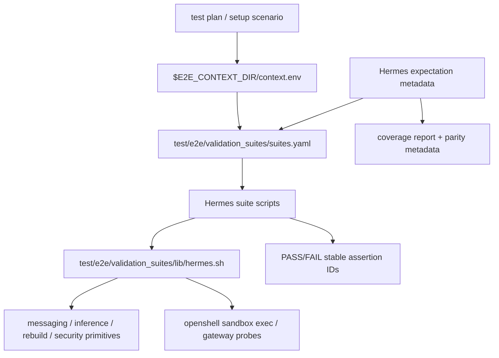

# Specification: Issue #3811 — Hermes Scenario Suite Migration

Issue: #3811
Parent epic: #3588
Related issues/PRs: #3891 / PR #3914, #3893 / PR #4175, #3895 / PR #3918, #3981 / PR #3984, #4067 / PR #3925, #4068 / PR #4107, #4070 / PR #4126, #4111, #4145, PR #4152, PR #4158, #4146 / PR #4144, #4189 / PR #4222, #4230, #4232, #4245, #4246, #3582, #3225 / PR #3228, #2432 / PR #2473.

## Overview & Objectives

Migrate Hermes E2E coverage from legacy one-off scripts into the layered scenario framework without copying the scripts line-for-line. The implementation must add Hermes-specific domain primitives, wire scenario suites with stable assertion IDs, encode known Hermes product bugs as explicit expected outcomes, and update scenario coverage metadata so the domain is visible as covered, expected-failing, deferred, or retired.

Objectives:

- Add `test/e2e/validation_suites/lib/hermes.sh` as the shared primitive layer for Hermes runtime, inference, messaging, rebuild, policy, provider, security, and TUI assertions.
- Move high-value behavior from these legacy sources into scenario suites:
  - `test/e2e/test-hermes-e2e.sh`
  - `test/e2e/test-hermes-inference-switch.sh`
  - `test/e2e/test-hermes-discord-e2e.sh`
  - `test/e2e/test-hermes-slack-e2e.sh`
  - Hermes-specific portions of `test/e2e/test-rebuild-hermes.sh`
  - Hermes-relevant helpers under `test/e2e/lib/discord-gateway-proof.sh`, `test/e2e/lib/slack-api-proof.sh`, `test/e2e/lib/security-posture-assertions.sh`, and `test/e2e/lib/inference-switch-retry.sh`.
- Preserve `run-scenario.sh <id> --plan-only` and existing dry-run suite behavior.
- Do not reinstall, onboard, or rediscover setup state from validation suites; suites must consume `$E2E_CONTEXT_DIR/context.env`.
- Emit stable assertion IDs in the form `<layer>.<domain>.<behavior>`, with Hermes expected-state IDs using `expected.hermes.<domain>.<behavior>`.
- Represent open Hermes product bugs as runnable expected-failure/current-bug scenarios or explicit gated/deferred metadata. Do not silently retire them.

## Current State Analysis

The layered scenario framework already exists:

- Scenario metadata lives in `test/e2e/nemoclaw_scenarios/scenarios.yaml` and `test/e2e/nemoclaw_scenarios/expected-states.yaml`.
- Suite metadata lives in `test/e2e/validation_suites/suites.yaml`.
- Suite runner behavior is covered by `test/e2e/scenario-framework-tests/e2e-suite-runner.test.ts`.
- Schema, resolver, expected-failure, and coverage behavior are covered by tests under `test/e2e/scenario-framework-tests/`.
- Current Hermes suite coverage is only `hermes-specific -> hermes/00-hermes-health.sh`, and that script is effectively a placeholder that validates `E2E_AGENT=hermes`.
- Existing shared primitives cover messaging, rebuild/upgrade, security policy/credentials, inference routing, sandbox lifecycle, and baseline onboarding, but there is no Hermes-specific primitive library.
- Existing `expected_failure` metadata is setup-oriented (`preflight`, `install`, `onboard`, `readiness`, `suite`) and currently only classifies a small set of infrastructure failure classes. Issue #3811 needs product-bug expectation metadata at the assertion/suite level, not only setup-level negative scenarios.
- `test/e2e/docs/parity-inventory.generated.json` still exists as the generated/static metadata successor for legacy assertion mapping; `test/e2e/docs/MIGRATION.md` says migration is tracked through scenario definitions, suite inventory, and domain issues rather than a workflow-level parity gate.

Root causes of the current coverage gap:

1. **Hermes primitive layer is missing.** The scenario suite layer has no `validation_suites/lib/hermes.sh`, so Hermes-specific assertions cannot be shared across runtime, messaging, rebuild, provider, policy, security, and TUI suites.
2. **Legacy scripts still bundle setup, action, and assertion.** The legacy Hermes scripts install, onboard, mutate state, and assert behavior in one entry point. The scenario framework needs those assertions separated from setup and driven by context emitted by a completed plan.
3. **Known product bugs have no first-class coverage metadata.** Open Hermes bugs such as #3893, #3895, #4070, #4189, #4230, #4232, #4245, #4246, #3582, #3225, and #2432 must remain visible as expected current failures or gated scenarios; otherwise migration would make failing legacy behavior look retired.
4. **Coverage reporting is setup-centric.** The current report shows scenarios and suites, but not enough domain-level Hermes assertion expectation detail to distinguish covered/pass, expected-failing, deferred platform/secret coverage, or retired assertions.

## Architecture Design

### Layering Model



### Domain Primitive Library

Create `test/e2e/validation_suites/lib/hermes.sh` as the canonical Hermes primitive layer. It should:

- Source `test/e2e/runtime/lib/context.sh` and `test/e2e/runtime/lib/logging.sh`.
- Load `$E2E_CONTEXT_DIR/context.env` through an explicit `e2e_hermes_load_context` function.
- Require only the minimum keys for each assertion; do not require live secrets for config-only assertions.
- Provide dry-run behavior that prints the same stable assertion IDs as live execution.
- Centralize repeated assertion behavior in private helpers such as `_e2e_hermes_assertion`, `_e2e_hermes_plan`, `_e2e_hermes_require_agent`, `_e2e_hermes_run_override`, and `_e2e_hermes_redact` so suite scripts do not duplicate dry-run, command-override, context, or redaction logic.
- Redact sensitive values and never echo raw token/API key values.
- Wrap shared helpers instead of duplicating them where possible:
  - `messaging_providers.sh` for provider/config/no-secret/gateway-path checks.
  - `inference_routing.sh` for inference-local and provider route checks.
  - `rebuild_upgrade.sh` for rebuild preservation checks.
  - `security_policy_credentials.sh` for policy/credential/shields patterns.
- Use override command variables for live probes where tests need stubs, following the style of `REBUILD_UPGRADE_SANDBOX_CMD`.

Recommended primitive families:

- `e2e_hermes_assert_gateway_health`
- `e2e_hermes_assert_agent_home_permissions`
- `e2e_hermes_assert_env_integrity`
- `e2e_hermes_assert_security_posture`
- `e2e_hermes_assert_inference_switch_route_state`
- `e2e_hermes_assert_env_immutable_on_switch`
- `e2e_hermes_assert_gateway_pid_stable`
- `e2e_hermes_assert_inference_local_chat`
- `e2e_hermes_assert_hermes_api_chat`
- `e2e_hermes_assert_external_timeout_classification`
- `e2e_hermes_assert_discord_config_schema`
- `e2e_hermes_assert_discord_policy_egress`
- `e2e_hermes_assert_discord_gateway_connects`
- `e2e_hermes_assert_discord_empty_user_allowlist_open_dm_policy`
- `e2e_hermes_assert_discord_no_openclaw_pairing_copy`
- `e2e_hermes_assert_discord_plugin_entry_registered`
- `e2e_hermes_assert_slack_config_enabled`
- `e2e_hermes_assert_slack_provider_state`
- `e2e_hermes_assert_slack_socket_mode_starts`
- `e2e_hermes_assert_slack_no_secret_leak`
- `e2e_hermes_assert_slack_idle_reconnect_delivers_first_mention`
- `e2e_hermes_assert_telegram_first_message_tool_dispatch`
- `e2e_hermes_assert_telegram_single_polling_loop`
- `e2e_hermes_assert_telegram_privacy_mode_guidance`
- `e2e_hermes_assert_telegram_group_message_preconditions`
- `e2e_hermes_assert_rebuild_provider_credential_reused`
- `e2e_hermes_assert_rebuild_messaging_config_preserved`
- `e2e_hermes_assert_rebuild_dashboard_forward_released`
- `e2e_hermes_assert_rebuild_post_rebuild_health`
- `e2e_hermes_assert_policy_inactive_messaging_not_preenabled`
- `e2e_hermes_assert_policy_managed_inference_anthropic_messages_path`
- `e2e_hermes_assert_policy_venv_python_egress`
- `e2e_hermes_assert_policy_no_phantom_allowlist`
- `e2e_hermes_assert_provider_anthropic_compatible_chat`
- `e2e_hermes_assert_provider_gemini_tool_schema_compatible`
- `e2e_hermes_assert_provider_onboard_smoke_not_sufficient`
- `e2e_hermes_assert_security_shields_up_down_macos_vm_driver`
- `e2e_hermes_assert_security_shields_config_locked`
- `e2e_hermes_assert_tui_history_writable`

### Expected Outcome Metadata

Add a Hermes assertion expectation model that can be consumed by tests and coverage reporting. Keep it lightweight and local to the existing E2E resolver metadata; do not overload setup-level `expected_failure` unless a whole scenario setup is expected to fail.

Use a top-level `hermes_expectations` section in `test/e2e/nemoclaw_scenarios/expected-states.yaml` and extend the existing resolver schema/load/reporting path to read it. This keeps the metadata beside expected-state contracts and avoids adding a fourth metadata file.

Minimum shape:

```yaml
hermes_expectations:
  expected.hermes.discord.empty-user-allowlist-open-dm-policy:
    status: expected_fail_current_bug
    issue: 4070
    fix_pr: 4126
    scope: suite
    reason: Current main pairs first DM when guild configured and allowlist empty.
  expected.hermes.runtime.gateway-health:
    status: expected_pass
    issue: 3891
    fix_pr: 3914
    scope: suite
```

Allowed statuses:

- `expected_pass`
- `expected_fail_current_bug`
- `deferred_platform_or_secret`
- `out_of_scope`
- `retired`

Do not recreate stale workflow-level parity-map infrastructure or introduce a separate Hermes coverage file unless implementation discovers that `expected-states.yaml` cannot support the metadata without breaking the resolver.

### Suite Organization

Add or extend suite entries in `test/e2e/validation_suites/suites.yaml`:

- `hermes-runtime`
- `hermes-inference-switch`
- `hermes-discord`
- `hermes-slack`
- `hermes-telegram`
- `hermes-rebuild`
- `hermes-policy`
- `hermes-provider-compatibility`
- `hermes-security-tui`

Keep existing generic suites (`messaging-discord`, `messaging-slack`, `messaging-telegram`, `rebuild`, `inference-routing`, `security-shields`) available for shared OpenClaw/Hermes behavior. Add Hermes-specific suites only for assertions that need `expected.hermes.*` IDs, Hermes config paths, Hermes bug expectations, or Hermes-only state. Hermes provider-specific scenarios may list both the generic provider suite and the Hermes-specific provider suite when both shared and Hermes-only checks are useful.

### Scenario Wiring

Use existing Hermes setup scenarios and onboarding profiles when possible:

- `ubuntu-repo-cloud-hermes`
- `ubuntu-repo-docker__cloud-nvidia-hermes`
- `ubuntu-repo-docker__cloud-nvidia-hermes-discord`
- `ubuntu-repo-docker__cloud-nvidia-hermes-slack`

Update existing Hermes test plans to attach the new Hermes-specific suites where relevant. For example, the Hermes Discord and Slack plans should keep any useful shared messaging suite and also add `hermes-discord` or `hermes-slack` for Hermes-only expected IDs and product-bug metadata. Add only the minimum additional scenarios/profiles needed for Telegram, provider compatibility, macOS security, or live-secret gated coverage. Every platform-specific scenario must declare `runner_requirements`.

### Assertion ID Contract

All suite scripts must emit stable PASS/FAIL IDs. Required IDs include:

- `expected.hermes.runtime.gateway-health`
- `expected.hermes.runtime.agent-home`
- `expected.hermes.runtime.env-integrity`
- `expected.hermes.runtime.security-posture`
- `expected.hermes.inference.switch-route-state`
- `expected.hermes.inference.env-immutable-on-switch`
- `expected.hermes.inference.gateway-pid-stable`
- `expected.hermes.inference.inference-local-chat`
- `expected.hermes.inference.hermes-api-chat`
- `expected.hermes.inference.external-timeout-classification`
- `expected.hermes.discord.config-schema`
- `expected.hermes.discord.policy-egress`
- `expected.hermes.discord.gateway-connects`
- `expected.hermes.discord.empty-user-allowlist-open-dm-policy`
- `expected.hermes.discord.no-openclaw-pairing-copy`
- `expected.hermes.discord.plugin-entry-registered`
- `expected.hermes.slack.config-enabled`
- `expected.hermes.slack.provider-state`
- `expected.hermes.slack.socket-mode-starts`
- `expected.hermes.slack.no-secret-leak`
- `expected.hermes.slack.idle-reconnect-delivers-first-mention`
- `expected.hermes.telegram.first-message-tool-dispatch`
- `expected.hermes.telegram.single-polling-loop`
- `expected.hermes.telegram.privacy-mode-guidance`
- `expected.hermes.telegram.group-message-preconditions`
- `expected.hermes.rebuild.provider-credential-reused`
- `expected.hermes.rebuild.messaging-config-preserved`
- `expected.hermes.rebuild.dashboard-forward-released`
- `expected.hermes.rebuild.post-rebuild-health`
- `expected.hermes.policy.inactive-messaging-not-preenabled`
- `expected.hermes.policy.managed-inference-anthropic-messages-path`
- `expected.hermes.policy.venv-python-egress`
- `expected.hermes.policy.no-phantom-allowlist`
- `expected.hermes.provider.anthropic-compatible-chat`
- `expected.hermes.provider.gemini-tool-schema-compatible`
- `expected.hermes.provider.onboard-smoke-not-sufficient`
- `expected.hermes.security.shields-up-down-macos-vm-driver`
- `expected.hermes.security.shields-config-locked`
- `expected.hermes.tui.history-writable`

## Configuration & Deployment Changes

No production deployment changes are required. E2E-only configuration changes may include:

- New suite scripts under `test/e2e/validation_suites/hermes/`.
- New shared helper `test/e2e/validation_suites/lib/hermes.sh`.
- New or extended suite entries in `test/e2e/validation_suites/suites.yaml`.
- New or extended scenario/test plan entries in `test/e2e/nemoclaw_scenarios/scenarios.yaml`.
- New top-level `hermes_expectations` metadata in `test/e2e/nemoclaw_scenarios/expected-states.yaml`.
- Coverage/reporting changes under `test/e2e/runtime/resolver/coverage.ts` and related resolver schema/load code to validate and render Hermes expectation metadata.
- Tests under `test/e2e/scenario-framework-tests/` for schema, suite wiring, dry-run assertion IDs, expected-current-bug metadata, and coverage reporting.

Sensitive environment variables and live secrets must never be printed. Live messaging tests should support required-secret metadata and fake-provider/fake-gateway fallbacks where practical.

## Implementation Phases

## Phase 1: Add Hermes Primitive Library and Runtime Baseline [COMPLETED: 5e6fe3a]

Goal: Establish the reusable Hermes assertion layer and replace the placeholder Hermes health suite with real context-driven baseline checks.

What to change:

- Add `test/e2e/validation_suites/lib/hermes.sh`.
- Replace or extend `test/e2e/validation_suites/hermes/00-hermes-health.sh` to call Hermes primitives.
- Add suite scripts for runtime baseline:
  - `hermes/00-runtime-gateway-health.sh`
  - `hermes/01-runtime-agent-home.sh`
  - `hermes/02-runtime-env-integrity.sh`
  - `hermes/03-runtime-security-posture.sh`
- Extend `test/e2e/validation_suites/suites.yaml` with `hermes-runtime` and/or expand `hermes-specific`.
- Keep all baseline checks context-driven; do not run install/onboard from a suite.

Tests:

- Add/update `test/e2e/scenario-framework-tests/e2e-lib-helpers.test.ts` to source `lib/hermes.sh` safely.
- Add/update suite-runner dry-run tests to verify the four runtime assertion IDs are emitted.
- Run `npm test -- test/e2e/scenario-framework-tests/e2e-lib-helpers.test.ts test/e2e/scenario-framework-tests/e2e-suite-runner.test.ts`.

Expected PASS/FAIL behavior:

- On current main, runtime baseline assertions from #3891 / PR #3914 should PASS or be skipped only with explicit platform/secret gating evidence.

Acceptance criteria:

- Hermes primitive library exists and is source-safe.
- Runtime suite uses `$E2E_CONTEXT_DIR/context.env`.
- `run-suites.sh hermes-runtime` works in dry-run with stable IDs.
- No secret values are emitted in dry-run or live paths.

## Phase 2: Encode Hermes Coverage and Expected-Outcome Metadata

Goal: Make Hermes assertion coverage visible and distinguish pass, current bug, deferred/gated, out-of-scope, and retired behavior.

What to change:

- Add Hermes assertion expectation metadata under top-level `hermes_expectations` in `test/e2e/nemoclaw_scenarios/expected-states.yaml`.
- Include every issue from the issue inventory with status:
  - PASS: #3891, #3981, #4067, #4068, #4111/#4145 route/config classification behavior.
  - Expected current failure: #3893, #3895, #4070, #4189, #4230, #4232, #4245, #4246 if Hermes-applicable, #3582, #3225, #2432.
  - Deferred/gated: live Slack/Discord/Telegram paths requiring secrets or platform-specific runners.
  - Out-of-scope: #4246 only if implementation proves plugin-entry generation is OpenClaw-only and not shared/Hermes-applicable.
- Update resolver/schema/coverage tests to validate allowed statuses and ensure all Hermes expectation IDs referenced by suites have metadata.
- Update `test/e2e/docs/MIGRATION.md`, `test/e2e/docs/README.md`, or the successor generated/static metadata as needed.

Tests:

- Add a schema test that rejects unknown Hermes expectation statuses.
- Add a coverage-report test that renders Hermes expectations and current-bug links.
- Add a metadata hygiene test that requires every `expected.hermes.*` assertion ID to have expectation metadata.

Expected PASS/FAIL behavior:

- Metadata-only tests should PASS locally.
- Known product bugs must be represented as expected current failures, not hidden by deleted/retired assertions.

Acceptance criteria:

- All issue inventory rows from #3811 are represented.
- The coverage report surfaces Hermes covered/pass, expected-fail, deferred/gated, out-of-scope, and retired classifications.
- No stale workflow-level parity map is recreated.

## Phase 3: Migrate Hermes Inference Switching and Provider Routing

Goal: Move Hermes inference switching behavior from `test-hermes-inference-switch.sh` into scenario suites with route/config checks separated from external provider availability.

What to change:

- Add `test/e2e/validation_suites/hermes/inference/` scripts or flat Hermes scripts for:
  - switch route state
  - `.env` immutability
  - gateway PID stability
  - in-sandbox `https://inference.local/v1/chat/completions`
  - Hermes API chat
  - external timeout classification
- Extend `suites.yaml` with `hermes-inference-switch`.
- Reuse `validation_suites/lib/inference_routing.sh` for generic inference-local checks and keep Hermes-specific config/hash/PID checks in `lib/hermes.sh`.
- Wire the suite to Hermes scenarios that already complete cloud Hermes onboarding.

Tests:

- Add dry-run suite-runner coverage for `hermes-inference-switch`.
- Add helper tests for timeout classification and secret-redacted failure output.
- Run targeted scenario framework tests plus existing inference switch related tests if touched.

Expected PASS/FAIL behavior:

- #4111/#4145 behavior should PASS for route/config checks on current main.
- External provider timeout should be classified as external/gated rather than a product regression when route/config checks pass.

Acceptance criteria:

- Stable IDs under `expected.hermes.inference.*` are emitted.
- External model availability cannot mask route/config regression results.
- Legacy inference-switch assertions in metadata are mapped or explicitly retired/deferred.

## Phase 4: Migrate Hermes Messaging Suites

Goal: Add Discord, Slack, and Telegram Hermes messaging suites with fake/gated live paths and explicit current-bug expectations.

What to change:

- Add Hermes-specific messaging scripts under `test/e2e/validation_suites/hermes/` or provider subdirectories.
- Extend `suites.yaml` with:
  - `hermes-discord`
  - `hermes-slack`
  - `hermes-telegram`
- Reuse `validation_suites/lib/messaging_providers.sh` for shared provider/config/no-secret/gateway-path primitives.
- Add fake-provider/fake-gateway paths using existing fixtures where possible:
  - `test/e2e/nemoclaw_scenarios/fixtures/fake-discord.sh`
  - `test/e2e/nemoclaw_scenarios/fixtures/fake-slack.sh`
  - `test/e2e/nemoclaw_scenarios/fixtures/fake-telegram.sh`
- Add or update scenario/test plan metadata for Hermes Discord, Slack, and Telegram.

Tests:

- Add dry-run suite-runner tests for each Hermes messaging suite.
- Add helper tests for no-secret-leak and provider-specific config parsing.
- Add metadata tests for required secrets and runner requirements.

Expected PASS/FAIL behavior:

- Discord:
  - Existing gateway/config parity should PASS where legacy tests already pass.
  - #4070 should be expected-fail on current main until PR #4126 or equivalent lands.
  - #4246 should be expected-fail if shared/Hermes-applicable; otherwise out-of-scope with evidence.
- Slack:
  - Basic config/token/no-secret assertions should PASS where current main supports them.
  - #4189 should be expected-fail until fixed.
  - #3582 should be expected-fail or live-secret/platform-gated until fixed/proven.
- Telegram:
  - #4067 and #4068 should PASS for landed fixes or report live-secret/platform gating with evidence.
  - #3893 should be expected-fail until PR #4175 or equivalent lands.

Acceptance criteria:

- Stable IDs under `expected.hermes.discord.*`, `expected.hermes.slack.*`, and `expected.hermes.telegram.*` are emitted.
- Live-secret requirements are explicit.
- No raw Slack/Discord/Telegram credentials appear in logs, config artifacts, or failure output.

## Phase 5: Migrate Hermes Rebuild and Durable State

Goal: Move Hermes-specific rebuild assertions into scenario suites without duplicating generic rebuild coverage owned elsewhere.

What to change:

- Add/extend Hermes rebuild primitives for:
  - provider credential reuse from OpenShell gateway when host env is empty
  - messaging config/provider hash preservation
  - dashboard forward release before rebuild/channel stop-start flows
  - post-rebuild health
- Extend `suites.yaml` with `hermes-rebuild` or Hermes-specific steps in the existing `rebuild` suite.
- Keep generic marker preservation, version upgrade, and post-rebuild inference in shared `rebuild_upgrade.sh` where applicable.
- Map Hermes-specific portions of `test-rebuild-hermes.sh`; retire only old-base-image setup details that are no longer semantically relevant.

Tests:

- Add dry-run suite-runner tests for `hermes-rebuild`.
- Add helper tests with command overrides to simulate gateway credential present / host env empty.
- Add metadata tests for #3895 and #4146 current expectations.

Expected PASS/FAIL behavior:

- #3895 should be expected-fail until PR #3918 or equivalent lands.
- #4146 should be expected-fail if the old port-forward race still reproduces in the scenario profile; PASS once PR #4144 or equivalent lands and scenario evidence proves it.
- Previously fixed rebuild preservation behavior should PASS.

Acceptance criteria:

- Hermes rebuild checks do not duplicate generic rebuild suite responsibilities.
- Current-bug expectations include linked issue/PR evidence.

## Phase 6: Migrate Hermes Policy, Provider Compatibility, Security, and TUI Coverage

Goal: Cover remaining Hermes policy/network, provider compatibility, shields, and TUI usability gaps.

What to change:

- Add suites:
  - `hermes-policy`
  - `hermes-provider-compatibility`
  - `hermes-security-tui`
- Implement assertions for:
  - inactive messaging policies not preenabled (#3981)
  - Anthropic-compatible `/v1/messages` path (#4230)
  - Hermes venv Python egress (#3225)
  - no phantom/unrelated allowlist entries
  - Anthropic-compatible in-sandbox chat (#4230)
  - Gemini tool schema compatibility (#4232)
  - onboard smoke not sufficient for runtime chat
  - macOS Docker Desktop VM-driver shields up/down (#4245)
  - shields config locked/status consistency
  - writable Hermes TUI history and clean `/exit` (#2432)
- Add platform-specific runner requirements where macOS/VM-driver behavior is involved.

Tests:

- Add dry-run suite-runner tests for the new suites.
- Add helper tests for policy path classification and provider failure classification.
- Add metadata tests for platform-gated and expected-fail statuses.

Expected PASS/FAIL behavior:

- #3981 should PASS for landed fix.
- #4230 and #4232 should be expected-fail until product fixes land.
- #4245 should be expected-fail on macOS Docker Desktop until fixed.
- #3225 and #2432 should be expected-fail or platform-gated until fixed/proven.

Acceptance criteria:

- Remaining issue inventory items are represented by runnable assertions or explicit gated/out-of-scope metadata.
- Platform-specific scenarios declare runner requirements.

## Phase 7: Integrate Scenario Plans and Verify Plan-Only Compatibility

Goal: Wire all Hermes suites into the scenario matrix while preserving plan-only and expected-state validation behavior.

What to change:

- Update `test/e2e/nemoclaw_scenarios/scenarios.yaml` to attach Hermes suites to relevant setup scenarios/test plans.
- Add minimal new onboarding profiles/test plans only when behavior belongs before expected-state validation or requires a distinct setup profile.
- Ensure `run-scenario.sh <id> --plan-only` still emits valid plans for all changed Hermes scenarios.
- Ensure expected-state validation still gates suite execution appropriately.

Tests:

- Add resolver tests that all Hermes scenarios resolve.
- Add tests that `--plan-only` includes expected Hermes suites and required metadata.
- Run scenario framework schema/resolver/suite tests.

Expected PASS/FAIL behavior:

- Plan-only should PASS for all Hermes scenarios.
- Live execution may PASS, expected-fail, or skip/gate according to metadata; unexpected pass/fail should be surfaced by validation.

Acceptance criteria:

- Scenario matrix contains all intended Hermes suite families.
- No suite performs setup rediscovery or onboarding.
- Plan-only behavior is backward compatible.

## Phase 8: Validate Against Main and In-Flight Fix PRs

Goal: Prove current expected-failure scenarios reproduce on main and flip to PASS on fix branches where practical.

What to change:

- No source changes unless validation exposes metadata or suite bugs.
- Run targeted scenarios on current main-equivalent code for expected current bugs.
- Where practical, run the same scenario suite against in-flight PR branches:
  - PR #4175 for #3893
  - PR #3918 for #3895
  - PR #4126 for #4070
  - PR #4144 for #4146
  - PR #2473 for #2432
- Capture evidence in the issue/PR or local validation notes.

Tests:

- Execute targeted `run-scenario.sh` or `run-suites.sh` commands appropriate to each scenario.
- For fake-provider paths, run locally in CI-compatible dry/fake mode.
- For live paths, run only where runner/platform/secrets are available.

Expected PASS/FAIL behavior:

- Current main should reproduce RED for open product bugs unless the bug has already been fixed.
- Fix PR branches should flip the corresponding assertion to GREEN where the PR is intended to fix the issue.
- Landed-fix scenarios should be GREEN or explicitly platform/secret-gated.

Acceptance criteria:

- Validation evidence exists for the highest-risk current-bug scenarios.
- Expected metadata is updated if reality differs from the issue inventory.

## Phase 9: Clean the House

Goal: Remove migration debris and leave the scenario framework easier to maintain.

What to change:

- Update migration docs and coverage metadata with final mapped/deferred/retired status.
- Remove or de-emphasize obsolete Hermes legacy script paths only if project policy allows after parity is proven.
- Remove temporary TODOs, debug output, fake-only shortcuts, and stale comments.
- Ensure new helper APIs are documented in E2E docs.
- Confirm AGENTS/README guidance does not point contributors at legacy-style Hermes `test-*.sh` additions.

Tests:

- Full scenario framework test suite.
- Docs validation if touched.
- Shellcheck or existing E2E lint/convention tests for new suite scripts.

Acceptance criteria:

- No dead files or stale migration TODOs remain for completed work.
- Coverage report accurately reflects remaining gaps.
- New Hermes E2E work has a clear extension path through primitives and suites.

## Validation Expectations

- Landed fixes should be GREEN on current main or explicitly platform/secret-gated.
- Open product bugs should be RED on current main and link to the source issue.
- In-flight PRs should flip RED to GREEN when practical to test.
- Live messaging scenarios must declare required secrets and provide fake-provider/fake-gateway assertions where possible.
- External provider flakes must be classified separately from product regressions.
- Any assertion that cannot run must be classified as `deferred_platform_or_secret`, `out_of_scope`, or `retired` with evidence.

## Refactoring Alignment

- #3588 is the primary architecture epic; structure all work as layered scenario metadata, expected-state contracts, and validation suites.
- #4247 / PR #4050 messaging enrollment manifests overlap with Slack/Discord/Telegram config semantics. Keep messaging assertions focused on rendered/runtime outcomes rather than old onboarding internals so they remain valid after manifest migration.
- #3802 onboarding FSM overlaps only if new onboarding profiles/assertions are needed. Prefer post-onboard suites and avoid coupling tests to current imperative onboarding internals.
- PR #2485 touches Dockerfile/startup/security token paths. Avoid modifying `Dockerfile`, `scripts/nemoclaw-start.sh`, or production security code for this migration unless a product bug fix is intentionally included outside this testing issue.

## Recommended Test Commands

Run targeted tests while implementing phases:

```bash
npm test -- test/e2e/scenario-framework-tests/e2e-lib-helpers.test.ts
npm test -- test/e2e/scenario-framework-tests/e2e-suite-runner.test.ts
npm test -- test/e2e/scenario-framework-tests/e2e-scenario-schema.test.ts
npm test -- test/e2e/scenario-framework-tests/e2e-coverage-report.test.ts
bash test/e2e/runtime/run-suites.sh hermes-runtime
bash test/e2e/runtime/run-scenario.sh ubuntu-repo-cloud-hermes --plan-only
```

Use `E2E_DRY_RUN=1` and a seeded `E2E_CONTEXT_DIR/context.env` for local suite wiring tests. Live tests require the runner, platform, and secret requirements declared by each scenario.
