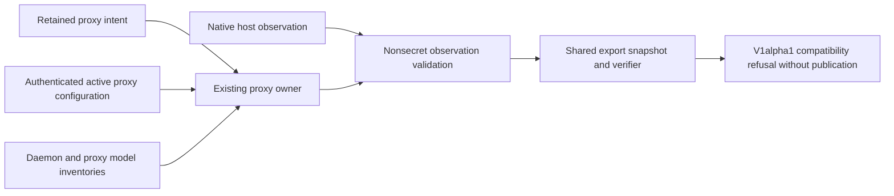

<!-- SPDX-FileCopyrightText: Copyright (c) 2026 NVIDIA CORPORATION & AFFILIATES. All rights reserved. -->
<!-- SPDX-License-Identifier: Apache-2.0 -->

# Inference

`src/lib/inference` is for model/provider configuration, inference health checks, local runtime support, and model catalog helpers.

Suggested homes:

```text
config.ts                 inference configuration and normalization
health.ts                 inference endpoint health checks
local.ts                  local inference orchestration helpers
provider-models.ts        provider model catalog support
nvidia-featured-models.ts NVIDIA featured catalog parsing and fallback
model-prompts.ts          prompt/model display helpers
nim.ts                    NIM catalog and lifecycle support
ollama/model-size.ts      Ollama model size parsing
ollama/proxy.ts           Ollama auth proxy support
ollama/windows.ts         Windows Ollama support
vllm.ts                   vLLM support
web-search.ts             web-search capability helpers
onboard-probes.ts         onboarding-time inference validation probes
```

Longer term, pure inference decisions should move under `src/lib/domain/inference/**`, and HTTP/process boundaries should move under `src/lib/adapters/**`.

## Native hosted inference

`native-hosted/profiles.ts` maps fixed hosted selections to checked-in OpenShell provider profiles.
The supported selections are NVIDIA, OpenAI, Anthropic, Gemini, OpenRouter, and Hermes Provider.
Each profile restricts the upstream hostname, TLS port, request paths, and agent executables.
Credential values remain in OpenShell. Sandbox configuration contains only a placeholder credential.

`native-hosted/index.ts` owns profile import, provider identity checks, attachment, and confirmed removal.
The registry records the selected attachment in `nativeHostedProviderAttachment`.
Credential registration also retains ownership by gateway and profile before any sandbox uses the
provider. Onboarding and inference selection reconcile those receipts with sandbox ownership before
reuse. Reset removes the selected provider's gateway receipt only after deletion is confirmed;
a failed deletion preserves it. Switching providers retains prior ownership without retaining access.
The persistence boundary also reads Slice 1's `nativeNvidiaProviderAttachment` field without changing its provider identity.
Selection does not update the shared `inference.local` route.
A switch retains `pendingNativeHostedProviderDetach` until OpenShell confirms removal of the previous attachment.
Retries complete that cleanup before applying another selection.
Existing beta sandboxes without an attachment receipt require recreation. Status, doctor, connect,
and launch readiness must refuse missing or mismatched ownership; they must not substitute the shared
route. Native probes preserve the selected API protocol and the recorded gateway.
Custom endpoints and local providers retain their existing routing behavior.
V1alpha1 configuration export supports native NVIDIA, OpenAI, Anthropic, OpenRouter,
and Hermes Provider attachments. Gemini export is refused before publication because
V1 cannot consume that provider. Exporting an older shared-route sandbox continues to
verify its original image endpoint without implicitly migrating it.

Agent configuration preserves the provider's API protocol and native base URL.
OpenRouter attribution comes from `native-hosted/openrouter-headers.ts` and is configured in each supported agent.
Hermes authentication retains its logical OAuth or manual-key selection.
Both authentication methods store the protected native credential under `OPENAI_API_KEY` in OpenShell.
The host's unrelated OpenAI credential must never replace that Hermes credential during model selection.

## Ollama export observations

V1alpha1 configuration export currently refuses attached Ollama before publication.
The source observation checks below do not establish output compatibility.
Successful export depends on #11928's named-service contract and #12012's exporter mapping.

The native Linux Docker export slice composes the current proxy owner and nonsecret observer in
`adapters/config/live-export-source.ts`. Each snapshot asks `ollama/proxy.ts` for a fresh probe of
the retained descriptor, port, PID, and three fixed endpoint reads. `ollama/proxy-observation.ts`
observes the host platform and validates retained intent before requesting an authenticated read.
Only then does the proxy owner read its token, capturing it for that snapshot's proxy requests.
The token stays inside this owner and enters curl through stdin. Fixed loopback reads bypass ambient
HTTP proxies and have bounded responses. These reads must not acquire a lifecycle lock, migrate
state, restart a process, or call the token getters that can adopt legacy state.



The proxy's authenticated `GET /_nemoclaw/proxy-config` reports its current PID, actual listener,
and backend origin. It never forwards this request or returns backend userinfo, paths, queries, or
credentials. `ollama/proxy-observation.ts` compares that response with retained intent and the selected
model digest from both native model inventories. Older running proxies without this response fail
source verification; upgrading or restarting them remains an operator lifecycle action.

The `serving.backend: ollama` source model records the daemon as external and the auth proxy as
NemoClaw-managed. It does not claim ownership of the daemon process, software installation, or model
cache. Source verification covers the selected model on native Linux Docker with managed OpenClaw
and no direct sandbox GPU. Read-only secondary agents must share the primary agent's verified
route, model, and tuning. These source constraints remain separate from v1alpha1 output support.

The pinned OpenShell release can bind the Ollama route to its `openai` provider type without
a provider profile. The binding can be global or use the provider's own workspace. Export records
an explicit absent-profile observation only when the read at that binding returns not found.
Other read failures and bindings to a foreign workspace remain terminal.
Both snapshots include the profile evidence, so adding or replacing a profile during export prevents
publication. Present profiles still undergo the existing complete boundary validation.

Ollama onboarding records no user credential. Source verification requires the gateway provider to declare
exactly the internal `NEMOCLAW_OLLAMA_PROXY_TOKEN` credential used by the managed proxy. It accepts
either an absent user-credential selection or that explicit internal credential name, verifies the
live proxy, and keeps the credential value inside the proxy owner.
