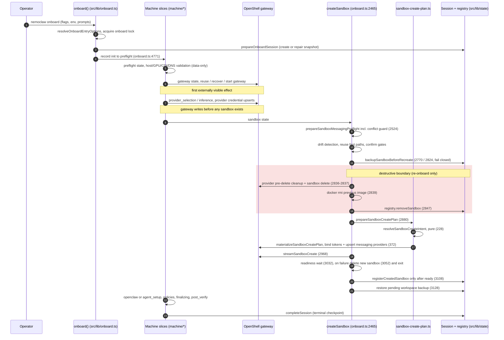

<!-- SPDX-FileCopyrightText: Copyright (c) 2026 NVIDIA CORPORATION & AFFILIATES. All rights reserved. -->
<!-- SPDX-License-Identifier: Apache-2.0 -->

# Agent Instructions for `src/lib/onboard`

## Purpose

This document is the lifecycle contract map required by issue #6225 (epic #6224). It records, for every onboarding and runtime-mutation journey, where desired state comes from, what is validated before effects, where the first externally visible and first destructive effects happen, what is checkpointed, where the credential boundary sits, and what compensation exists today.

This is a characterization map. It describes current behavior, including behavior the epic considers a contract gap. Nothing in this file is a target design; target designs live in the child issues (#6226, #6227, #6228) and in `machine/README.md`.

Companion documents:

- `src/lib/onboard/README.md` covers file placement for the `onboard.ts` split.
- `src/lib/onboard/machine/README.md` covers the FSM target architecture, state vocabulary, and handler contract.
- `src/lib/messaging/AGENTS.md` covers the messaging package this map frequently crosses into.

Line anchors below were verified against the tree this document was committed with. Symbol names are the stable reference; treat line numbers as hints that drift.

## Shared Lifecycle Vocabulary

### Epic terminology (from #6224, use verbatim)

- **Lifecycle contribution.** An internal, data-first input to a NemoClaw plan: policy, provider, package, port-forward, resource, or runtime setup. Not a public SDK.
- **Managed agent package.** A package NemoClaw records as desired state for an agent runtime (OpenClaw, Hermes, Deep Agents Code). #5998 owns the narrow user-facing managed OpenClaw package lifecycle (CLI and desired-state MVP), not this epic.
- **Agent-native plugin.** A plugin interpreted by OpenClaw, Hermes, or another agent runtime.
- **NemoClaw plugin SDK.** Reserved for a future versioned external contract. Epic #6224 does not create one, and nothing in this package should be documented as one before the #6229 decision record exists.

### Lifecycle verbs

These definitions describe how the terms are used in this map. They are grounded in current code artifacts and in epic #6224's principles (plan before effects; persist data, bind capabilities at apply time; version and revalidate resumed plans; one vocabulary across create, rebuild, re-onboard, reconcile).

| Term | Meaning in this map | Current code artifact |
|---|---|---|
| intent | Deterministic, serializable description of a desired outcome, derived from operator inputs and recorded selections before any effect runs. Contains logical bindings (credential env-var names, presence flags), never secret values, temp paths, callbacks, or process handles. | `SandboxCreateIntent` (`sandbox-create-intent-types.ts:41`), produced by the pure `resolveSandboxCreateIntent` (`sandbox-create-plan.ts:228`). Explicitly not a persistence, machine-event, or public API contract. |
| plan | The compiled form of an intent plus observed state, ready to execute. The codebase has two flavors today: serializable plans (`SandboxMessagingPlan`) and execution plans that carry temp paths and cleanup callbacks (the return value of `materializeSandboxCreatePlan`). | `MessagingWorkflowPlanner.buildPlan` (`src/lib/messaging/compiler/workflow-planner.ts:44`); `materializeSandboxCreatePlan` (`sandbox-create-plan.ts:334`). |
| apply | The effectful phase. Capabilities (credential values, live handles, gateway connections) are bound at apply time, not stored in intent or checkpoints. | `bindMessagingTokenDefs` (`sandbox-create-plan.ts:298`) rebinds real tokens at materialization and fails on drift; gateway upserts happen inside `materializeSandboxCreatePlan`. |
| checkpoint | Durable, secret-free record of progress that a later run can resume from. | The onboard session (`~/.nemoclaw/onboard-session.json`, `src/lib/state/onboard-session.ts:39`) with whole-step granularity plus the machine snapshot; pre-recreate workspace backups; the rebuild backup manifest. |
| result | The explicit outcome a state handler returns to the machine: advance, retry, branch, complete, or failed. | `OnboardStateResult` (`machine/result.ts`), applied through `OnboardRuntime.applyResult` and the `OnboardRuntimeBoundary` facade (`runtime-boundary.ts`). |
| compensation | Effects run after a failure or cancellation to undo or mitigate a partially applied journey. | Failed-create sandbox deletion (`onboard.ts:3052`); cancel rollback (`cancel-rollback.ts`); `rollbackChannelAdd` (`src/lib/actions/sandbox/policy-channel.ts:1079`); rebuild's recovery-registry restore (`rebuild-recreate-phase.ts:206`). |
| reconcile | Bringing recorded desired state and observed live state back into agreement without a full re-run. | Drift detection in `createSandbox` (`onboard.ts:2614-2635`); `reconcileSandboxMessaging` (`machine/handlers/sandbox-messaging.ts:253`); `mergeOpenClawRestoredConfig` ownership rules (`src/lib/state/openclaw-config-merge.ts:17`). |

## Machine states and production owners

The 13 machine states (`machine/definition.ts:12-65`) and their transition table (`machine/transitions.ts:11-29`: the linear advance chain, the `inference -> provider_selection` retry, the `sandbox -> openclaw | agent_setup` branch, and every non-terminal state `-> failed`). Every non-terminal state has exactly one production owner:

| State | Production owner |
|---|---|
| `init` | Entered by session bootstrap; advanced to `preflight` directly by `onboard()` (`onboard.ts:4771`) before the first slice runs. |
| `preflight` | `machine/handlers/preflight.ts` |
| `gateway` | `machine/handlers/gateway.ts` |
| `provider_selection`, `inference` | `machine/handlers/provider-inference.ts` (composite handler with declared sequence ownership) |
| `sandbox` | `machine/handlers/sandbox.ts`, with the resume decision in `handlers/sandbox-resume.ts:50` and messaging reconciliation in `handlers/sandbox-messaging.ts:253` |
| `openclaw`, `agent_setup` | `machine/handlers/agent-setup.ts` (agent branch) |
| `policies` | `machine/handlers/policies.ts` |
| `finalizing`, `post_verify` | `machine/handlers/finalization.ts` |
| `complete`, `failed` | Terminal; no handler. |

The FSM is deliberately step-granular. Mid-operation resume inside gateway startup, sandbox creation, credential upserts, model probes, or policy application is out of scope for the current machine (`machine/types.ts:4-10`). This is the root of several checkpoint gaps below.

## Journey Contract Matrix

Summary:

| Journey | Entry point | Desired-state source | First destructive effect | Durable checkpoint |
|---|---|---|---|---|
| 1. Sandbox create (fresh onboard) | `onboard()` (`src/lib/onboard.ts:4610`) | Flags + env + prompts of the current run | None against prior state; creation itself at `streamSandboxCreate` (`onboard.ts:2968`) | Whole-step session + machine snapshot |
| 2. Rebuild / installer upgrade | `rebuildSandbox` (`rebuild-pipeline.ts:34` via the `rebuild.ts` facade) | Registry entry + matching session only; ambient env quarantined | `openshell sandbox delete` (`rebuild-destroy-phase.ts:81`) | Backup manifest + session rewritten as recreate contract + recovery registry snapshot |
| 3. Re-onboard / resume over existing sandbox | Same `onboard()`, live-sandbox block of `createSandbox` (`onboard.ts:2571`) | Current run's env/flags/prompts; registry and gateway used as drift baseline | Delete + `docker rmi` + registry removal (`onboard.ts:2836-2847`) | Pre-recreate workspace backup + session |
| 4. Runtime mutation (provider switch, config set, channels, plugin entries) | `inference-set.ts`, `sandbox/config.ts`, `policy-channel.ts` | CLI flags + registry/session metadata; per-channel delta plans | None in-place; channel changes defer destruction to a queued rebuild | Audit entries + registry plan persistence |

### Journey 1: sandbox create (fresh onboard, interactive and non-interactive)

| Contract dimension | Current behavior |
|---|---|
| Desired-state source | Flags, env, and TTY prompts resolved by `resolveOnboardEntryOptions` (`entry-options.ts:46`; auto-resume of an in-progress session at line 63). Provider/model/endpoint selected in the `provider_selection`/`inference` states. Messaging plan compiled by `MessagingWorkflowPlanner.buildPlan` and transported through process env `NEMOCLAW_MESSAGING_PLAN_B64` (`src/lib/messaging/applier/types.ts:20`). Create intent resolved by `resolveSandboxCreateIntent` (`sandbox-create-plan.ts:228`). |
| Deterministic planning/validation | `preflight()` host checks (`onboard.ts:1594`); early env validation and onboard lock (`onboard.ts:4659-4662`); messaging conflict guard inside `prepareSandboxMessagingPreflight` (`onboard.ts:2524` -> `sandbox-messaging-preflight.ts:63` -> `messaging-conflict-guard.ts:65`); `resolveSandboxCreateIntent` is pure and deterministic. |
| First externally visible effect | Gateway reuse/recover/start in the `gateway` state (`startGateway`, `onboard.ts:2276`). Inference-provider credential upserts to the gateway happen during `provider_selection`/`inference` (`upsertProvider`, `onboard.ts:898`), before any sandbox exists. |
| First destructive effect | None against pre-existing sandbox state on a truly fresh create. Gateway messaging-provider upserts run with `replaceExisting: true` inside `materializeSandboxCreatePlan` (`sandbox-create-plan.ts:372`), which overwrites same-name provider entries in shared gateway state. Creation itself is `streamSandboxCreate` (`onboard.ts:2968`). |
| Checkpoints | Whole-step session (`Session`, `onboard-session.ts:84`; 8 fixed steps; atomic tmp+rename save) plus machine snapshot, written through `OnboardRuntimeBoundary`. Registry registration is deferred until the sandbox is confirmed ready (`registerCreatedSandbox`, `onboard.ts:3108`) to prevent phantom entries. There is no sub-step checkpoint. |
| Credential/secret boundary | Session persists `credentialEnv` as an env-var name only (`onboard-session.ts:100`), `endpointUrl` redacted at save (`onboard-session.ts:492`), legacy credential migration as sha256 hashes only (`onboard-session.ts:122`). `SandboxCreateIntent` carries presence flags and env keys, never values; real tokens are rebound at apply time by `bindMessagingTokenDefs` (`sandbox-create-plan.ts:298`), which fails closed on availability or provider-type drift. |
| Retry/compensation/rollback | Readiness failure deletes the failed new sandbox (`onboard.ts:3052`) and exits with retry hints. Build-context temp dirs (which can hold env-arg API keys) are cleaned inline with a process-exit safety net (`onboard.ts:2856`, `2988`). Two-key cancel rollback is armed only for a brand-new sandbox (`onboard.ts:3175`) and clears the session when it fires (`cancel-rollback.ts:157`). Nonzero exit marks the last started step failed (`exit-step-failure.ts:19`, registered at `onboard.ts:4794`). |
| Extension assembly points | All current lifecycle contributions converge in `prepareSandboxCreatePlan` (`onboard.ts:2880`): messaging channel manifests (via token defs and the plan env), policy presets (`initialSandboxPolicy`), extra providers from the registry, Hermes tool gateways, GPU create args, resource-profile flags. Web-search reaches the create args only indirectly (BRAVE/TAVILY keys via `extra-placeholder-keys.ts` and the extra-provider registry); its plugin-entry/config rendering flows through the build patch and `web-search-flow.ts`, outside the create plan. |
| Existing tests / known-uncovered failure modes | Tests: `sandbox-create-plan.test.ts` (#6218 characterization), `machine/handlers/sandbox.test.ts`, the `machine/*.test.ts` suite, `test/onboard.test.ts`, `test/onboard-selection.test.ts`, `test/onboard-messaging.test.ts`. Uncovered: process death between gateway provider upserts and sandbox create leaves gateway credential state changed with no sandbox; no test pins gateway provider state after a mid-create failure; no mid-step resume (by design, `machine/types.ts:4-10`). |

Interactive and non-interactive runs share this contract; non-interactive substitutes env defaults and hard aborts for prompts (`non-interactive-abort.ts`, and the `isNonInteractive()` branches in `createSandbox`).

### Journey 2: rebuild, including installer-driven upgrade

Installer batch upgrades call the same pipeline: `upgradeSandboxes` invokes `rebuildSandbox(name, ["--yes"], { recoveryManifest, ... })` (`src/lib/actions/upgrade-sandboxes.ts:310`).

| Contract dimension | Current behavior |
|---|---|
| Desired-state source | Registry entry + matching session only, never ambient env: `prepareRebuildResumeConfig` (`rebuild-resume-config.ts:224`, the #5735 pre-delete trust boundary; custom-endpoint URLs fail closed if recorded only in another sandbox's session). Ambient `NEMOCLAW_*` selection env is quarantined for the recreate by `isolateAmbientRecreateEnv` (`rebuild-env-isolation.ts:116`, applied at `rebuild-recreate-phase.ts:177`). Messaging comes from the registry-persisted plan: `stageRebuildMessagingPlanOrBail` (`rebuild-messaging-phase.ts:81`) -> `buildRebuildPlanFromSandboxEntry` (`workflow-planner.ts:116`). |
| Deterministic planning/validation | All before destruction, in `runRebuildPreflightPhase` (`rebuild-preflight-phase.ts:68`): registry entry snapshot pinned and re-asserted unchanged after confirmation (`:77`, `:124`); gateway schema; recovery-manifest validation; confirmation; onboard lock; then `prepareRebuildTargetPreflights` (`rebuild-preflight-target-phase.ts:40`): target config, recreate options, messaging plan staged (`:81`), messaging conflict preflight (#5954) immediately after staging (`:90` -> `rebuild-messaging-conflict-preflight.ts:49`, forced non-interactive abort), authoritative runtime preflight, base image, target runtime. DCode rebuilds additionally prebuild and fingerprint the replacement image pre-delete (#6214): `prepareDcodeReplacementBeforeMutation` (`rebuild-dcode-preflight.ts:354`). Mutation-edge revalidation runs immediately before deletion: `revalidatePreparedRecoveryBeforeDelete` (`rebuild-pipeline.ts:119`) and `dcodePreflight.revalidateBeforeDelete` (`rebuild-pipeline.ts:146` -> `revalidateDcodeReplacementAtMutationEdge`, `rebuild-dcode-preflight.ts:415`). |
| First externally visible effect | Shields auto-unlock window (`runRebuildShieldsPhase`, `rebuild-pipeline.ts:104`) and the validated-target registry update at the end of preflight (`rebuild-preflight-target-phase.ts:135`). In the destroy phase, MCP adapter scrub/provider detach and NIM container stop precede deletion (`rebuild-destroy-phase.ts:57-70`). |
| First destructive effect | `openshell sandbox delete` (`rebuild-destroy-phase.ts:81`), then registry entry removal (`:113`; the entry is intentionally preserved when MCP entries exist, as the durable MCP rebuild transaction). |
| Checkpoints | Workspace backup manifest (`runRebuildBackupPhase`, `rebuild-backup-phase.ts:35`, or a validated installer `recoveryManifest`); session rewritten wholesale as the recreate contract with preflight/gateway pre-marked complete and provider/model/credential-env/endpoint pinned (`rebuild-recreate-phase.ts:103-149`); registry snapshot taken for recovery recreates (`rebuild-pipeline.ts:100`). |
| Credential/secret boundary | Credential preflight before any destruction (`rebuild-credential-preflight.ts`); session and registry carry env-var names and redacted endpoints only; the scoped-env facade saves and restores mutation-prone env keys around the whole pipeline (`rebuild-pipeline.ts:40-59`). |
| Retry/compensation/rollback | Recreate runs `onboard()` in-process with `process.exit` intercepted by a sentinel throw (`rebuild-recreate-phase.ts:163-196`). On failure: `markLastStartedStepFailed` (`:201`); registry snapshot restore only for recovery recreates (`:206-217`); backup path preserved and manual `snapshot restore` instructions printed (`:229-239`); MCP registry restore for retry (`:218`); shields relocked (`:242` and the pipeline `finally` at `rebuild-pipeline.ts:231`). On success: restore phase + post-restore phase reapply state, policy presets, and messaging hooks (`rebuild-pipeline.ts:206-229`). |
| Extension assembly points | Messaging plan restaged from manifests; policy presets restored from backup manifest and registry; MCP entries carried through the registry entry; `plugins.entries` merged under the ownership contract `OPENCLAW_CONFIG_RESTORE_OWNERSHIP` (`openclaw-config-merge.ts:17-23`: current generated entries win by id, backup-only user entries kept). |
| Existing tests / known-uncovered failure modes | Tests: `rebuild-flow.test.ts`, `rebuild-resume-config.test.ts`, `rebuild-dcode-flow.test.ts`, `rebuild-messaging-conflict-preflight.test.ts`, `rebuild-env-isolation.test.ts`, `rebuild-resume-snapshot.test.ts`, `rebuild-shields-finally.test.ts`. Uncovered: a plain (non-recovery) recreate failure leaves no registry entry, only a backup and printed instructions; non-DCode rebuilds build the replacement image only after deletion, so a build failure strands the operator on the recovery path. |

### Journey 3: re-onboard and resume over an existing sandbox

Two sub-modes share `onboard()`: (a) the live-sandbox block in `createSandbox` (`onboard.ts:2571-2848`), and (b) the `--resume` decision `decideSandboxResume` (`machine/handlers/sandbox-resume.ts:50`: create / reuse / recreate / repair-and-recreate), applied by `machine/handlers/sandbox.ts`.

| Contract dimension | Current behavior |
|---|---|
| Desired-state source | The current run's env, flags, and prompts. Registry and gateway are only a drift baseline: agent drift (`onboard.ts:2574`), provider migration need (`:2614`), selection drift via live gateway probe (`:2617`), GPU drift (`:2619`), Hermes tool-gateway and dashboard drift (`:2624-2629`), messaging credential rotation (`:2635`). Restore intent (#6130) is keyed on installer env `NEMOCLAW_RESTORE_LATEST_BACKUP_ON_RECREATE=1` (`not-ready-recreate.ts:56`), consumed at `onboard.ts:2564` (`selectPreUpgradeBackupForCreate`) and `onboard.ts:2711` (`resolveNotReadyOutcome`; without the flag a non-interactive not-ready sandbox blocks with hints). |
| Deterministic planning/validation | Messaging conflict guard runs pre-delete (`onboard.ts:2524`), unlike pre-#5954 rebuild. CPU-sandbox-vs-GPU-request reuse guard (`:2655-2666`). Interactive confirm gates for recreate (`:2718-2762`). MCP-managed sandboxes refuse the generic recreate path and are redirected to `rebuild` (`:2804-2812`). Resume conflicts (`getResumeConfigConflicts`, `resume-config.ts:101`: sandbox name only counts if the sandbox step completed, #2753; provider/model hints; `--from` path equality) exit before any effect. Terminal machine snapshots are repaired only per `classifyResumeMachineRepair` (`resume-repair-policy.ts:34`: failed, or inconsistently reopened complete) by `repairResumeMachineSnapshot` (`resume-machine-repair.ts:52`). |
| First externally visible effect | Same as journey 1 (gateway state, provider upserts). On reuse fast paths, messaging providers are upserted without any deletion (`onboard.ts:2677`, `:2735`). |
| First destructive effect | `onboard.ts:2836-2847`: provider pre-delete cleanup, `openshell sandbox delete` (`:2837`), `docker rmi` of the previous image (`:2839`), `registry.removeSandbox` (`:2847`). |
| Checkpoints | `backupSandboxBeforeRecreate` (`onboard.ts:2770` for credential rotation, `:2824` general; `sandbox-backup-on-recreate.ts:25`). Fail-closed: a failed backup aborts the recreate unless `NEMOCLAW_RECREATE_WITHOUT_BACKUP=1`. Skipped when a pre-upgrade backup was already selected or a not-ready recreate is in progress (`:2817-2822`). |
| Credential/secret boundary | Same session redaction rules as journey 1. `migratedLegacyValueHashes` is trusted on resume only entry-by-entry when the sha256 of the currently staged legacy value matches. |
| Retry/compensation/rollback | Workspace restore after create (`onboard.ts:3128-3142`); default-sandbox restoration deferred to post-create (`:3126`, #4614); cancel rollback deliberately not armed for recreates (`:3175` gate). There is no registry snapshot restore on this path; a failed recreate relies on session + backup + `onboard --resume`. |
| Extension assembly points | Policy presets carried forward across recreate (`policyPresetCarry.applyRecreatePolicyCarryForward`, `onboard.ts:2815`); messaging channels re-resolved by `reconcileSandboxMessaging` (`handlers/sandbox-messaging.ts:253-269`) in the order: recorded channels, env plan, registry plan, then `session.messagingPlan`. |
| Existing tests / known-uncovered failure modes | Tests: `session-bootstrap.test.ts`, `resume-machine-repair.test.ts`, `entry-options.test.ts`, `machine/handlers/sandbox-resume.test.ts`, `machine/handlers/sandbox.test.ts`, `not-ready-recreate.test.ts`, `sandbox-backup-on-recreate.test.ts`. Uncovered: resume identity when the sandbox step never completed (session may lack `sandboxName`; #5961/#5783 territory); interrupted-run snapshot shapes outside the two repaired classes (#6040); no pinning of the delete-then-create window (process death there leaves neither sandbox nor registry entry). |

### Journey 4: runtime mutation

Four surfaces. The `nemoclaw` OpenClaw plugin's TUI commands are read-only; all mutation is host CLI.

**4a. Provider/model switch** (`nemoclaw inference set` -> `runInferenceSet`, `src/lib/actions/inference-set.ts:826`, serialized by a timer-bound shields mutation lock at `:838`):

- Intent: CLI flags plus optional explicit endpoint/credential metadata, merged with registry/session metadata.
- Validation before any write (`runInferenceSetWithoutHostLock`, `:593`): provider allowlist and model-id charset (`:599-605`), registered-agent match, shields-down requirement (`:622`), local-provider reachability (`:651-671`).
- Writes are ordered, layered, forward-only: gateway route (`:674`) -> registry (`:698`) -> registry API-family refresh (`:722`) -> in-sandbox config patch, non-fatal (`:762`; both degraded states are explicitly repaired by `rebuild`, comment at `:755-759`) -> session (`:786`) -> audit entry (`:795`).
- No rollback. Degraded states are reported; `rebuild` is the documented repair.

**4b. Config change** (`nemoclaw <name> config set` -> `configSet`, `src/lib/sandbox/config.ts:886`):

- Validation: dotpath validation (`:903`), shields-down (`:914`), `gateway.*` refusal (`:937`), scalar-ancestor/array clobber refusal (`:955`), new-key confirmation gate (`:966`, #2400), SSRF validation with DNS-pinned URL rewrite (`:992`).
- Apply: under the sandbox mutation lock plus the shields transition lock, a re-read plus compare-and-swap on the config's sha256 (`:1004-1023`) then write, hash recompute, and audit (`:1027-1030`). Fail-closed CAS; no compensation needed.

**4c. Messaging channel add/remove/start/stop** (`src/commands/sandbox/channels/*` -> `src/lib/actions/sandbox/policy-channel.ts`: `addSandboxChannel` `:924`, `removeSandboxChannel` `:1307`, `stopSandboxChannel`/`startSandboxChannel` `:1481`/`:1490` -> `sandboxChannelsSetEnabled` `:1407`):

- Intent: per-channel delta plans built from the registry entry (`workflow-planner.ts:62-115`: add, stop, start, remove).
- Validation: agent support gate; a hand-rolled mirror of the onboard conflict guard, `checkChannelAddConflict` (`:389`), which uniquely offers `--force`; conflict-detection errors fail closed unless `--force` or an interactive override (`:423-442`); channel pre-enable hooks run next, with hook-registry read failures fail-soft, warn and proceed (`:483-490`).
- Apply: gateway provider upsert/detach, policy preset apply/remove, and registry plan persistence run immediately, but the destructive apply is deferred to a rebuild: `promptAndRebuild` (`:682`) -> `rebuildSandbox(name, ["--yes"])` (`:699`). Non-interactive runs queue the change and print the rebuild command.
- Compensation: `rollbackChannelAdd` (`:1079`) restores prior tokens on preset failure; `channels start` re-disables the plan if its preset fails (`:1463-1472`); QR-channel remove hard-stops before any registry mutation if in-sandbox state cannot be cleared (`:1370-1382`, #3998); session preset mirroring `syncSessionPolicyPresetsWithRegistry` (`:1224`) prevents a later rebuild resume from reverting presets.

**4d. Plugin entries** (`plugins.entries.*` in agent config):

- Written as manifest render targets at build/rebuild time (for example `plugins.entries.telegram`, `src/lib/messaging/channels/telegram/manifest.ts:130`) and by the web-search flow.
- Reconciled at rebuild restore by `OPENCLAW_CONFIG_RESTORE_OWNERSHIP` (`openclaw-config-merge.ts:17-23`): `currentGeneratedEntryMaps: ["plugins.entries"]`, so current generated entries win by id, backup-only user entries are kept, and stale web-search entries are never resurrected.
- Direct runtime edits go only through `config set` gates. There is no dedicated plugin CLI; the managed-package CLI is #5998's scope.

### Agent differences

- The FSM branches `sandbox -> openclaw` for OpenClaw and `sandbox -> agent_setup` for other agents; both rejoin at `policies`.
- Deep Agents Code (DCode) is the only agent with pre-delete replacement-image validation on rebuild (#6214). It is also excluded from messaging: no channel manifest lists it under `supportedAgents`, and `channels add` rejects it before any mutation (see `src/lib/messaging/AGENTS.md`).
- Hermes adds tool-gateway and dashboard drift axes to the re-onboard drift baseline and its own credential preflight on rebuild.

## Persisted state and field ownership

- `~/.nemoclaw/onboard-session.json` is owned by `src/lib/state/onboard-session.ts` and written through `OnboardRuntimeBoundary` during onboard; the rebuild pipeline rewrites it wholesale as the recreate contract (`rebuild-recreate-phase.ts:103`). Step helpers default to record-only (`RECORD_ONLY_STEP_MUTATION_OPTIONS`, `src/lib/state/onboard-step-mutation.ts:19`); `LEGACY_MACHINE_STEP_MUTATION_OPTIONS` (`:15`) remains the escape hatch that also moves the machine snapshot, used by the exit backstop and rebuild.
- The sandbox registry is owned by `src/lib/state/registry.ts`; the machine snapshot `{version, state, stateEnteredAt, revision}` is owned by `OnboardRuntime`.
- Known ambiguity (pinned, not endorsed): `null` is overloaded across several session fields to mean unset, declined, or explicitly cleared. Explicit-clear semantics exist only for the whitelisted updates in `filterSafeUpdates` (the #2625 null-vs-undefined contract in `onboard-session.ts`). Modeling `unset`/`declined`/`known value` explicitly is #6228's mandate; sandbox-identity nullability is tracked by #5783/PR #5860.

## Create path sequence

Current-ordering facts this diagram pins (do not "fix" silently; they are #6226/#6228 targets):

1. Gateway credential writes (inference providers, then messaging providers) precede sandbox existence and, on the recreate path, follow the deletion of the old sandbox.
2. `resolveSandboxCreateIntent` runs inside `prepareSandboxCreatePlan` at `onboard.ts:2880`, after the destructive boundary at `onboard.ts:2837`, not before it.
3. Registry registration is post-ready only; there is no durable record of the selected sandbox identity before the long-running create stream starts.

## Duplicated decision points (divergences) and recommended owners

Recommended owners name where a single decision should live. No refactor is implied here; alignment work belongs to the referenced child issues.

1. **Messaging desired state has four sources by path.** First onboard compiles the plan from current selections and transports it via `NEMOCLAW_MESSAGING_PLAN_B64` (`MessagingSetupApplier.writePlanToEnv`, `applier/setup-applier.ts:45`); rebuild restages from the registry entry plan (`buildRebuildPlanFromSandboxEntry`, `workflow-planner.ts:116`); resume reuse resolves recorded channels, then env plan, then registry plan, then `session.messagingPlan` (`handlers/sandbox-messaging.ts:253-269`); channel mutations build single-channel deltas (`workflow-planner.ts:62-115`). Drift among env/session/registry yields different recreated states per path. Recommended owner: the registry-persisted plan via `MessagingHostStateApplier`, with env and session copies demoted to transport/cache; alignment via #6226 and #6228.
2. **Ambient env polarity is inverted between paths.** Onboard/re-onboard treat `NEMOCLAW_PROVIDER`/`MODEL`/`ENDPOINT_URL` as authoritative intent; rebuild quarantines exactly those (`isolateAmbientRecreateEnv`, `rebuild-env-isolation.ts:116`) and pins intent from registry + matching session (`prepareRebuildResumeConfig`, `rebuild-resume-config.ts:224`, #5735). The same environment produces opposite outcomes depending on the path. Recommended owner: one target-resolution module that decides when ambient env is intent versus contamination; alignment via #6226.
3. **One conflict-guard engine, three wirings with divergent semantics.** Onboard: `enforceMessagingChannelConflicts` (`messaging-conflict-guard.ts:65`) with an interactive "continue anyway" path. Rebuild: `preflightRebuildMessagingConflicts` (`rebuild-messaging-conflict-preflight.ts:49`, #5954) forcing non-interactive abort. `channels add`: the hand-rolled mirror `checkChannelAddConflict` (`policy-channel.ts:389`) uniquely offers `--force`; detection errors fail closed unless forced or interactively overridden (`:423-442`), while pre-enable hook registry-read failures remain fail-soft (`:483-490`). Recommended owner: `messaging-conflict-guard.ts` as the sole engine, taking per-path policy (interactive / abort / force) declaratively.
4. **Backup/restore intent differs per path.** Rebuild always backs up and auto-restores, including policy presets (`rebuild-backup-phase.ts`, `rebuild-pipeline.ts:206-229`); re-onboard backs up fail-closed but restores only workspace state (presets travel via carry-forward, `onboard.ts:2815`); the non-interactive not-ready path restores only under the installer flag (#6130, `not-ready-recreate.ts:56`); channel mutations create no checkpoint of their own and lean on the next rebuild's backup. Recommended owner: one backup/restore policy module consumed by both `createSandbox` and the rebuild pipeline; durable semantics belong to #6228.
5. **Registry lifecycle asymmetry.** Create registers only post-ready (`registerCreatedSandbox`, `onboard.ts:3108`); rebuild removes the entry at the destroy phase (`rebuild-destroy-phase.ts:113`, retained only for MCP-bearing entries) and restores a snapshot only for recovery recreates (`rebuild-recreate-phase.ts:206-217`); re-onboard recreate removes at `onboard.ts:2847` with no snapshot restore at all. A plain failed recreate leaves no registry entry on either path. Recommended owner: `sandbox-registration.ts` as the registration contract; durable pre-create identity belongs to #6228.
6. **Pre-delete replacement validation exists only for DCode rebuilds** (#6214): image prebuilt and fingerprinted (`rebuild-dcode-preflight.ts:354`) and revalidated at the mutation edge (`:415`). Non-DCode rebuilds validate base image, credentials, and runtime pre-delete but build the real image after deletion; onboard/re-onboard build entirely post-delete. Recommended owner: the `rebuild-dcode-orchestrator` pattern as the documented precedent; full same-name build-verify-swap atomicity is #5801's scope, explicitly outside this epic.
7. **Policy-preset reconciliation exists only on rebuild.** The restore/post-restore phases reapply presets and reconcile the registry; onboard writes `appliedPolicies` once at registration (`onboard.ts:3115`); channel commands mutate presets one at a time and mirror them into the session (`syncSessionPolicyPresetsWithRegistry`, `policy-channel.ts:1224`) specifically so a later rebuild resume does not revert them. The paths reconverge only via ad-hoc mirrors. Recommended owner: the `policy-preset-persistence`/`policy-preset-sync` modules as the single reconciliation point.

## Bug to contract-gap map

| Issue | Symptom | Contract gap | Status |
|---|---|---|---|
| #5961 | Interrupted non-interactive onboard cannot resume safely | Checkpoint gap: whole-step session with no durable sandbox identity or effect-group metadata before the interruptible create step, so resume cannot distinguish never-started, in-flight, and created | Open; targeted by #6227/#6228 |
| #6040 | `onboard --resume` aborts on macOS/DGX Spark | Recovery gap: only `failed` and inconsistently-reopened-`complete` snapshots are repaired (`classifyResumeMachineRepair`, `resume-repair-policy.ts:34`); other interrupted snapshot shapes have no explicit recovery transition | Open; targeted by #6227 |
| #6179 | Invalid FSM transition attempted after successful sandbox creation | Transition-graph gap: handlers can emit results whose source state no longer matches; stale results are skipped by `recordStateResultWithStepCompatibility` (`runtime-boundary.ts:204`, reasons `already_at_target`/`source_state_mismatch`) instead of being rejected or recomputed under an enforced legal-transition rule | Open; targeted by #6227 |
| #5954 | Rebuild detected a messaging credential conflict only after destroying the sandbox | Plan-before-effects gap in rebuild preflight ordering | Fixed by PR #5955 (`9e583ed47`); the guard now runs at `rebuild-preflight-target-phase.ts:90`, before every destructive phase |
| #6099 | Healthy sandbox rolled back after a late dashboard-forward failure | Compensation-scope gap: post-ready, non-destructive failures sit inside a destructive rollback window (`ensureDashboardForward(..., { rollbackSandboxOnFailure: true })`, `onboard.ts:3092`) | Open; in-flight PR #6116 (`forward-start.ts`) |
| #6195 | Rebuild deleted a DCode sandbox before validating that recreation could succeed | Plan-before-effects gap at rebuild's destructive boundary | Fixed by PR #6214 (`2c4bf1944`); see divergence 6 |

## Recently addressed by #6218 and #6214

- **PR #6218** (`2a68fbc7e`, merged 2026-07-03) separated the deterministic, serializable, secret-free `SandboxCreateIntent` (`resolveSandboxCreateIntent`, `sandbox-create-plan.ts:228`) from effectful materialization (`materializeSandboxCreatePlan`, `:334`), kept the `prepareSandboxCreatePlan` compatibility surface (`:400`), and extended the characterization coverage in `sandbox-create-plan.test.ts`. It deliberately did **not** move intent resolution ahead of the destructive boundary (still invoked at `onboard.ts:2880`, after the delete at `:2837`), did not persist intent, and did not define a machine-event or public contract. Those are exactly #6226, #6228, and #6229.
- **PR #6214** (`2c4bf1944`, merged 2026-07-03) made DCode rebuilds prepare, fingerprint, and mutation-edge-revalidate the replacement before deletion (`rebuild-dcode-preflight.ts:354`, `:415`), closing #6195's ordering gap for DCode. Non-DCode rebuild ordering is unchanged.
- **PR #5955** (`9e583ed47`, merged 2026-07-03) moved the rebuild messaging conflict check before destruction, closing #5954.

## In-flight work

Do not treat recovery and resume semantics in this package as frozen:

- **PR #6253** (open) is the recovery-path refactor toward #6227. The recovery/resume surface (`resume-machine-repair.ts`, `session-bootstrap.ts`, `machine/transitions.ts`, `exit-step-failure.ts`, and neighbors) is claimed by open PRs in this area; coordinate before touching those files.
- **PR #6116** (open) reworks the dashboard-forward rollback scope for #6099 (`forward-start.ts`).
- **PR #5860** (open) addresses null sandbox identity and coarse checkpoints for #5783.

## Characterization tests

The machine event/transition traces for fresh, resume, recreate, success, and failure paths are pinned by `machine/transition-traces.test.ts` (see the "Characterization traces" section of `machine/README.md`). Together with the per-journey tests listed in the matrix above, they form the regression baseline for #6225: they assert current behavior, including orderings this document flags as gaps. When #6226/#6227/#6228 intentionally change an ordering, update the pinned trace in the same PR and reference the child issue in the test title.
